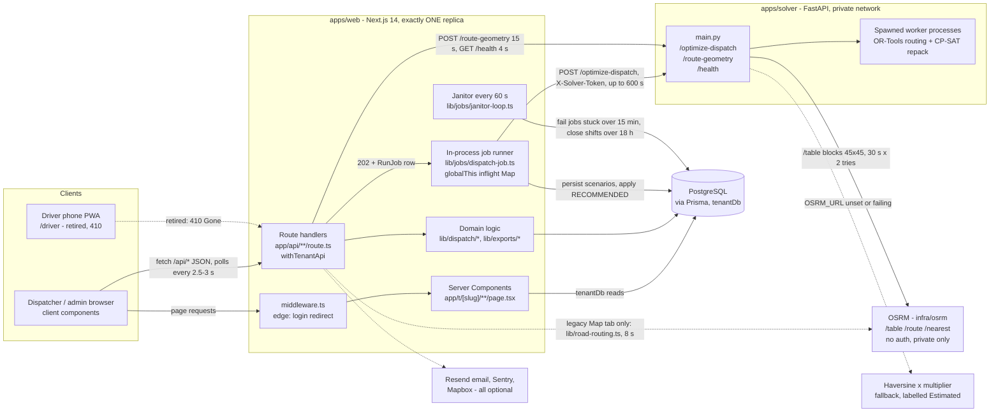
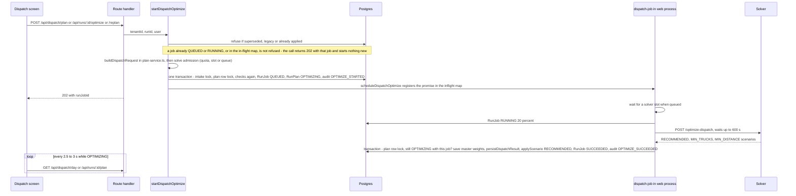
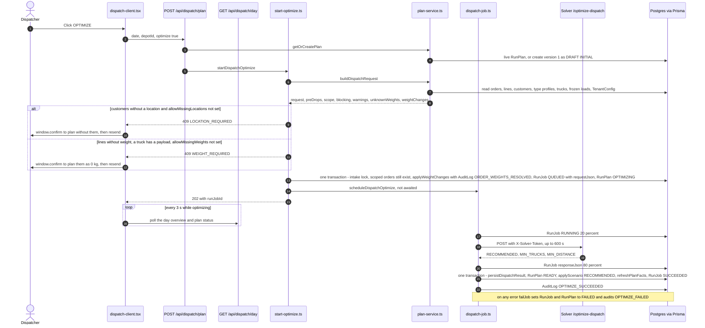
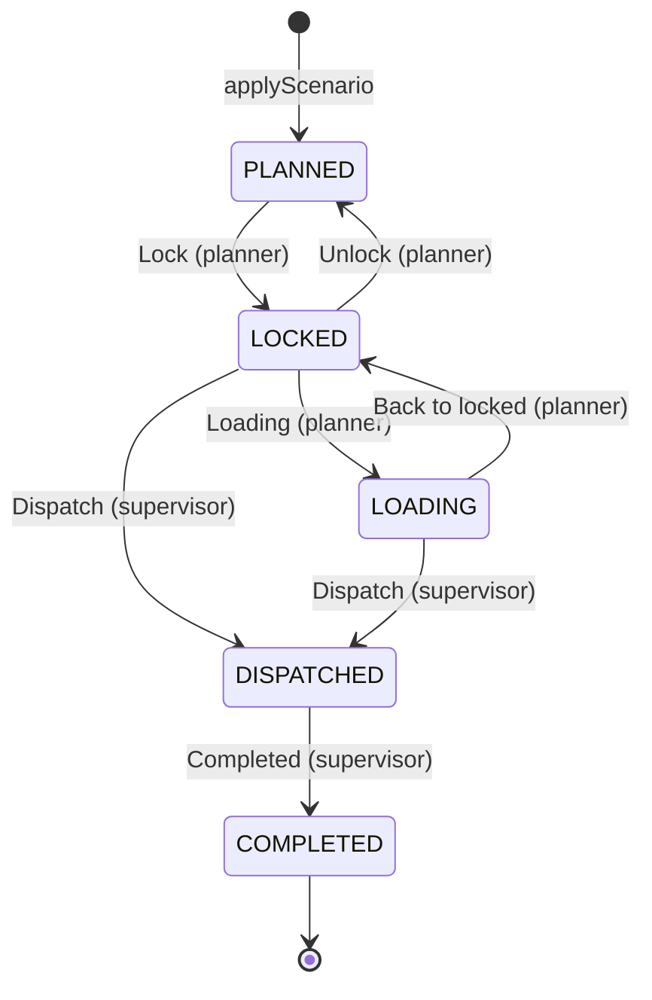
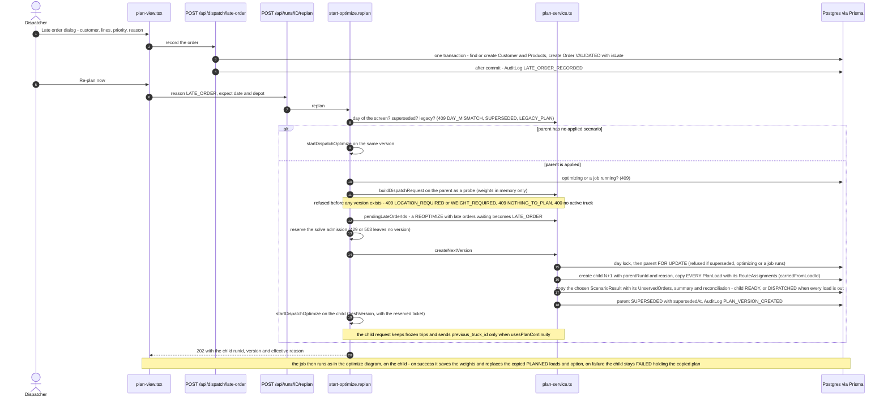
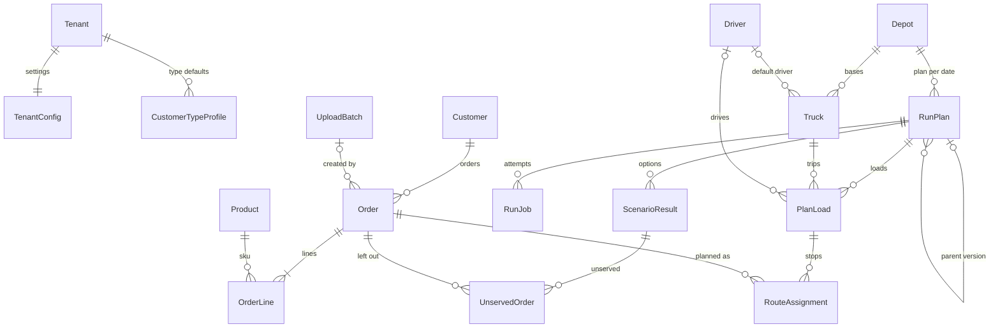
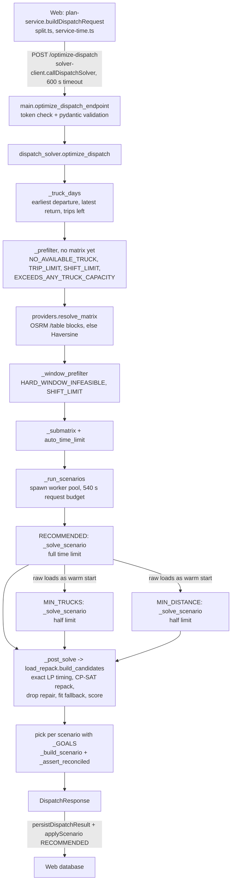

# RouteIQ - Project Handbook

RouteIQ is the daily dispatch planner of **NMWC** (National Mineral Water Co., Muscat, Oman). Every evening it turns tomorrow's sales orders into truck loading plans and delivery routes: which truck carries which orders, in how many loads, in which stop order and at what times.

| | |
|---|---|
| **Built for** | NMWC dispatchers (planners and supervisors) and the admins who keep the master data (customers, trucks, drivers, products, settings) |
| **Status on 25 Sep 2026** | **Live in production** on Railway since 24 Sep 2026 (PR #25). `main` is at `f2f4099` (PR #30) |
| **Repository** | `github.com/rahmanmansoori244-droid/routeiq` (**private**) |
| **Stack** | pnpm monorepo: `apps/web` (Next.js 14 App Router + Prisma 5 + PostgreSQL), `apps/solver` (Python FastAPI + Google OR-Tools routing and CP-SAT), `packages/shared-types`, `infra/osrm` (self-hosted OSRM road routing), `docs/` |

**How to use this handbook**

- **People:** [section 1](#1-where-everything-is) gives quick answers. [Section 3](#3-daily-dispatch-process-flow) walks through the daily workflow as the code runs it. [Section 5](#5-running-testing-deploying-operating) covers running, testing and deploying.
- **AI code reviewers:** start with [section 7.3](#73-guide-for-an-ai-code-reviewer). It covers where to start reading, how to run the tests, the invariants that must hold, the riskiest code, what is out of scope and what you must not do. [Section 7.4](#74-review-leads-found-while-writing-this-handbook) lists the leads already found. Check them; do not assume they are confirmed.
- **Citations.** Each statement names a repo-relative path, and where useful a function, so you can jump straight to it. The facts come from `main` at `f2f4099`, the git history, the merged pull requests and `docs/`. Facts marked **(per work log)** come from the operator's build notes and are not recorded in the repo.
- **What wins.** Where this handbook, older documents and the code disagree, **the code wins**, then `docs/`. `CLAUDE.md` (the May 2026 SaaS spec) and `OVERNIGHT_REPORT.md` are historical.
- **Conventions.** P1 is the highest priority and P5 the lowest. Times of day are minutes from local midnight in the tenant timezone (default `Asia/Muscat`), so 390 means 06:30. Money is OMR and distances are km. A "plan" is one `RunPlan` row: one depot, one delivery date, one version.
- **No secrets, no customer data.** This handbook names environment variables but never gives their values, and it contains no real customer data. Keep it that way when you edit it.
- **Stabilization release.** The security part (PR1) changed sign-in, sessions, roles, the driver app and several env vars. [`docs/SECURITY.md`](./SECURITY.md) describes the result and the owner runbook; the sections below are updated to match and mark the review items fixed. PR3 (plan lifecycle and concurrency) added database locks for every plan change, copy-forward re-plans that keep the previous plan when the optimization fails, the stale-day guard on the dispatch screen and the solve admission ([2.7](#27-background-job-model), [3.11](#311-step-9-late-orders-and-plan-versions), [3.14](#314-status-values-and-transitions)).

## Contents

- [1. Where everything is](#1-where-everything-is)
- [2. Repository map & architecture](#2-repository-map--architecture)
  - [2.1 Repository tree](#21-repository-tree) · [2.2 The web app](#22-the-web-app) · [2.3 The solver](#23-the-solver) · [2.4 Shared types, OSRM image and repository automation](#24-shared-types-osrm-image-and-repository-automation) · [2.5 Tech stack and versions](#25-tech-stack-and-versions)
  - [2.6 Runtime architecture](#26-runtime-architecture) · [2.7 Background job model](#27-background-job-model) · [2.8 Timeouts, budgets and limits](#28-timeouts-budgets-and-limits) · [2.9 Environment variables by service](#29-environment-variables-by-service) · [2.10 Multi-tenancy, authentication and roles](#210-multi-tenancy-authentication-and-roles)
- [3. Daily dispatch process flow](#3-daily-dispatch-process-flow)
  - [3.1 Where the flow code lives](#31-where-the-flow-code-lives) · [3.2 The day at a glance](#32-the-day-at-a-glance)
  - [3.3 Step 1: upload](#33-step-1-upload-and-validate-the-order-file) · [3.4 Step 2: locations](#34-step-2-customer-locations-and-details) · [3.5 Step 3: day overview](#35-step-3-the-day-overview) · [3.6 Step 4: OPTIMIZE](#36-step-4-optimize) · [3.7 Step 5: review](#37-step-5-reviewing-the-plan) · [3.8 Step 6: load states](#38-step-6-load-states) · [3.9 Step 7: drivers](#39-step-7-a-driver-per-load) · [3.10 Step 8: exports](#310-step-8-exports) · [3.11 Step 9: late orders and versions](#311-step-9-late-orders-and-plan-versions)
  - [3.12 Settings that change the plan](#312-settings-that-change-the-plan) · [3.13 Audit log](#313-audit-log) · [3.14 Status values](#314-status-values-and-transitions) · [3.15 Data model](#315-data-model-used-by-the-dispatch-flow) · [3.16 API route map](#316-api-route-map-for-the-dispatch-flow) · [3.17 Legacy surfaces](#317-legacy-and-unused-surfaces-still-in-the-repo)
- [4. Optimizer logic](#4-optimizer-logic)
  - [4.1 Files](#41-files-and-entry-points) · [4.2 Pipeline](#42-solve-pipeline) · [4.3 Contract](#43-request-and-response-contract) · [4.4 How the web shapes the request](#44-how-the-web-shapes-the-request) · [4.5 Matrix](#45-distance-and-time-matrix) · [4.6 Truck-days and prefilters](#46-truck-days-and-prefilters) · [4.7 Routing model](#47-the-or-tools-routing-model) · [4.8 Scenarios](#48-scenarios-and-warm-starts)
  - [4.9 Worker pool](#49-worker-pool-budget-and-deadlines) · [4.10 Extraction and costs](#410-extraction-and-reported-costs) · [4.11 Post-solve stage](#411-post-solve-stage) · [4.12 Unserved reasons](#412-unserved-reason-codes-and-messages) · [4.13 Reconciliation assertion](#413-reconciliation-assertion) · [4.14 Legacy PyVRP](#414-legacy-pyvrp-optimize-path) · [4.15 Benchmarks](#415-benchmark-results)
- [5. Running, testing, deploying, operating](#5-running-testing-deploying-operating)
  - [5.1 At a glance](#51-at-a-glance) · [5.2 Local development](#52-local-development) · [5.3 Test suites](#53-test-suites) · [5.4 CI](#54-ci-github-actions) · [5.5 Migrations](#55-database-migrations) · [5.6 Railway](#56-deployment-on-railway)
  - [5.7 Backups](#57-backups) · [5.8 Health endpoint](#58-health-endpoint) · [5.9 Job failures and the janitor](#59-job-failures-and-the-janitor) · [5.10 Runbook pointers](#510-operating-runbook-pointers) · [5.11 Gotchas](#511-known-operational-gotchas) · [5.12 Verify a deploy](#512-how-to-verify-a-deploy)
- [6. History & decisions](#6-history--decisions)
  - [6.1 Timeline](#61-timeline) · [6.2 Decisions](#62-decisions)
- [7. Known limitations, open work & guide for AI code reviewers](#7-known-limitations-open-work--guide-for-ai-code-reviewers)
  - [7.1 Open backlog](#71-open-backlog-ranked) · [7.2 Known limitations](#72-known-limitations) · [7.3 Reviewer guide](#73-guide-for-an-ai-code-reviewer) · [7.4 Review leads](#74-review-leads-found-while-writing-this-handbook) · [7.5 Open questions](#75-open-questions-for-the-owner)
- [Glossary](#glossary)
- [Document map](#document-map)

---

## 1. Where everything is

| You are looking for | Where it is |
|---|---|
| **All source code** | GitHub, private repo `rahmanmansoori244-droid/routeiq`, branch `main` (local `main` = `origin/main` = `f2f4099`). Everything needed to build, test and deploy is tracked |
| **Web app** (screens, REST API, background optimize jobs) | `apps/web`: pages in `app/`, API handlers in `app/api/**/route.ts`, server logic in `lib/` ([2.2](#22-the-web-app)) |
| **Planning logic on the web side** (orders → solver request → loads) | `apps/web/lib/dispatch/plan-service.ts` (`buildDispatchRequest`, `applyScenario`, `createNextVersion`, `refreshPlanFacts`), `apps/web/lib/dispatch/start-optimize.ts`, `apps/web/lib/jobs/dispatch-job.ts` |
| **Optimizer logic** | `apps/solver/dispatch_solver.py` (OR-Tools route search, scenarios), `apps/solver/load_repack.py` (CP-SAT load re-assignment, exact timing), `apps/solver/providers.py` (road distances). See [section 4](#4-optimizer-logic); `docs/OPTIMIZER_DESIGN.md` explains it in plain language |
| **Web ↔ solver contract** | `packages/shared-types/src/dispatch.ts` (TypeScript) mirrors `apps/solver/dispatch_models.py` (Python) field for field for `/optimize-dispatch`. The `/route-geometry` models (`GeometryRequest` / `GeometryResponse`) have no TypeScript mirror; `callRouteGeometry` in `apps/web/lib/solver-client.ts` declares its own inline response type |
| **Process flow** (upload → locations → optimize → review → lock/dispatch → exports → late orders) | [Section 3](#3-daily-dispatch-process-flow). The screen code is in `apps/web/app/t/[slug]/dispatch/`; the dispatcher's guide is `docs/DISPATCHER_GUIDE.md` |
| **Database** | PostgreSQL through Prisma: `apps/web/prisma/schema.prisma` (26 models, 15 enums) and 10 migrations in `apps/web/prisma/migrations/` ([3.15](#315-data-model-used-by-the-dispatch-flow), [5.5](#55-database-migrations)) |
| **Road routing** | `infra/osrm/` (Docker image with the Oman + UAE map); runbook `docs/OSRM_SETUP.md` |
| **Tests and CI** | `apps/web/tests/`, `apps/solver/tests/`, `.github/workflows/ci.yml` and `osrm.yml` ([5.3](#53-test-suites), [5.4](#54-ci-github-actions)) |
| **Deployment** | Railway project `routeiq`; runbook `docs/RAILWAY_DEPLOYMENT.md`. Service settings live in the Railway dashboard, not in the repo ([5.6](#56-deployment-on-railway)) |
| **Environment variable names** | [2.9](#29-environment-variables-by-service) is the complete list; `.env.example` has placeholders for the main ones only. The **values** live only in Railway (production) and in git-ignored local `.env` files |
| **Documentation** | `docs/` (current, Sep 2026) and the root `README.md`. See the [Document map](#document-map) |
| **Local only, never in git** (`.gitignore`) | `.dev/` holds a portable Postgres, logs, start scripts, the benchmark harness `.dev/bench` and **real NMWC order data**. It is private: never copy it anywhere. `.env`, `.env.local` and `.env.*.local` hold real configuration values. Build output and dependencies (`node_modules/`, `.next/`, `apps/solver/.venv/`, `__pycache__/`) are also ignored |

### Is all of it on GitHub?

- **Yes: all of the code is on GitHub.** `origin` is `github.com/rahmanmansoori244-droid/routeiq` (private), and everything built so far is merged into **`main`**. Production deploys from `main`. When this handbook was written (25 Sep 2026), `main` was at PR #30 (`f2f4099`) plus this handbook (PR #31).
- **Other branches:** each feature was built on its own branch (for example `nmwc-dispatch-mvp`, `split-deliveries`, `driver-pack`, `optimizer-fewer-trucks`). Those branches are all merged, so treat `main` as the only source of truth. The Dependabot branches are open dependency-update PRs that have not been merged.
- **Tracked:** all source code, migrations, tests, CI, Dockerfiles and docs.
- **Not tracked on purpose:** see the last row of the table above. An online reviewer sees the complete code but no real data and no configuration values. Production values are Railway service variables.

---

## 2. Repository map & architecture

RouteIQ is a pnpm/Turborepo monorepo with three runtime pieces:

- a **Next.js 14 web app** (`apps/web`), which serves the UI and the REST API and runs the background optimization jobs;
- a **Python FastAPI optimizer** (`apps/solver`), built on Google OR-Tools;
- a **self-hosted OSRM road-routing server** (`infra/osrm`).

All data is stored in PostgreSQL through Prisma. Production runs on Railway ([5.6](#56-deployment-on-railway)).

### 2.1 Repository tree

```
routeiq/
├── apps/
│   ├── web/                    Next.js 14 app: UI pages, REST API, background optimize jobs (TypeScript)
│   └── solver/                 FastAPI optimizer service: OR-Tools dispatch planner (+ legacy PyVRP)
├── packages/
│   └── shared-types/           TypeScript wire types shared by web and solver contract
├── infra/
│   └── osrm/                   Docker image of the OSRM road-routing server (Oman + UAE map baked in)
├── docs/                       Current runbooks and design docs (Sep 2026) - these win over CLAUDE.md
├── .github/                    CI workflows, Dependabot config, PR template
├── CLAUDE.md                   HISTORICAL: original v1.3 multi-tenant SaaS build spec (May 2026)
├── OVERNIGHT_REPORT.md         HISTORICAL: May 2026 build/bug-hunt report from the PyVRP era
├── README.md                   Entry point; links to docs/
├── .env.example                Placeholders for the main web and solver variables (the full list is in section 2.9)
├── docker-compose.yml          Local dev only: Postgres 16 + PostGIS, and the solver container
├── package.json                Root scripts (turbo dev/build/lint/typecheck/test, db:*), engines Node>=20, pnpm>=9
├── pnpm-workspace.yaml         Workspaces: apps/*, packages/*
├── pnpm-lock.yaml              Locked JS dependency versions (lockfile v9)
├── turbo.json                  Turborepo task graph (build/dev/lint/typecheck/test; .env is a global input)
├── .npmrc, .prettierrc, .editorconfig, .gitignore
└── .dev/        (git-ignored)  Local only; not on GitHub; contains real data - do not copy
```

> **Historical documents.** `CLAUDE.md` is the May 2026 SaaS specification, and many code comments still cite "CLAUDE.md §N". `README.md` says that wherever `CLAUDE.md` disagrees with the `docs/` files or the code, **the docs and code win**. `OVERNIGHT_REPORT.md` describes the PyVRP build of 12 May 2026. The dispatch planner has since replaced that engine.

### 2.2 The web app

`apps/web` is a Next.js 14 App Router app.

```
apps/web/
├── middleware.ts           Edge middleware: unauthenticated /t/* and /admin -> /login (query string kept); signed-in users bounced off /login,/signup to /
├── instrumentation.ts      Startup hook: loads Sentry config per runtime; logs missing production settings; starts the in-process janitor (Node runtime only)
├── next.config.js          Security headers (HSTS, nosniff, DENY framing, baseline CSP), instrumentationHook, optional Sentry wrapper
├── app/                    Pages (React Server Components) + *-client.tsx client components
├── app/api/                60 route handlers. Most return the { data, error } JSON envelope; the exceptions are
│                           /api/health ({ ok, db, solver, routing }), the NextAuth handlers, the Excel/PDF exports and
│                           the job-debug download (files), and /api/orders/sample (CSV)
├── lib/                    All server-side logic (tables below)
├── components/             App shell (sidebar, mobile-sidebar, topbar, user-menu, nav-link, page-shell),
│                           maps (plan-map, pin-map, map-picker: MapLibre + OSM), empty states, ui/ (shadcn/Radix primitives)
├── prisma/                 schema.prisma, migrations/, seed + fixture scripts, synth-data/
├── tests/                  Vitest: lib/ (pure unit), tenant-isolation.spec.ts (real DB), integration/ (HTTP; web + solver running)
├── types/modules.d.ts      Declares the mapbox-gl CSS module
├── sentry.{client,server,edge}.config.ts   Sentry init per runtime. Only the client and server configs scrub the
│                                           authorization/cookie/x-solver-token/x-janitor-token headers (beforeSend);
│                                           sentry.edge.config.ts has no scrubber
├── sentry.config.example.ts                Template/instructions
└── vitest.config.ts, tailwind.config.ts, postcss.config.js, components.json (shadcn), tsconfig.json, .eslintrc.json
```

**Pages (`app/**/page.tsx`, 30 in total).** Every tenant page goes through `app/t/[slug]/layout.tsx`, which runs `getCurrentTenant(slug)`. A slug that does not match the user's tenant returns 404.

| Route | Files | Purpose |
|---|---|---|
| `/` | `app/page.tsx` | Sends the user to `/login`, `/admin` (SUPER_ADMIN) or `/t/<slug>`. A session the server no longer accepts goes through `/api/auth/end-session` first, so there is no redirect loop |
| `/login`, `/signup`, `/forgot`, `/reset` | `app/{login,signup,forgot,reset}/*` | Sign in (`callbackUrl` reduced to a same-origin page path, `lib/safe-redirect.ts`), self-service tenant signup (open unless `SIGNUP_MODE=closed`; always a TENANT_ADMIN), password reset (`/forgot` says "Reset by email is not available" when production has no `RESEND_API_KEY`; the admin reset on the Users screen then applies) |
| `/admin` | `app/admin/page.tsx` | Platform page, SUPER_ADMIN only (404 for everyone else) |
| `/driver`, `/driver/manifest` | `app/driver/*` | **Retired** in PR1: a notice that also clears the old sign-in data from the phone. Was the driver phone PWA (legacy "Module C") |
| `/t/[slug]` | `page.tsx`, `kpi-card.tsx`, `trend-chart.tsx` | Dashboard (KPIs from `lib/dashboard.ts`) |
| `/t/[slug]/dispatch` | `dispatch/page.tsx`, `dispatch-client.tsx`, `plan-view.tsx`, `late-order-dialog.tsx`, `location-dialog.tsx`, `customer-dialog.tsx`, `client-api.ts` | **Daily dispatch, the main NMWC workflow** ([section 3](#3-daily-dispatch-process-flow)) |
| `/t/[slug]/dispatch/plan/[id]` | `plan/[id]/page.tsx`, `plan-version-client.tsx` | One plan version (older versions stay viewable) |
| `/t/[slug]/{depots,trucks,drivers,regions,products}` | `*-table.tsx`, `*-form.tsx`, `add-*-button.tsx` | Master data CRUD |
| `/t/[slug]/customers`, `/customers/[id]`, `/customers/import` | `customers-client.tsx`, `customer-editor.tsx`, `import-form.tsx` | Customer master, location editing, bulk import |
| `/t/[slug]/upload`, `/upload/[batchId]` | `upload-dropzone.tsx`, `upload-tabs.tsx`, `batches-table.tsx`, `orders-table.tsx`, `validation-report.tsx` | "Upload orders" menu: batches and orders list (legacy screen, see [3.17](#317-legacy-and-unused-surfaces-still-in-the-repo)) |
| `/t/[slug]/runs`, `/runs/new`, `/runs/[id]`, `/runs/[id]/live` | `run-detail.tsx`, `routes-tab.tsx`, `map-tab.tsx`, `baseline-tab.tsx`, `scenario-cards.tsx` | "Plan history". `runs/[id]` redirects dispatch plans to `/dispatch/plan/[id]` and still renders **legacy** (pre-Sep 2026) runs; `live` is a "retired" notice (PR1) |
| `/t/[slug]/{audit,users,settings,onboard,help}` | `audit-client.tsx`, `users-client.tsx`, `settings-form.tsx`, `onboard-wizard.tsx` | Admin screens and help. The audit, users, settings and onboard pages redirect users below TENANT_ADMIN to `/t/[slug]` (`canManageMasterData`); help does not. This matches the roles table in [2.10](#210-multi-tenancy-authentication-and-roles) |

There are **no Server Actions**. Nothing in the repo uses `'use server'`, although `next.config.js` sets `experimental.serverActions.bodySizeLimit`. Server Components read the database directly through `tenantDb`. Client components call `/api/*` with `fetch`; `api()` in `app/t/[slug]/dispatch/client-api.ts` unwraps the `{ data, error }` envelope.

**API route handlers (`app/api/**/route.ts`).** 44 of the 61 route files use `withTenantApi()` from `lib/api.ts`. In this table, "any" means any signed-in tenant role, VIEWER included. The full matrix is checked in: `apps/web/tests/lib/api-role-matrix.spec.ts` fails CI when a handler is added, removed or re-gated without updating it.

| Group | Endpoint | Methods → minimum role | Purpose |
|---|---|---|---|
| Auth / platform | `auth/[...nextauth]` | GET, POST → public | NextAuth handlers (credentials sign-in, session) |
| | `auth/signup` | POST → public (5/min/IP); 404 when `SIGNUP_MODE=closed` | Creates Tenant + TenantConfig + first user, **always TENANT_ADMIN** (PR1: never SUPER_ADMIN) |
| | `auth/end-session` | GET → public | Clears a session cookie the server no longer accepts and redirects to `/login?reason=session`, with `?next=` (the dispatch page) as `callbackUrl`. A session the server still accepts (fresh DB reading) is never signed out: it goes to `/` (PR1) |
| | `auth/forgot`, `auth/reset` | POST → public (5/min/IP) | Password-reset token issue (delivered after the response) and consume (one transaction with the password update) (`lib/password-reset.ts`) |
| | `health` | GET → public | DB + solver + routing + email status; 503 if the DB or solver is down ([5.8](#58-health-endpoint)) |
| | `cron/janitor` | GET, POST → `X-Janitor-Token` or `Authorization: Bearer` = `JANITOR_TOKEN` (production: never `SOLVER_TOKEN`) | Runs `reapStuckJobs()` and `reapStaleShifts()` |
| | `tenant/config` | GET, PATCH TENANT_ADMIN (GET was any before PR1) | Tenant settings (dispatch timing, costs, provider…) |
| | `users`, `users/[id]` | GET, POST, PATCH TENANT_ADMIN (GET was any before PR1) | User admin. Refuses to grant SUPER_ADMIN, and (PR1) refuses to change a SUPER_ADMIN unless the caller is one. Inviting an existing email is 409 |
| | `users/[id]/reset-password` | POST TENANT_ADMIN (PR1) | Admin password reset: a new one-time password returned once; old password, open sessions and reset links end; `PASSWORD_RESET_BY_ADMIN` audit row. 403 for a SUPER_ADMIN target (non-super caller), 400 for yourself |
| | `audit` | GET TENANT_ADMIN (no role gate before PR1) | Audit log query; credential hashes redacted from before/after JSON |
| | `dashboard/kpis` | GET any | Dashboard numbers |
| Master data | `depots`, `trucks`, `drivers`, `regions`, `products` (+ `/[id]`) | GET any, POST/PATCH/DELETE TENANT_ADMIN | CRUD. A truck or (PR1) a driver used on a plan is deactivated instead of deleted. Driver rows never carry the PIN hash (`DRIVER_PUBLIC_SELECT`) |
| | `drivers/[id]/pin` | POST → **410** (retired in PR1) | Was: set or rotate a legacy driver-app PIN |
| | `customers`, `customers/[id]` | GET any, POST/PATCH PLANNER, DELETE TENANT_ADMIN | Customer master |
| | `customers/[id]/location`, `locations/parse` | PUT/POST PLANNER | Parse a pasted location (`lib/dispatch/location-input.ts`) and save it |
| | `customers/import` | POST PLANNER (checked in the handler; 401 only without a session, 403 without a tenant) | Bulk customer import |
| Orders | `orders/upload` | POST PLANNER (in handler, 60/h/user) | Check a sales-order Excel/CSV and create an UploadBatch; no orders are written yet |
| | `orders/[batchId]/confirm` | POST PLANNER | Write customers, products and orders (`lib/dispatch/intake-server.ts`) |
| | `orders`, `orders/batches`, `orders/[batchId]` | GET any, DELETE PLANNER | List orders and batches, delete a batch |
| | `orders/sample` | GET any | Sample order file from the tenant's master data (comment says "dev-only") |
| **Dispatch planner** | `dispatch/day` | GET any | Day overview for a depot + date (`lib/dispatch/day-overview.ts`) |
| | `dispatch/plan` | POST PLANNER | Get or create plan v1, and optionally start optimizing (`startDispatchOptimize`) |
| | `dispatch/late-order` | POST PLANNER | Record a late order; the next re-plan plans it |
| | `runs/[id]/optimize` | POST PLANNER (solve admission, [2.7](#27-background-job-model); the old 30/h/tenant limiter is gone since PR3) | Start a background optimize → 202 + `runJobId` |
| | `runs/[id]/replan` | POST PLANNER | New plan version that keeps frozen loads, then optimizes (`replan()`) |
| | `runs/[id]/status`, `runs/[id]/plan` | GET any | Poll job status; full plan detail (`getPlanDetail`) |
| | `runs/[id]/choose-scenario` | POST PLANNER | Apply MIN_TRUCKS or MIN_DISTANCE instead of RECOMMENDED |
| | `runs/[id]/loads/[loadId]` | PATCH PLANNER (dispatch/complete need SUPERVISOR, checked in `plan-service.ts`) | Load status and driver per load |
| | `runs/[id]/load-geometry` | GET any | Road polylines per load, through the solver's `/route-geometry` |
| | `runs/[id]/export/excel`, `export/pdf` | GET any | Dispatch workbook / driver sheets for dispatch plans; legacy route sheets for legacy runs |
| | `runs/[id]/jobs/[jobId]/debug` | GET SUPERVISOR (any before PR1) | Raw `requestJson` / `responseJson` / `errorJson` of a RunJob; 404 for a job of another run |
| Legacy runs | `runs`, `runs/[id]` | GET any, POST PLANNER | List runs; "New run" opens the existing plan for that depot and day. `GET runs/[id]` returns job status only, never the solver JSON (PR1) |
| | `runs/[id]/dispatch`, `runs/[id]/unlock` | POST SUPERVISOR | Mark a run dispatched, or unlock it back to READY |
| | `runs/[id]/routes/[assignmentId]` | PATCH/DELETE PLANNER | Manual move / unassign (`lib/route-adjust.ts`) |
| | `runs/[id]/baseline` | GET any, POST PLANNER | Upload the manual baseline to compare against |
| | `runs/[id]/route-geometries` | GET any | Legacy Map tab polylines; the web calls Mapbox (`MAPBOX_TOKEN`) or the self-hosted OSRM (`OSRM_URL`, no public default since PR1) directly, else straight lines (`lib/road-routing.ts`) |
| | `runs/[id]/live` | GET → **410** (retired in PR1) | Was: latest driver-app GPS per truck |
| Driver PWA (retired) | `driver/login`, `driver/manifest`, `driver/ping`, `driver/stop`, `driver/shift/end` | **410 Gone** before any auth or DB work (`lib/driver-app.ts`, PR1) | Was: PIN login, manifest, GPS ping, stop done + signature, end shift |

**Server logic (`apps/web/lib`).**

| File | Purpose / key exports |
|---|---|
| `db.ts` | The single `PrismaClient`, shared through `global.__prisma` so the instrumentation bundle reuses the same pool |
| `tenant.ts` | `tenantDb(tenantId)` (Prisma extension that scopes queries to one tenant), `getCurrentTenant(slug)`, `validateSlug()` |
| `auth.ts` | NextAuth config (`handlers`, `auth`, `signIn`, `signOut`), `hashPassword()`, `isSuperAdmin()`. The jwt callback stamps `authTime` and `pwf` at sign-in, enforces the 12 h absolute lifetime (edge too) and, in Node, refreshes role/tenant from the DB |
| `session-principal.ts` | (PR1) `loadPrincipal` (30 s cache), `evaluatePrincipal`, `refreshSessionClaims`, `invalidatePrincipal` / `invalidateTenant`, `passwordFingerprint`, `effectiveRole` (SUPER_ADMIN needs `SUPER_ADMIN_EMAILS` too) |
| `auth-credentials.ts` | (PR1) `verifyCredentials`: soft ip+email / per-IP throttle, `LOGIN_THROTTLED` alert, dummy bcrypt for unknown emails, one generic message |
| `session-redirect.ts`, `safe-redirect.ts`, `signup-policy.ts` | (PR1) `redirectToSignIn` via `/api/auth/end-session`; `safeCallbackUrl`, `endSessionUrl` / `sessionEndedLoginUrl` (the page to come back to after an ended session); `signupMode` (`SIGNUP_MODE`) |
| `client-ip.ts`, `crypto.ts`, `janitor-auth.ts`, `startup-checks.ts`, `temp-password.ts` | (PR1) client IP from the proxy-appended hop (`TRUSTED_PROXY_HOPS`, `CLIENT_IP_HEADER`; one-time warning when it is internal or unresolved), the only reader of forwarding headers; `constantTimeEqual`; the janitor token rule; startup `[config]` warnings; the one-time password for invites and admin resets |
| `driver-app.ts`, `driver-fields.ts` | (PR1) `driverAppGone()` (410 for the retired driver app); `DRIVER_PUBLIC_SELECT` |
| `api.ts` | `withTenantApi()` wrapper (auth, tenant, role, rate limit, error mapping), `ok`/`fail`, `parseBody`, `hasRole`, `notFoundIfNull`, `HttpError` (PR1: an expected failure with its status) |
| `rbac.ts` | `canManageMasterData`, `canPlan`, `canApproveOverride`, `canView`, `requireRole` (used by pages) |
| `driver-auth.ts` | Retired driver app (PR1): PIN login, `requireDriverShift()`, `endShift()`, `generatePin()`. Nothing calls it; kept until the driver-app tables are dropped |
| `password-reset.ts` | Reset tokens: 32 bytes, SHA-256 hash stored, 24 h TTL, 3 per hour, only the newest link works; `resetPasswordWithToken()` (one transaction); `deliverResetEmail()` sends through Resend and never logs the link in production |
| `rate-limit.ts` | In-memory fixed-window `RateLimiter` (swept, capped at 20,000 keys) + `LIMITS` (auth 5/min, uploads 60/h, optimize 30/h, sign-in throttles). `RATE_LIMITS_DISABLED` is ignored on Railway ([5.10](#510-operating-runbook-pointers)) |
| `solver-client.ts` | HTTP client to the solver: `callDispatchSolver()`, `callRouteGeometry()`, `postJsonLong()`, legacy `callSolver()` |
| `road-routing.ts` | Legacy map geometry straight from Mapbox Directions → the self-hosted OSRM (`OSRM_URL`; no public default since PR1) → straight lines, with a process-local LRU cache (200 entries) |
| `audit.ts` | `audit()` writer (strips credential hashes, `redactForAudit`) and the `AuditAction` union |
| `schemas.ts` | Zod request schemas |
| `csv.ts` | Upload parsing limits (10 MB, 50,000 rows, 10 s) and allowed MIME types |
| `dashboard.ts`, `route-adjust.ts`, `maps.ts`, `nav.ts`, `format.ts`, `error-message.ts`, `observability.ts`, `utils.ts` | KPIs; legacy manual route edits; MapLibre/OSM map config; sidebar items per role; unit labels; API error text; Sentry shim; `cn()` |
| **`dispatch/plan-service.ts`** | **Core of the planner** (1,074 lines). The only place that turns orders into a solver request (`buildDispatchRequest`) and a solver response into loads (`persistDispatchResult`, `applyScenario`). It also owns versions (`getOrCreatePlan`, `createNextVersion`, `currentPlan`, `isLegacyPlan`, `pendingLateOrderIds`) and load changes (`updateLoad`, `changeLoadStatus`, `setLoadDriver`) |
| `dispatch/start-optimize.ts` | `startDispatchOptimize()` (guards, RunJob creation, schedule) and `replan()` (new version, keeps frozen loads) |
| `dispatch/order-intake.ts` / `intake-server.ts` | Pure file normalizer and resolver / its server side (loads master data, decides LATE, writes on confirm) |
| `dispatch/customer-attrs.ts` | Effective customer attributes (`effectiveAttrs`: confirmed customer value > customer type > stored or tenant default; see [3.4](#34-step-2-customer-locations-and-details)), blocking issues, `routingProviderFor()`, `parsePriorityWeights()`, `parseServiceArea()` |
| `dispatch/load-state.ts` | Load lifecycle PLANNED → LOCKED → LOADING → DISPATCHED → COMPLETED, with the role for each transition |
| `dispatch/split.ts`, `service-time.ts`, `time.ts`, `reconcile.ts`, `summary.ts` | Split deliveries; unloading time; Asia/Muscat time helpers; the cases check (uploaded = planned + unserved); plan summary and version diff |
| `dispatch/day-overview.ts`, `plan-detail.ts` | Data for the day screen; `getPlanDetail()`, shared by the plan screen and the exports |
| `dispatch/workbook.ts`, `driver-pack.tsx`, `driver-links.ts`, `pdf-text.ts`, `location-input.ts` | NMWC Excel workbook; driver sheets PDF; Google Maps / WhatsApp links; WinAnsi-safe PDF text; pasted-location parser |
| `exports/excel.ts`, `pdf.tsx`, `route-sheet-data.ts` | Route sheets for **legacy** runs only |
| `jobs/optimize-job.ts` | Shared in-flight registry (`trackInflight`, `isOptimizing`), `reapStuckJobs()`, `STUCK_JOB_MS`, plus the legacy `scheduleOptimize` / `buildSolverPayload` (no callers; see [4.14](#414-legacy-pyvrp-optimize-path)) |
| `jobs/dispatch-job.ts` | `scheduleDispatchOptimize()`: calls the solver, saves every scenario, applies RECOMMENDED, records failures |
| `jobs/janitor-loop.ts`, `jobs/shift-janitor.ts` | 60-second in-process sweep; closes DriverShifts that have been ACTIVE for more than 18 h |

**Database and scripts (`apps/web/prisma`).**

- `schema.prisma` has 26 models and 15 enums:
  - `Tenant`, `TenantConfig`, `User`;
  - `Depot`, `Truck`, `Driver`, `Region`, `Customer`, `CustomerTypeProfile`, `Product`;
  - `UploadBatch`, `Order`, `OrderLine`;
  - `RunPlan` (one plan version per depot + date), `PlanLoad`, `ScenarioResult`, `RouteAssignment`, `RunJob`, `UnservedOrder`;
  - `ManualBaseline*`, `DriverShift`, `TruckLocation`, `DeliveryProof`, `AuditLog`, `PasswordResetToken`.
- The 9 migrations are listed in [5.5](#55-database-migrations). The dispatch data model is in [3.15](#315-data-model-used-by-the-dispatch-flow).
- Scripts:
  - `seed-nmwc-dispatch.ts` (`db:seed:dispatch`): demo tenant; `SEED_PASSWORD` sets the demo logins.
  - `nmwc-dispatch-data.ts`: pure generator of fictional demo data (seeded PRNG).
  - `nmwc-dispatch-fixtures.ts` (`fixtures:dispatch`): writes `tests/fixtures/nmwc/*`.
  - `seed-synth.ts`: loads the `synth-data/` CSVs. `check-priority-drops.ts`: diagnostic.
  - `grant-platform-admin.ts <email> [--revoke]` (PR1): the only way to grant or revoke platform admin; owner-run ([`docs/SECURITY.md`](./SECURITY.md)).
  - Deleted in PR1: `seed-nmwc.ts` (hard-coded demo password, review L9) and `smoke-driver-flow.ts` (left driver-app residue in the `nmwc` tenant).

**Tests (`apps/web/tests`).**

- `tests/lib/*.spec.ts` (32 files): pure unit tests of `lib/dispatch/*`, schemas, password reset, plan continuity and (PR1) sessions, sign-in, redirects, route guards and repo guards.
- `tests/tenant-isolation.spec.ts`: runs `tenantDb` against a real Postgres.
- `tests/integration/*.spec.ts` (12 files): HTTP tests against a running web app and solver.
- Helpers and fixtures: `tests/integration/helpers.ts`, `tests/lib/plan-detail-fixture.ts`, `tests/fixtures/**`.
- Every spec is listed in [5.3](#53-test-suites).

### 2.3 The solver

| File | Purpose |
|---|---|
| `main.py` | FastAPI app: `GET /health` (public, includes the cached OSRM probe), `POST /optimize-dispatch`, `POST /route-geometry`, legacy `POST /optimize`. `_check_token()` checks `X-Solver-Token` (constant-time on bytes since PR1, every endpoint but `/health`) |
| `dispatch_models.py` | Pydantic contract for `/optimize-dispatch` and `/route-geometry`. The `/optimize-dispatch` models are mirrored field for field by `packages/shared-types/src/dispatch.ts` (times are minutes from midnight; money is OMR). `GeometryRequest` / `GeometryResponse` have no TypeScript mirror; `callRouteGeometry` in `apps/web/lib/solver-client.ts` declares its own inline type |
| `dispatch_solver.py` | NMWC engine: `optimize_dispatch()` → `_truck_days`, `_prefilter`, `resolve_matrix`, `_window_prefilter`, `auto_time_limit`, `_run_scenarios` (spawned worker processes), `_post_solve`. OR-Tools routing with guided local search; RECOMMENDED / MIN_TRUCKS / MIN_DISTANCE |
| `load_repack.py` | Post-solve stage: `repack()` reassigns whole loads to trucks and departure times with CP-SAT; `time_plan()` does exact timing; `score()`, `build_candidates()` |
| `providers.py` | Road matrix: `OSRMProvider` (`/table` in 45×45 blocks, `/route` geometry, snap-distance guard), `HaversineProvider` (straight line × multiplier, flagged "estimated"), `resolve_matrix()` fallback, `configured_osrm_url()` |
| `solver.py`, `models.py`, `distance.py` | **Legacy** v1 PyVRP three-scenario solver behind `/optimize`, its models, and its Haversine/Mapbox/OSRM matrices. The web app no longer calls `/optimize` |
| `scripts/bench_dispatch.py`, `scripts/bench_day1.py` | Local benchmarks: synthetic dispatch day / legacy day 1 |
| `tests/test_dispatch.py` (44 tests), `tests/test_repack.py` (29), `tests/test_solver.py` (27, legacy), `tests/conftest.py` | Pytest. Uses Haversine or a mocked OSRM (`httpx.MockTransport`), so no network is needed. A few tests are parametrised; PR #29 reports 104 collected tests |
| `Dockerfile`, `.dockerignore`, `requirements.txt`, `README.md` | `python:3.11-slim` image running `uvicorn main:app` on `$PORT` (default 8000) |

### 2.4 Shared types, OSRM image and repository automation

| Path | Purpose |
|---|---|
| `packages/shared-types/src/dispatch.ts` | TS types for the `/optimize-dispatch` wire contract (`DispatchRequest`, `DispatchResponse`, `PlannedLoad`, …). They must match `apps/solver/dispatch_models.py`. There are no types for `/route-geometry` |
| `packages/shared-types/src/index.ts` | Legacy `/optimize` types (mirrors `apps/solver/models.py`); re-exports dispatch |
| `infra/osrm/Dockerfile` | Builds the OSRM graph at image build time: Geofabrik GCC extract, clipped to Oman + UAE (`BBOX`), car profile, MLD. The `MAP_REFRESH` build arg busts the cache for the monthly map refresh |
| `infra/osrm/docker-compose.yml`, `smoke-test.sh` | Run on a VM or on-prem (bound to 127.0.0.1); the smoke test checks real Muscat road distances |
| `.github/workflows/ci.yml` | Web and solver CI ([5.4](#54-ci-github-actions)) |
| `.github/workflows/osrm.yml` | On PRs touching `infra/osrm/**`: build the OSRM image, smoke test, IPv6 bind check. Nothing is published |
| `.github/dependabot.yml`, `PULL_REQUEST_TEMPLATE.md` | Weekly npm / pip / actions updates (grouped); PR template (phase checklist from CLAUDE.md) |

The `docs/` files are listed in the [Document map](#document-map).

### 2.5 Tech stack and versions

Version ranges come from `package.json` / `requirements.txt`; "locked" versions come from `pnpm-lock.yaml`.

| Layer | Technology | Version |
|---|---|---|
| Tooling | Node / pnpm / Turborepo / TypeScript | Node ≥ 20 (CI uses 20); `packageManager: pnpm@9.0.0`; turbo ^2.0 (locked 2.9.12); TS ^5.4 (locked 5.9.3) |
| Web framework | Next.js App Router, React | next 14.2.35 (pinned); react / react-dom 18.3.1 |
| Auth | next-auth (Auth.js v5 beta), bcryptjs | 5.0.0-beta.19 (pinned); bcryptjs 2.4.3 |
| ORM / DB | Prisma + @prisma/client; PostgreSQL | ^5.18 (locked 5.22.0). Postgres 16 + PostGIS 3.4 image locally and in CI; production is `postgres-ssl:18` per `docs/RAILWAY_DEPLOYMENT.md` |
| Validation / forms | zod, react-hook-form | zod ^3.23 (locked 3.25.76); RHF ^7.51 |
| UI | Tailwind CSS, shadcn/ui on Radix, lucide-react, sonner, recharts | tailwind ^3.4.3 (locked 3.4.19); recharts locked 2.15.4 |
| Maps | MapLibre GL + OpenStreetMap raster tiles | maplibre-gl 4.7.1 (`mapbox-gl` and `react-map-gl` are dependencies, but nothing imports them) |
| Files | SheetJS `xlsx` (reads uploads), papaparse (CSV), exceljs (writes workbooks), @react-pdf/renderer (PDF), qrcode | xlsx 0.20.2 (tarball from cdn.sheetjs.com); papaparse 5.5.3; exceljs 4.4.0; react-pdf 3.4.5 |
| Observability | @sentry/nextjs | ^8.20 (locked 8.55.2); off when no DSN is set |
| JS tests | vitest, tsx | vitest ^1.5 (locked 1.6.1); tsx ^4.7 |
| Solver runtime | Python, FastAPI, uvicorn[standard], httpx | Python 3.11 (Dockerfile + CI); fastapi==0.111.0; uvicorn==0.30.1; httpx >=0.27,<0.30 |
| Optimization | Google OR-Tools (routing + CP-SAT); PyVRP (legacy `/optimize` only) | ortools >=9.10,<10; pyvrp >=0.13,<0.14. Ranges only; there is no Python lockfile |
| Solver tests | pytest | >=8.0 |
| Road routing | OSRM backend | `ghcr.io/project-osrm/osrm-backend:v26.9.0-debian`, MLD algorithm |
| Hosting / CI | Railway; GitHub Actions | web on Nixpacks, solver and OSRM on Dockerfiles; Actions on `ubuntu-latest` |

### 2.6 Runtime architecture



**Request paths.**

1. **Pages.** `middleware.ts` checks the NextAuth JWT (and its 12 h absolute lifetime) at the edge and only redirects unauthenticated users; the database re-check of the user happens in the Node runtime (`lib/session-principal.ts`). The tenant layout `app/t/[slug]/layout.tsx` calls `getCurrentTenant(slug)`. That loads the tenant by slug, checks it against the session, and returns `{ tenant, user, db: tenantDb(tenant.id) }`. Pages then read through `db` directly.
2. **API.** Handlers are wrapped in `withTenantApi(handler, { role, rateLimitKey })` (`lib/api.ts`). In order, the wrapper:
   1. calls `auth()`, which re-checks the user, tenant and password against the DB (30 s cache): no session → 401; no tenant on the session → 403;
   2. applies the optional rate limit, only when `rateLimitKey` is passed (no route passes it today; the limited routes call `rateLimit()` themselves);
   3. checks the role rank → 403;
   4. builds `ctx = { user, db: tenantDb(session.user.tenantId), ip }`;
   5. maps Zod errors to 400 and Prisma P2002 / P2025 / P2003 to 409 / 404 / 400.

   The tenant of an API call always comes from the **session**; no API URL contains a slug. Much of `lib/dispatch/*` and `lib/jobs/*` uses the unscoped `prisma` client and passes `tenantId` explicitly in each `where`.
3. **Web → solver.** `lib/solver-client.ts` reads `SOLVER_URL` and sends the header `X-Solver-Token: $SOLVER_TOKEN`.
   - `callDispatchSolver()` uses `postJsonLong()` (`node:http` / `node:https`), not `fetch`. Node's undici `fetch` gives up after 300 s without response headers, and the solver sends nothing until the plan is ready. The timeout is `DISPATCH_TIMEOUT_MS = 600_000`.
   - An HTTP 404 from the solver is reported as "optimizer is being updated", because web and solver deploy independently. For other errors, FastAPI's `{ detail }` is passed through (for example 504 `SolveAborted`).
4. **Solver → roads.** `resolve_matrix()` (`apps/solver/providers.py`) takes the OSRM URL from the request's `config.osrm_url` (from `TenantConfig.osrmUrl`) first, then from the `OSRM_URL` env var. If OSRM is not configured or fails, the plan falls back to Haversine distances labelled Estimated; it is never blocked. The web decides the provider before calling (`routingProviderFor()` in `lib/dispatch/customer-attrs.ts`). Details are in [4.5](#45-distance-and-time-matrix).
5. **Inside the solver.** FastAPI runs the synchronous endpoint in its threadpool. `_run_scenarios()` solves RECOMMENDED first, then the two alternatives warm-started from it. Each scenario runs in a `multiprocessing` "spawn" pool, because OR-Tools holds the GIL and would otherwise freeze `/health`. `_post_solve()` then runs the CP-SAT load repack. The whole request must finish within `SOLVER_BUDGET_SEC` (540 s), before the web's 600 s timeout ([4.9](#49-worker-pool-budget-and-deadlines)).

### 2.7 Background job model

Optimization is asynchronous: the API answers **202** and the client polls. The detailed steps are in [3.6](#36-step-4-optimize); failures and the janitor are in [5.9](#59-job-failures-and-the-janitor).



- **One job per plan.** `trackInflight(runId, …)` in `lib/jobs/optimize-job.ts` keeps an in-memory `Map` on `globalThis.__routeiqInflight`, shared with the instrumentation bundle. A second start for the same run returns the active job. Since PR3 the database decides, not this map: the start transaction locks the plan row and answers 202 with the job that won a race.
- **Guarded finalization (PR3, review F07 / ADD-JOB-AUDIT).** The result is saved in one transaction that first locks the plan row and checks that the version is still `OPTIMIZING` with this job as `currentJobId` and the job still `RUNNING`. Otherwise the result is stale (the version was superseded, reaped, or another job took over): the job is marked FAILED "Stale result" and the plan is not touched. `OPTIMIZE_SUCCEEDED` is written in the same transaction, so a saved plan can never be marked FAILED by a later audit error.
- **On failure.** `failJob()` fails only a job that is still QUEUED or RUNNING, and moves the plan to FAILED only while it is `OPTIMIZING` with this job as current (never over READY or SUPERSEDED); it writes an `OPTIMIZE_FAILED` audit row. A re-plan version holds a copy of the previous plan ([3.11](#311-step-9-late-orders-and-plan-versions)), so after a failure it is FAILED but still usable. When the solver finds no plan at all (RECOMMENDED `NO_SOLUTION`) for a version that already holds a plan, that is a failure too and the plan is kept.
- **Solve admission (PR3, review F16).** `lib/dispatch/solve-admission.ts`, shared by every solve entry through `startDispatchOptimize`:
  - **Quotas:** 15 optimization starts per user and 30 per company in any rolling hour (429 `SOLVE_QUOTA_USER` / `SOLVE_QUOTA_TENANT` with `Retry-After`; only starts that created a job count).
  - **Concurrency:** `SOLVER_MAX_CONCURRENT` (default 2) solves at once in total, and per company one less than that, at least 1 (so 1 per company with the default, 2 with `SOLVER_MAX_CONCURRENT=3`). One company can therefore never hold every slot; waiting solves start fewest-running first, then in the order they were queued (fair order, below).
  - **Queue:** a start beyond the caps is not refused. Its job is created and waits (QUEUED, "Waiting: N optimization(s) ahead") until a slot frees. A company may have at most 2 solves waiting; one more answers 429 `SOLVE_QUEUE_TENANT` with `Retry-After` to that company only. The shared queue holds 10 (`maxQueue`): once it is full, a company that already has a solve waiting gets 503 `SOLVER_BUSY` until there is room, but **a company with nothing waiting is always queued**, so other companies filling the queue never lock it out. Only the absolute cap of 200 waiting (`queueHardCap`, process memory) answers 503 to every start that would wait.
  - **Fair order:** a freed slot goes to the waiting solve of the company with the fewest solves running; among those, first come first served by when the solve was queued, whether or not its company ever ran one; so first come first served within a company. A company at its own concurrency cap keeps waiting. The guarantee: a company with nothing running is never overtaken by a solve queued after its own, so it waits at most for solves that were queued before it. It is only that: once the company runs a solve, solves queued later by companies running fewer start first, and at its own cap (1 with the defaults) its next solve waits for its running one to end; a second start while one of its solves waits can get 503 when the shared queue is full (third review of PR3: the docs promised "the next free slot" and "never refused"). `position()` estimates the place with the same rule, assuming the running solves end in the order they started.
  - Review of PR3: with the first defaults (2 per company = every slot, one shared first-come queue) a sign-up company could take both slots and all 10 queue places, and NMWC's OPTIMIZE got 503 or waited about 45 minutes. Second review: five sign-up companies with 2 waiting each still filled the queue of 10, so NMWC, with nothing waiting, got 503 for as long as they kept it full; and a company that had never run a solve won every tie, so a stream of fresh sign-ups went ahead of NMWC's waiting solve.
  - The solver itself refuses more than `MAX_CONCURRENT_DISPATCH` concurrent solves with 503 "solver busy" (defence in depth during a deploy overlap); the job then fails with "busy, optimize again in a minute".
- **Why exactly one replica.** The in-flight map, the rate-limit buckets, the solve admission and the geometry LRU all live in process memory. `README.md` and the header of `lib/jobs/optimize-job.ts` therefore require **exactly one web replica**. Plan correctness no longer depends on it: every plan mutator takes database locks (PR3, [3.14](#314-status-values-and-transitions)), which also hold across a Railway deploy overlap.
- **Janitor.** `instrumentation.ts` → `startJanitor()` (unless `ROUTEIQ_DISABLE_JANITOR=1`) runs `reapStuckJobs()` and `reapStaleShifts()` 5 s after boot and then every 60 s. It fails jobs orphaned by a redeploy: every push to `main` redeploys web and kills in-flight solves. The same sweep can be triggered through `/api/cron/janitor`.

### 2.8 Timeouts, budgets and limits

| Hop / item | Value | Where |
|---|---|---|
| UI polling while optimizing | 3 s (day view), 2.5 s (plan view) | `dispatch-client.tsx`, `plan-view.tsx` |
| Web → solver `/optimize-dispatch` | **600 s** (raw `node:http`, because undici `fetch` gives up after 300 s without headers) | `DISPATCH_TIMEOUT_MS`, `postJsonLong()` in `lib/solver-client.ts` |
| Web → solver `/route-geometry` / `/health` | 15 s / 4 s | `GEOMETRY_TIMEOUT_MS`; `app/api/health/route.ts` |
| Web → solver `/optimize` (legacy, unreachable) | 240 s | `SOLVER_TIMEOUT_MS`, `callSolver()` |
| Web → Mapbox/OSRM (legacy Map tab) | 8 s | `lib/road-routing.ts` |
| **Whole solver request** | **540 s** | `SOLVER_BUDGET_SEC` (env override), `dispatch_solver.py` |
| RECOMMENDED search limit (automatic) | 5 / 20 / 150 / 240 s for ≤25 / ≤200 / ≤350 / more stops. The web always sends `time_limit_sec: null`, so `TenantConfig.solverTimeLimitSeconds` has no effect | `auto_time_limit()` |
| RECOMMENDED fitted to the budget | min(limit, remaining budget − 20 s) | `_run_scenarios()`, `REC_OVERHEAD_SEC = 20` |
| RECOMMENDED backstop | 2 × limit + 60 s, capped at the budget end; when exceeded, `SolveAborted` → HTTP 504 | `REC_GRACE_SEC = 60`, `_await_worker()` |
| Alternatives (MIN_TRUCKS, MIN_DISTANCE) | half the limit (at least 2 s) when warm-started, plus 20 s grace; skipped with a warning if less than 2 s of budget remains | `_run_scenarios()`, `SOLVER_ALT_GRACE_SEC` |
| CP-SAT repack | each solve min(15, max(3, limit / 2)) s; stage deadline rounds × job budget + 20 s, no later than budget end − 2 s | `REPACK_CAP_SEC`, `REPACK_MIN_SEC`, `STAGE_GRACE_SEC`, `_post_solve()` |
| Solver → OSRM | 30 s per request, 2 attempts, 1 s backoff; blocks of 45×45 (at most 90 coordinates per call); snap limit 5 km | `providers.py` (`OSRM_TABLE_TILE`, `OSRM_MAX_SNAP_M`) |
| Health probes | web → solver 4 s; solver → OSRM 2 s, cached 60 s | `api/health/route.ts`, `routing_status()` in `main.py` |
| Saving the plan | transaction timeout 120 s, `maxWait` 15 s | `lib/jobs/dispatch-job.ts` |
| Screen actions waiting for a plan row (load change, Use instead, re-plan, new plan, optimize start) | row / day lock wait 5 s (`SET LOCAL lock_timeout`), then 409 "Plan is being saved - retry" (`PLAN_BUSY`); load changes run in a 30 s transaction | `lib/dispatch/plan-locks.ts` (PR3) |
| Solve admission | 15 starts per user and 30 per company per rolling hour; `SOLVER_MAX_CONCURRENT` (2) concurrent in total and one less per company (at least 1); at most 2 waiting per company (then 429 for that company); a shared queue of 10 that refuses (503) only a company that already has one waiting; 200 waiting at most (then 503) | `lib/dispatch/solve-admission.ts` (PR3) |
| Solver concurrent solves | `MAX_CONCURRENT_DISPATCH` (2); more answer 503 at once | `apps/solver/main.py` (PR3) |
| Stuck job / janitor interval | 15 min / 60 s | `STUCK_JOB_MS`, `janitor-loop.ts` |
| Stale driver shift | 18 h | `SHIFT_STALE_MS` in `shift-janitor.ts`; `driver-auth.ts` |
| Web session | 8 h idle, **12 h absolute** (PR1); user re-checked at most every 30 s | `lib/auth.ts`, `lib/session-principal.ts` |
| Railway health checks | 300 s | Railway dashboard |

The chain **solver budget 540 s < web wait 600 s < janitor 15 min** is deliberate: a request never outlives its caller, and orphaned jobs are cleaned up. Measured wall times on the maintainer's machine for all three options (`docs/OPTIMIZER_BENCHMARK.md` §8.3): about 31–57 s for the 60–150-stop days (the syn60 days took 31–32 s) and 252–253 s for 300 stops.

### 2.9 Environment variables by service

Names and purpose only. This is the complete list; `.env.example` has placeholders for the main variables only (not `RESEND_FROM`, the `NEXT_PUBLIC_*` and other Sentry variables, `ROUTEIQ_DISABLE_JANITOR`, `SEED_PASSWORD`, the test and script variables, the solver tuning variables or the OSRM image variables). Production values live in Railway. Which local file each process reads is in [5.2](#52-local-development).

**Web (`apps/web`).**

| Variable | Required? | Purpose / read in |
|---|---|---|
| `DATABASE_URL` | yes | Postgres connection (`prisma/schema.prisma` datasource) |
| `NEXTAUTH_SECRET` | yes | JWT signing secret. next-auth reads it implicitly; app code never references it |
| `NEXTAUTH_URL` / `AUTH_URL` | yes (prod) | Public base URL. Reset links use `AUTH_URL`, else `NEXTAUTH_URL`; production refuses to build one without either (`lib/password-reset.ts`) |
| `SOLVER_URL` | yes | Solver base URL (`lib/solver-client.ts`, `app/api/health/route.ts`) |
| `SOLVER_TOKEN` | yes | Shared secret sent as `X-Solver-Token`. Local dev only: also the fallback for `JANITOR_TOKEN` |
| `JANITOR_TOKEN` | yes (prod) for the manual janitor route | Auth for `/api/cron/janitor` (`X-Janitor-Token` / Bearer). In production it is the only accepted token (PR1); unset = every call refused. The in-process janitor does not need it |
| `OSRM_URL` | optional on web | Base URL for the legacy Map tab geometry (`lib/road-routing.ts`); unset or empty = straight lines, no public default (PR1). The Excel "assumptions" sheet also reports whether it is set. The dispatch planner itself uses the **solver's** `OSRM_URL` |
| `MAPBOX_TOKEN`, `NEXT_PUBLIC_MAPBOX_TOKEN` | optional | Mapbox Directions for legacy geometries; token passed to map pages (the live page prefers `NEXT_PUBLIC_…`) |
| `RESEND_API_KEY`, `RESEND_FROM` | yes (prod) for reset emails | Password-reset email via Resend. Without the key, production sends nothing and logs only the user id (PR1); development logs the link. `/api/health` reports `email` |
| `SUPER_ADMIN_EMAILS` | optional | Comma-separated list. Since PR1 it grants nothing on its own: SUPER_ADMIN is honoured only for a user who also has the role, granted by `prisma/grant-platform-admin.ts`. Sign-up never grants it |
| `SIGNUP_MODE` | optional | `closed` turns public sign-up off (404, notices); anything else = open (the default, owner decision) (`lib/signup-policy.ts`) |
| `TRUSTED_PROXY_HOPS`, `CLIENT_IP_HEADER` | optional | Client IP for rate limits and audit rows: the X-Forwarded-For entry this many places from the right (default 1), or a single-value header the edge sets (`lib/client-ip.ts`). Confirm once against a LOGIN audit row. If the IP cannot be resolved (`0`, or a header the edge does not send) the log warns once, audit rows have no IP and sign-in uses per-account limits only |
| `SENTRY_DSN`, `NEXT_PUBLIC_SENTRY_DSN`, `SENTRY_ORG`, `SENTRY_PROJECT` | optional | Error reporting and source-map upload (`sentry.*.config.ts`, `next.config.js`) |
| `ROUTEIQ_DISABLE_JANITOR` | optional | `1` turns off the in-process janitor |
| `SOLVER_MAX_CONCURRENT` | optional (2) | Solve admission (PR3): how many optimizations run at once over all companies; one company may use one less (at least 1); more wait in a queue (`lib/dispatch/solve-admission.ts`). Keep it at or below the solver's `MAX_CONCURRENT_DISPATCH`, sized to the solver's CPUs. Set both to 3 to let one company run 2 solves at once |
| `RATE_LIMITS_DISABLED` | tests only | `1` bypasses the in-memory limiter (CI sets it) and the hourly solve quotas (PR3; the concurrency caps stay on); `NODE_ENV=test` bypasses them too. Ignored on Railway, and logged as an error on any other production server outside CI (PR1) |
| `NODE_ENV`, `NEXT_RUNTIME`, `PORT` | set by the platform | Log level and limiter bypass; instrumentation branch; Railway port |
| `SEED_PASSWORD` | seed only | Demo logins in `prisma/seed-nmwc-dispatch.ts` |
| `TEST_BASE_URL`, `TEST_EXPECT_OSRM` | tests only | Integration test target; assert road distances |

**Solver (`apps/solver`).**

| Variable | Required? | Purpose / read in |
|---|---|---|
| `SOLVER_TOKEN` | yes | Must equal the web's value. If unset, every protected endpoint returns 500 (`main.py`) |
| `OSRM_URL` | strongly recommended | OSRM base URL for the matrix, geometry and the `/health` routing probe (`providers.py`). Unset means Haversine, labelled Estimated. The legacy `distance.py` has no public default either since PR1 |
| `OSRM_MAX_SNAP_M` | optional (5000) | Beyond this snap distance a point uses estimated legs |
| `SOLVER_BUDGET_SEC` | optional (540) | Whole-request time budget |
| `SOLVER_ALT_GRACE_SEC` | optional (20) | Worker grace for alternative scenarios |
| `SOLVER_PARALLEL` | optional | `0` solves in-process with no worker processes (tests and debugging; `/health` blocks while solving) |
| `MAX_CONCURRENT_DISPATCH` | optional (2) | At most this many `/optimize-dispatch` solves at once; another one is refused at once with 503 "solver busy" (PR3, `main.py`). Size it to the solver's CPUs (each solve uses up to 3 OR-Tools processes) and keep the web's `SOLVER_MAX_CONCURRENT` at or below it |
| `MAPBOX_TOKEN` | legacy only | Mapbox matrix for legacy `/optimize` (`distance.py`) |
| `PORT` | optional (8000) | uvicorn port (Dockerfile `CMD`) |
| `ROUTEIQ_TEST_{HANG,FAIL,KILL}_SCENARIO`, `ROUTEIQ_TEST_{FAIL,HANG}_REPACK` | **tests only** | Fault-injection hooks in `dispatch_solver.py`; must never be set in production |
| `BENCH_TIME_LIMIT` | script only | `scripts/bench_day1.py` |

**OSRM (`infra/osrm`).** Runtime variables: `PORT` (5000), `OSRM_BIND` (`0.0.0.0`; `::` on Railway for IPv6), `MAX_TABLE_SIZE` (1000). Build args: `OSRM_IMAGE`, `PBF_URL`, `BBOX`, `PROFILE`, `MAP_REFRESH` (cache-buster for the monthly refresh).

**CI.** `.github/workflows/ci.yml` sets `DATABASE_URL`, `NEXTAUTH_SECRET`, `NEXTAUTH_URL`, `SOLVER_URL`, `SOLVER_TOKEN`, `JANITOR_TOKEN`, `RATE_LIMITS_DISABLED`, `SIGNUP_MODE=open` and a test `SUPER_ADMIN_EMAILS` at job level, with throwaway CI-only values.

### 2.10 Multi-tenancy, authentication and roles

**Tenant isolation: `tenantDb(tenantId)` in `lib/tenant.ts`.**

- **How it works.** It is a Prisma client extension (`prisma.$extends({ query: { $allModels: { $allOperations } } })`). For every model in `TENANT_SCOPED_MODELS`, it merges `tenantId` into:
  - `where` for `find*`, `count`, `aggregate`, `groupBy`, `update*`, `delete*` and `upsert`;
  - `data` for `create`, `createMany` and `upsert`.
- **Scoped models (18):** TenantConfig, Depot, Truck, Driver, Region, Customer, Product, UploadBatch, Order, RunPlan, RunJob, ManualBaseline, AuditLog, DriverShift, TruckLocation, DeliveryProof, PlanLoad, CustomerTypeProfile.
- **Guard.** An empty `tenantId` throws.
- **Not covered by the wrapper:**
  - `Tenant`;
  - `User` and `PasswordResetToken`: both have a `tenantId` column but are filtered by hand (for example `where: { tenantId }` in `app/api/users/route.ts`);
  - child tables without a `tenantId` column: `OrderLine`, `ScenarioResult`, `RouteAssignment`, `ManualBaselineAssignment`, `UnservedOrder`. They are reached through a tenant-checked parent or filtered with `where: { run: { tenantId } }`;
  - raw SQL (`$queryRawUnsafe` / `$executeRawUnsafe`). The janitor uses raw SQL on purpose, across all tenants;
  - code that imports `prisma` directly. That includes most of `lib/dispatch/*`, `lib/jobs/*` and `lib/driver-auth.ts`, which pass `tenantId` by hand.
- **Resolving the tenant.**
  - Pages use `getCurrentTenant(slug)`. A session is required (without one the browser goes through `/api/auth/end-session` to `/login`), the tenant must exist and be active, and the slug must match `session.user.tenantId` unless the user is SUPER_ADMIN. Any mismatch → `notFound()`, i.e. 404 rather than 403, so tenant existence does not leak. A SUPER_ADMIN viewing another tenant writes one `CROSS_TENANT_VIEW` audit row there per hour (PR1).
  - API routes use `withTenantApi`, which takes the tenant from the session.
- **Tests.**
  - `tests/tenant-isolation.spec.ts` covers Depot, Product, Region, Customer, Truck, AuditLog, TenantConfig, `updateMany`/`deleteMany`, and the empty-tenantId guard.
  - `tests/integration/cross-tenant.spec.ts` is the HTTP-level matrix.
  - `lib/tenant.ts` exports `_internal.TENANT_SCOPED_MODELS` "to prevent drift", but no test uses it.

**Authentication.**

- **Dispatchers and admins** (`lib/auth.ts`):
  - NextAuth v5 beta with a single **Credentials** provider. `verifyCredentials` (`lib/auth-credentials.ts`, PR1): Zod checks the email and password; the user is looked up by lowercase email; the password is checked with bcrypt (cost 12 in `hashPassword`), with a throw-away compare for unknown emails; the user and the tenant must be active; soft throttles per IP + email and per IP; one generic error.
  - `session.strategy = 'jwt'`, `maxAge` 8 h (idle), **12 h absolute** (PR1), `trustHost: true`, sign-in page `/login`.
  - The `jwt` callback stores `userId`, `tenantId`, `role`, `pwf` and `authTime` at sign-in. **Since PR1 every later session read in Node re-checks the user** (`lib/session-principal.ts`, 30 s cache): an inactive user or tenant, a changed tenant or a changed password ends the session, and role/tenant come from the DB. The edge middleware checks only the lifetime. The `session` callback copies the claims onto `session.user`. Details: [`docs/SECURITY.md`](./SECURITY.md).
  - The `signIn` event writes a `LOGIN` audit row (skipped for users without a tenant).
  - Handlers are mounted at `app/api/auth/[...nextauth]/route.ts`. The middleware matcher excludes `api/auth` and `api/health`.
- **Signup** (`app/api/auth/signup/route.ts`) is public (owner decision: stays open; `SIGNUP_MODE=closed` turns it off) and rate-limited. In one transaction it creates the Tenant, a TenantConfig (OSRM for Oman/UAE, otherwise HAVERSINE) and the first user, always a TENANT_ADMIN.
- **Password reset:** `lib/password-reset.ts` with `app/api/auth/{forgot,reset}` (email link), and the admin reset `app/api/users/[id]/reset-password` (Users screen, "Reset password": a one-time password shown once; works without email).
- **Drivers** have no User accounts. The legacy driver phone app (PIN login, `DriverShift` session tokens, `lib/driver-auth.ts`) is **retired** since PR1: its routes answer 410 and the migration `20260926090000_retire_driver_app_scrub_secrets` ended the open shifts and cleared the PIN hashes. Drivers work from the PDF sheets and WhatsApp.
- **Service to service.**
  - Solver endpoints other than `/health` require `X-Solver-Token` (`_check_token()` in `apps/solver/main.py`, `hmac.compare_digest` on bytes).
  - `/api/cron/janitor` requires `JANITOR_TOKEN` (outside production `SOLVER_TOKEN` as the fallback), compared with `constantTimeEqual()` (`lib/janitor-auth.ts`).
  - OSRM has no authentication and relies on private networking.

**Roles.** `enum Role` is in `schema.prisma`. The ranks are in `RANK` in `lib/rbac.ts`, duplicated as `ROLE_RANK` in `lib/api.ts`. The check is hierarchical: a role passes when `rank(user) >= rank(required)`.

| Role | Rank | Can do (as enforced in code) |
|---|---|---|
| `SUPER_ADMIN` | 100 | Everything. `/admin` page. Pages may cross tenants (`getCurrentTenant`, audited as `CROSS_TENANT_VIEW`), but API calls still use the session's own tenant. Since PR1 granted only by the owner-run `prisma/grant-platform-admin.ts` **and** honoured only while the email is in `SUPER_ADMIN_EMAILS`; sign-up and the tenant UI cannot grant it, and a TENANT_ADMIN cannot change such an account |
| `TENANT_ADMIN` | 80 | Master data CRUD (depots, trucks incl. default driver, drivers, regions, products), delete customers, users, tenant settings; audit, onboard, users and settings pages and (PR1) their read APIs (`canManageMasterData`; sidebar `ADMIN_ONLY` in `lib/nav.ts`) |
| `SUPERVISOR` | 60 | Everything PLANNER can do, plus: dispatch/complete loads (`lib/dispatch/load-state.ts`), legacy run dispatch/unlock, the job debug JSON (`canApproveOverride`) |
| `PLANNER` | 50 | Upload/confirm orders; create/edit customers and locations; optimize, re-plan, late orders, choose scenario; lock/unlock/loading of loads and driver per load; legacy route edits and baseline (`canPlan`) |
| `VIEWER` | 10 | Read-only: every GET endpoint without a role option, and the tenant pages |

---

## 3. Daily dispatch process flow

This section follows one NMWC delivery day through the web app, in the order the dispatcher works:

1. upload tomorrow's orders;
2. fix customer locations;
3. OPTIMIZE;
4. review the plan;
5. lock and dispatch loads;
6. hand out driver sheets;
7. handle late orders.

Each step names the page or component, the API route, the library functions and the database tables involved. The dispatcher's own guide to the same screen is `docs/DISPATCHER_GUIDE.md`; how the optimizer decides is in [section 4](#4-optimizer-logic).

### 3.1 Where the flow code lives

| Layer | Path | What it holds |
|---|---|---|
| Page | `apps/web/app/t/[slug]/dispatch/page.tsx` | Server page. Resolves the tenant and role (`canPlan`, `canApproveOverride` from `apps/web/lib/rbac.ts`) and renders `DispatchClient`. "Daily dispatch" is the first menu item in `apps/web/lib/nav.ts` |
| Day screen | `apps/web/app/t/[slug]/dispatch/dispatch-client.tsx` | Steps 1 to 3 (upload, resolve issues, optimize) and the card that holds `PlanView` |
| Plan screen | `apps/web/app/t/[slug]/dispatch/plan-view.tsx` | KPIs, reconciliation bar, plan options, truck loads, drivers, exports, unserved list, map, versions. Also used by `apps/web/app/t/[slug]/dispatch/plan/[id]/page.tsx` + `plan-version-client.tsx` (one plan version on its own page) |
| Dialogs | `location-dialog.tsx`, `customer-dialog.tsx`, `late-order-dialog.tsx` (same folder) | Add a location, edit customer details, record a late order |
| Client helper | `apps/web/app/t/[slug]/dispatch/client-api.ts` | `api()` fetch wrapper for the `{ data, error }` envelope, time formatters, `REASON_TEXT` labels for unserved reason codes |
| API routes | `apps/web/app/api/dispatch/*`, `apps/web/app/api/orders/*`, `apps/web/app/api/runs/[id]/*`, `apps/web/app/api/customers/[id]/*`, `apps/web/app/api/locations/parse` | Thin handlers, almost all wrapped in `withTenantApi` |
| Business logic | `apps/web/lib/dispatch/*` | Intake, locations, customer attributes, plan building, versions, load rules, reconciliation, summary, exports |
| Background job | `apps/web/lib/jobs/dispatch-job.ts`; shared in-flight map and stuck-job janitor in `apps/web/lib/jobs/optimize-job.ts` and `apps/web/lib/jobs/janitor-loop.ts` | Calls the solver and saves the result |
| Solver client | `apps/web/lib/solver-client.ts` | `callDispatchSolver` (POST `SOLVER_URL` + `/optimize-dispatch`) and `callRouteGeometry` (`/route-geometry`) |
| Wire types | `packages/shared-types/src/dispatch.ts` | `DispatchRequest`, `DispatchResponse`, `DispatchScenario` and friends; the Python side is `apps/solver/dispatch_models.py` |
| Schema | `apps/web/prisma/schema.prisma` and `apps/web/prisma/migrations/20260924090000_nmwc_dispatch_mvp` onward | See [3.15](#315-data-model-used-by-the-dispatch-flow) |
| Tests | `apps/web/tests/lib/dispatch-*.spec.ts`, `plan-continuity.spec.ts`, `driver-pack.spec.ts`; `apps/web/tests/integration/dispatch-mvp.spec.ts`, `dispatch-split.spec.ts`, `dispatch-timing.spec.ts`, `driver-pack.spec.ts` | Unit tests for the pure functions; integration tests against a running web server and solver |

### 3.2 The day at a glance

| # | Dispatcher action | UI | API | Main functions | Tables written |
|---|---|---|---|---|---|
| 1 | Pick delivery date and depot | `DispatchClient` | `GET /api/dispatch/day` | `getDayOverview` | none |
| 2 | "Check file" | Step 1 card | `POST /api/orders/upload` | `parseUpload`, `validateIntake` (`normalizeOrderRows`, `resolveOrderLines`) | `UploadBatch`, `AuditLog` |
| 3 | "Add N lines to the day" | `ValidationPanel` | `POST /api/orders/:batchId/confirm` | `revalidateIntake`, `confirmIntake` | `Customer` and `Product` stubs, `Order`, `OrderLine`, `IntakeLineKey`, `UploadBatch`, `AuditLog` |
| 4 | ADD LOCATION | `LocationDialog` | `POST /api/locations/parse`, `PUT /api/customers/:id/location` | `resolveLocationInput`, `coordStatus` | `Customer`, `AuditLog` |
| 5 | Details (priority, type, hours) | `CustomerDialog` | `PATCH /api/customers/:id` | none beyond the route | `Customer`, `AuditLog` |
| 6 | OPTIMIZE | Step 3 button | `POST /api/dispatch/plan` (no applied plan yet) or `POST /api/runs/:id/replan` | `getOrCreatePlan`, `startDispatchOptimize`, `buildDispatchRequest`, `applyWeightChanges`, `scheduleDispatchOptimize`, then `persistDispatchResult`, `applyScenario`, `refreshPlanFacts` | `OrderLine.weightKg` / `weightFromMaster` / `Order.totalWeightKg` (lines that take the product's case weight), `RunPlan`, `RunJob`, `ScenarioResult`, `UnservedOrder`, `PlanLoad`, `RouteAssignment`, `Order.status`, `AuditLog` |
| 7 | Review | `PlanView` | `GET /api/runs/:id/plan`, `GET /api/runs/:id/load-geometry`, `GET /api/drivers` | `getPlanDetail` | none |
| 8 | "Use instead" | Plan options table | `POST /api/runs/:id/choose-scenario` | `applyScenario` | same as 6, same version |
| 9 | Driver, Lock, Loading, Dispatch, Completed | Load row | `PATCH /api/runs/:id/loads/:loadId` | `updateLoad`, `checkTransition`, `checkDriverChange` | `PlanLoad`, `Order.status`, `RunPlan.status`, `AuditLog` |
| 10 | Export Excel, Driver sheets, WhatsApp | Plan header and load row | `GET /api/runs/:id/export/excel`, `GET /api/runs/:id/export/pdf` | `buildDispatchWorkbook`, `driverPackModel`, `renderDriverPackPdf`, `whatsappText` | none |
| 11 | Late order, then Re-plan | "Late order", "Re-plan" | `POST /api/dispatch/late-order`, `POST /api/runs/:id/replan` | `replan`, `createNextVersion` | new `RunPlan` version, then as 6 |

**Who can do what in this flow** (role ranks in [2.10](#210-multi-tenancy-authentication-and-roles)):

- **Any signed-in user of the tenant:** read the day, the plan, the drivers list and both exports. Those routes have no role gate.
- **PLANNER or above:** upload, confirm, location, customer edit, optimize, re-plan, late order, choose scenario, set a driver, and lock/unlock/loading.
- **SUPERVISOR or above:** DISPATCHED and COMPLETED. The route admits PLANNER; `changeStatusTx` then checks the role returned by `checkTransition`.
- **TENANT_ADMIN:** settings, the audit log page, truck default drivers and adding drivers.

**Tenant isolation.** The child tables `ScenarioResult`, `RouteAssignment`, `UnservedOrder` and `OrderLine` have no `tenantId` column. The dispatch code reaches them through a run or order it has already scoped, or with an explicit `run: { tenantId }` filter.

### 3.3 Step 1: upload and validate the order file

**UI.** The Step 1 card in `dispatch-client.tsx` has a file picker (`.xlsx`, `.xls`, `.csv`), "Check file" (`upload()`), the `ValidationPanel`, then "Add N lines to the day" (`confirmBatch()`). Nothing is saved as orders until confirm.

**Check file: `POST /api/orders/upload`** (`apps/web/app/api/orders/upload/route.ts`). Multipart form fields `file`, `depotId`, `deliveryDate`. PLANNER role, rate limit `LIMITS.ordersUpload` (`apps/web/lib/rate-limit.ts`).

1. `parseUpload` (`apps/web/lib/csv.ts`) reads CSV or XLSX with the file-size, row-count and content-type guards.
2. `validateIntake` (`apps/web/lib/dispatch/intake-server.ts`):
   - loads `TenantConfig` and the depot (`defaultDepot`: the one given, else the first active depot by code);
   - runs `normalizeOrderRows` (`apps/web/lib/dispatch/order-intake.ts`, pure). It maps the file headers through `HEADER_ALIASES` plus tenant extras from `TenantConfig.orderColumnMapJson`, and parses dates with `TenantConfig.dateOrder` (DMY by default; ISO dates and Excel serials also work). Every row becomes either a line or a row error:
     - required columns: customer code, product code, cases, and a delivery date (or the date picked on screen);
     - row errors: empty customer or product, cases not a whole number above 0, bad date, priority not 1 to 5 or P1 to P5, non-numeric weight, value or margin;
   - reads the tenant's customers and products and the already confirmed lines for the same dates, then calls `resolveOrderLines` (pure):
     - an inactive customer or product is an error;
     - a line equal to a confirmed one (same date, sales order, customer branch and product; `lineDupKey`, sales order trimmed and upper-case) with the **same cases** is a duplicate and is skipped; with **other cases** it is an error ("changing a confirmed line is not supported yet"), since there is no amendment flow;
     - the same sales order already confirmed for **another** delivery date (from `IntakeLineKey`) is a warning;
     - an unknown customer or product is not an error; it is listed as new;
     - the same sales-order line twice in one file is added together, with a warning;
     - customer identity is `customerKey(code, branchKey)`, case-insensitive. Master rows whose codes differ only in letter case ("twins") resolve to one row, always the same one (`preferredCustomer` / `preferredProduct`: active, then with a location / a case weight, then code, then id), with a warning;
     - weights: a file weight of 0 counts as blank (the product's case weight applies); a merged line keeps the cases of its blank-weight rows in `weightMissingCases` (such a line is weighed from the master at confirm, see below); products (existing without weight, or new) with rows that carry no file weight are listed in `issues.productsWithoutWeight`; a file kg per case under half or over twice the product's case weight is a warning (the column must be kg per line);
   - turns rows whose depot column names another depot into errors;
   - decides late per delivery date: late if `isAfterCutoff(now, date, planningCutoffMin, timezone)` (`apps/web/lib/dispatch/time.ts`; default cutoff 18:00 the day before), or if `currentPlan(...)` for that date already has a chosen scenario;
   - computes `contentHash`: SHA-256 of `contentFingerprint(lines)`, the normalized lines (delivery date, sales order, customer, product, cases, kg, value, margin, priority, depot) as text, sorted. Row order, column order and the export do not matter; the delivery date does (also when it came from the screen).
3. The route adds an error when a batch with the same `fileHash` (= `contentHash`, so for the same dates) was already CONFIRMED for this depot, or (`findSameConfirmedFile`) a batch confirmed before the stabilization release, whose `fileHash` was SHA-256 of the raw rows (`legacyRowsHash`, stored as `validationJson.legacyHash`), for one of the same delivery dates. Without that, a no-SO file confirmed before the deploy could be confirmed again after it (review of PR2). It creates an `UploadBatch` with status `PARSED` (has errors) or `VALIDATED` (no errors), stores the full validation result (including every resolved line) in `validationJson`, and writes audit `CREATE UploadBatch`. The `deliveryDate` form field must be a real date (`isRealIsoDate`).

**Confirm: `POST /api/orders/:batchId/confirm`** (`apps/web/app/api/orders/[batchId]/confirm/route.ts`). Body `{ lateReason? }`.

- **Refusals before the transaction:** a batch that is already confirmed, rejected or deleted (409); a batch with `errorRows > 0` (400); a batch validated by an older version (409); late lines without a reason (400, code `LATE_REASON_REQUIRED`).
- **Re-check inside the transaction** (review F05). The transaction first takes `lockIntake` (`pg_advisory_xact_lock(hashtextextended('intake:' || tenantId, 0))`, the same lock as the late-order route and batch delete), then `SELECT ... FOR UPDATE` on the batch row, then `revalidateIntake` (`intake-server.ts`). Each conflict answers 409 with a `code`, saves nothing and leaves the batch `VALIDATED`:
  - `STALE_VALIDATION`: the batch is older than `VALIDATED_BATCH_MAX_AGE_HOURS` (24): upload the file again;
  - `DUPLICATE_FILE`: another batch with the same `fileHash` and depot is CONFIRMED (or a pre-release batch with the same raw-row hash for one of the dates);
  - `DUPLICATE_LINES`: a line of the file is now confirmed (another file, tab or late order), with the rows;
  - `MASTER_CHANGED`: a customer or product of the file was deleted or deactivated after the check;
  - `LATE_REASON_REQUIRED`: the cutoff passed, or a plan was applied, since the check, and no reason was sent. The day screen then shows the late-reason field;
  - `INTAKE_BUSY`: the transaction timed out (Prisma P2028), e.g. waiting for the intake lock behind another large confirm. Nothing was saved; confirm again. Batch delete, the late order and the optimize start answer the same way.
- **Writes.** `confirmIntake`:
  - creates stub `Customer` rows for new customers (`createdFromUpload = true`, `geocodeConfidence = 'MISSING'`, no coordinates) and stub `Product` rows (`createdFromUpload = true`, case weight 0 = unknown). An existing row whose code differs only in case is reused (a deactivated one is `MASTER_CHANGED`);
  - creates one `Order` per customer branch and delivery date, with one `OrderLine` per SKU line (sales order number, product, cases, kg, value, margin, source row, notes). Line kg (`intakeLineWeight` in `weights.ts`): the file kg when every row of the line had one (`weightFromMaster = false`, never changed later); otherwise cases × the product's case weight, or 0 kg (unknown) when it has none, with `weightFromMaster = true`. A merged line whose rows only partly carry a weight is weighed from the master as a whole: a partial kg (e.g. 100 kg for 15 cases of which 5 had no weight) would count as known and too low for good. Lines weighed from the master follow it: a case weight entered or corrected later reaches them at the next optimize ([3.6](#36-step-4-optimize)). Order totals are summed from its lines;
  - writes one `IntakeLineKey` per line with a sales-order number (`createIntakeKeys`). Its unique index makes a second confirm of the same line fail; the route maps that (Prisma P2002) to 409 `DUPLICATE_LINES`;
  - sets the order's `priority` to the lowest number found in the file for that order, else the customer's; `priorityFromFile` records which. `status = 'VALIDATED'`. `isLate`, `lateReason` and `lateRecordedById` are set for late batches (late as re-checked). `salesValue` and `marginValue` are set only when every line carries one. Distinct line notes are joined with ` | `;
  - marks the batch `CONFIRMED`, stores `lateReason` and `isLate`, and writes audit `UPDATE UploadBatch`.

**Delete: `DELETE /api/orders/:batchId`** (`apps/web/app/api/orders/[batchId]/route.ts`, legacy `/upload` page only; review F20). One transaction under `lockIntake` and the batch row lock. Refused with 409 when the batch is already `DELETED`, when a plan for its depot and date(s) is `OPTIMIZING` (`PLAN_OPTIMIZING`), and when any of its orders has a `RouteAssignment`, an `UnservedOrder` row or sits in the scope of a chosen scenario (`BATCH_IN_PLAN`, naming the dates and plan versions). Otherwise the orders (their lines and `IntakeLineKey` rows cascade), the `DELETED` status and the audit row are written together. The 409 says the file cannot be deleted because a plan keeps every order it was made for, and that removing planned orders is not possible in the app yet. A late order only adds orders and a re-plan plans the same orders again, so neither removes a wrongly uploaded file's orders: until the "cancel orders from this file" flow exists (deferred, owner decision on F20), only an administrator can correct them.

The screen then switches to the first delivery date found in the file.

### 3.4 Step 2: customer locations and details

**What blocks optimizing.** `customerIssues` in `apps/web/lib/dispatch/customer-attrs.ts`, using `coordStatus`.

- **Blocking:** `LOCATION_REQUIRED` (no coordinates) and `INVALID_LOCATION` (0,0 or out of range, or outside the service area and never verified).
- **Notes only:** `LOCATION_UNVERIFIED`, `NEW_CUSTOMER`, `PRIORITY_UNCONFIRMED`, `TYPE_MISSING`, `NO_RECEIVING_WINDOW`.
- **Service area:** `parseServiceArea` uses `TenantConfig.serviceAreaJson` if set, else an Oman + UAE box (`DEFAULT_SERVICE_AREA` in `location-input.ts`) for tenants based there, else no area check.

**Effective attributes** (`effectiveAttrs` in `customer-attrs.ts`). The `CustomerTypeProfile` used is the one for the customer's `customerType`.

- **Priority:** the customer's own value if `priorityConfirmed`, else the type profile's `defaultPriority` if set, else the customer's stored (unconfirmed) priority. There is no tenant default priority.
- **Service minutes:** the customer's own value if `serviceTimeConfirmed`, else the type profile's `serviceTimeMin` if set, else the customer's `avgServiceTimeMin` if it is above 0, else the tenant `defaultServiceTimeMin`.
- **Hard and preferred windows:** no "confirmed" flag applies. The customer's own four window fields are used if any of them is set, else the type profile's four if any of those is set, else there is no window. There is no tenant default window.

**Add location** (`location-dialog.tsx`, map `apps/web/components/pin-map.tsx` on MapLibre):

1. "Read" calls `POST /api/locations/parse` (`apps/web/app/api/locations/parse/route.ts`), which runs `resolveLocationInput` (`apps/web/lib/dispatch/location-input.ts`). Nothing is saved. Rate limit 120 per minute per user.
   - **Accepted inputs:** "lat, lng"; degrees-minutes-seconds; Google Maps URLs (the `!3d...!4d...` pin, `q=`, `ll=`, `query=`, `destination=`, `daddr=`, `/search/`; a `/@lat,lng` map centre is accepted but needs a pin); `geo:` URIs; short share links (`maps.app.goo.gl`, `goo.gl/maps`), which the server resolves by following redirects to Google hosts only.
   - Uncertain results come back with `needsPin`.
2. "Save location" calls `PUT /api/customers/:id/location` (`apps/web/app/api/customers/[id]/location/route.ts`) with `{ lat, lng, source, input, confirmOutsideArea? }`.
   - It also accepts `{ input }` alone. It parses it again and answers 422 `CONFIRM_ON_MAP` when the result is not confident.
   - A point outside the service area gets 422 `OUTSIDE_AREA` until the dispatcher confirms.
   - It writes `lat`, `lng`, `locationInput`, `locationSource`, `locationVerified = true`, `locationVerifiedById`, `locationVerifiedAt`, `geocodeConfidence = 'HIGH'` and audit `CUSTOMER_LOCATION_SET`.
   - The location stays on the customer master. A later customer import (`apps/web/app/api/customers/import/route.ts`) does not overwrite a verified location.

**Details** (`customer-dialog.tsx`) calls `PATCH /api/customers/:id` (`apps/web/app/api/customers/[id]/route.ts`) with customer type, priority (which also sets `priorityConfirmed`), service minutes and the hard and preferred windows. Audit `UPDATE Customer`.

### 3.5 Step 3: the day overview

`GET /api/dispatch/day?date=&depotId=` runs `getDayOverview` (`apps/web/lib/dispatch/day-overview.ts`). The screen re-reads it after every action, and every 3 s while a plan is optimizing. It returns:

- the date (default tomorrow in the tenant timezone), the cutoff, the active depots and the selected depot;
- the orders in scope. `ordersInScopeWhere` in `plan-service.ts` selects the same depot and delivery date, and includes orders without a depot only when the tenant has exactly one active depot. Counts, cases, kg and late count;
- one issue card per customer branch, with effective priority, window text, issues and a `blocking` flag, blocking ones first. A deactivated customer that still has open orders (not on a frozen load, not dispatched) shows only `CUSTOMER_INACTIVE` (blocking; its open orders are left unserved at optimize). When the plan in use still has those orders on PLANNED loads (it was made before the customer was deactivated), the card says so and asks for a RE-PLAN. A deactivated customer whose orders are all on frozen loads gets no card (frozen loads keep them);
- weights per order **line**, not per product (`lineWeightStatus` in `apps/web/lib/dispatch/weights.ts`), for the open cases of each line (cases on frozen loads of the plan in use are subtracted per line, as `buildDispatchRequest` counts them, so a partly locked split order is still checked; for such an order only unknown weights are listed, since its open rest is planned with the product's weight at every optimize and never saved on the line it shares with the frozen part): `productsWithoutWeight` (0 kg and no case weight on the product: counted as 0 kg, the same lines the `WEIGHT_REQUIRED` check names) and `weightsToApply` (the product's case weight gives the line another kg: 0 kg and entered since, or weighed from the master and corrected since; applied at the next optimize), each with lines and cases per product;
- the live plan from `currentPlan`: the highest version for (tenant, depot, date) that is not `SUPERSEDED` or `ARCHIVED` and has no `supersededAt`, with its latest `RunJob`, loads by status, summary and whether the cases reconcile;
- `pending`: orders of the day that are not in the applied scenario's `scope.orderIds` or `scope.frozenOrderIds`, i.e. orders that arrived after the plan was made;
- `openOrders` (PR3): orders with cases not yet on a locked, loading or dispatched load of the plan in use. 0 while the day has orders means there is nothing left to plan;
- `outdated` (only with an applied plan): open cases in its scope whose case weight was entered or corrected since (`weightCases`), and orders of customers deactivated since that are still on its PLANNED loads (`inactiveOrders`). The plan view shows the same as warnings (`outdatedNotes` in `plan-detail.ts`);
- active trucks with their cases per load round, and the last 20 upload batches for the day.

The Step 3 button reads OPTIMIZE when no plan is applied yet and RE-PLAN when one is. It is enabled when the day has orders and there is either no applied plan, at least one pending order, an `outdated` plan (the Step 3 card then says why), or a failed last optimization ("the previous plan was kept"). It is disabled with "nothing left to plan" when `openOrders` is 0 and nothing is pending (PR3, review F03), and while an action of the plan below it runs (PR3 review, [3.11](#311-step-9-late-orders-and-plan-versions)). Step 4 shows done when the plan is DISPATCHED, or when every load of the plan in use is out although its last re-plan failed (the version then stays FAILED, holding the plan that was dispatched).

**Stale-day guard** (PR3, review ADD-STALE-DAY-CLIENT). `DispatchClient` loads the day only through the day loader (`app/t/[slug]/dispatch/day-loader.ts`), and every load is for the day selected **now**: the first load, polling, "Try again", and the reload after an action (a load change, OPTIMIZE / RE-PLAN, a confirmed file, a saved dialog) that ends after the dispatcher picked another date or depot. Second review of PR3: those reloads closed over the date of the render the action started in, so they reloaded the old day and the screen stayed on "Loading <new date>..." for good (no load on its way, no error, no Try again). As a backstop, an answer for a selection the dispatcher has left, with no other load on its way, is not shown; the selection is loaded instead. The loader uses a gate (`request-gate.ts`): an answer for a date or depot the dispatcher already left is dropped, whatever order the answers arrive in. An answer for the day being loaded is shown when it is newer than the one on screen, even if a later refresh of that day has started, and the 3 s polling while optimizing skips a tick while the previous load of the day is still on its way (at most 5 ticks in a row). Review of PR3: the first version kept only the newest answer, so a day overview slower than 3 s dropped every answer and froze the screen on "Optimizing...". After a date or depot change the screen shows only the pickers and "Loading <date>" until that day has loaded; a failed load shows the error with "Try again" instead of the previous day. A day shown after a failed load (`afterError`) also reloads the plan below it, in place: `DispatchClient` bumps `PlanView`'s `reloadSignal` prop, which runs the plan's own load, so an open late order, the opened loads and a running action stay (fourth review of PR3: this used to bump the plan's key, and one failed day poll during an optimization remounted the plan and closed the late order being typed). The plan is remounted only when its id changes, after OPTIMIZE / RE-PLAN reached the server, and after a plan action whose day reload was shown (`refresh()` answers true), so a failed day reload leaves the plan on screen (third review of PR3: the day's Try again brought the day back while Step 4 stayed replaced by an error). A file check that answers after the dispatcher picked another day is not offered on the new day, and a confirmed file moves the screen to the file's delivery date only while the dispatcher is still on the day it was added on (`dayAfterConfirm`; third review of PR3: the answer took the screen and the URL back to the file's date). `api()` (`client-api.ts`) never rejects: a request that does not reach the server (offline, a connection reset while Railway redeploys) answers `{ ok: false, status: 0 }` with "The server could not be reached (...). Check the connection and try again." like any refusal (second review of PR3: a rejected request skipped the clean-up, so one network error left OPTIMIZE and every plan action disabled until the page was reloaded). Upload, Confirm, OPTIMIZE / RE-PLAN and the plan's actions are enabled only while the day on screen is the selected one; their payloads are built from the loaded day, and OPTIMIZE / RE-PLAN send `expect: { date, depotId }` (the server answers 409 `DAY_MISMATCH` for a plan of another day).

### 3.6 Step 4: OPTIMIZE

**Which route runs.** `optimize()` in `dispatch-client.tsx`:

- **No applied plan:** `POST /api/dispatch/plan { date, depotId, optimize: true, allowMissingLocations, expect }` (`apps/web/app/api/dispatch/plan/route.ts`). It calls `getOrCreatePlan`, which returns the live plan or creates version 1 (`status DRAFT`, `reason INITIAL`, audit `CREATE RunPlan`), then `startDispatchOptimize`. Version 1 is created by `createInitialPlan` under the **day lock** (`lockPlanDay`, a PostgreSQL advisory lock per company, depot and date; PR3, review F06): the check for a live plan and the create run in one transaction, so concurrent first requests (two dispatchers, two tabs, the legacy "New run") get the same plan. The legacy `POST /api/runs` uses the same helper and answers an existing plan with 200.
- **Stale screen guard** (PR3, review ADD-STALE-DAY-CLIENT). The day screen sends `expect: { date, depotId }` of the day it shows; `/api/dispatch/plan` and `/replan` answer 409 `DAY_MISMATCH` when the plan is for another day or depot.
- **Plan already applied:** `POST /api/runs/:id/replan` with reason `LATE_ORDER` when late orders are pending, else `REOPTIMIZE` ([3.11](#311-step-9-late-orders-and-plan-versions)).
- **409 `LOCATION_REQUIRED`:** the browser asks whether to optimize anyway. If yes, it sends the request again with `allowMissingLocations: true`, and those customers' orders become unserved with reason `MISSING_COORDINATES` or `INVALID_LOCATION`.
- **409 `WEIGHT_REQUIRED`** (review F02): open lines still have no weight and an active truck of the depot has a payload (`capacityWeightKg > 0`). The body lists `unknownWeights` (product, lines, cases). The browser asks (`askOverride` in `client-api.ts`: "Cancel, and add the case weight under Products - or optimize anyway (treated as 0 kg)?"; only TENANT_ADMIN can edit products, so PLANNER and SUPERVISOR users read "ask a company admin to add the case weight under Products", `weightFixText`); yes sends `allowMissingWeights: true`. The plan then carries a warning ("Planned without weights for N order line(s) ...") in its scenario warnings, and `OPTIMIZE_STARTED` records the override. The plan's Re-plan button asks the same questions.

`POST /api/runs/:id/optimize` (`apps/web/app/api/runs/[id]/optimize/route.ts`) calls the same `startDispatchOptimize`. The dispatch screen does not use it; the legacy run page does. Its old per-company limiter is gone (PR3): every solve entry goes through the shared solve admission ([2.7](#27-background-job-model)).

**`startDispatchOptimize`** (`apps/web/lib/dispatch/start-optimize.ts`) checks, in order:

1. the plan exists;
2. it is for the `expect`ed day and depot, when the caller sent one (else 409 `DAY_MISMATCH`);
3. it is not superseded (status `SUPERSEDED` or `supersededAt` set);
4. it is not a legacy plan, else 409 `LEGACY_PLAN`. `isLegacyPlan` is true when the plan has `RouteAssignment` rows without a `loadId`, or its chosen scenario has no dispatch `scope` and `loads`;
5. if a job is QUEUED or RUNNING, or the in-memory in-flight map holds the run, it answers 202 with that job;
6. it is not already applied (`chosenScenarioId` set, whatever the status - also FAILED, since a failed re-plan still holds the previous plan), else 409 `NEW_VERSION_REQUIRED` (use re-plan). A version a re-plan just created carries a copy of the previous plan; it counts as not applied while it has never had a job (`freshVersion`). Review of PR3: a FAILED version with a plan could be re-optimized in place (a second tab's OPTIMIZE, `POST /api/runs/:id/optimize`), replacing loads the dispatcher had seen without a new version.

It then calls `buildDispatchRequest`, and refuses missing locations and unknown weights (unless allowed, `gate` in `start-optimize.ts`), nothing left to plan (409 `NOTHING_TO_PLAN` when every order is on a locked, loading or dispatched load - its text says to unlock a load only when a LOCKED or LOADING one exists, otherwise that every load has left the depot and a late order can still be planned; 400 "Upload orders first" only when the day has no orders at all) and a depot with no active trucks (400). Then it reserves the solve admission (429 / 503, [2.7](#27-background-job-model)); every answer below that starts no job gives the reservation back.

**Weights from the product master** (`resolveOrderLineWeights` / `masterLineKg` in `weights.ts`). A line weight of 0 means unknown. A line at 0 kg, or weighed from the master (`weightFromMaster`), whose product's case weight now gives another kg, is planned with cases × that weight; the order total is summed again. File weights never change, and orders whose kg lives on the order only (older orders: lines at 0 kg, order total above 0) are left as they are. `buildDispatchRequest` does this **in memory** and lists what it would save in `weightChanges` (orders with no part on a frozen load of this version, not DISPATCHED / DELIVERED; the open rest of a partly frozen order is planned with it but not saved). So a re-plan probe that is refused leaves the live plan's orders, loads and portions exactly as they were (review of PR2). The job saves `weightChanges` only when it applies the plan made with them (step 5 of the background job below, PR3 review): a failed or stale optimization saves nothing, so after a failed re-plan the copied loads still match their orders' kg and the "planned with the old weight" warning stays.

**Start transaction** (timeout 30 s, maxWait 10 s; everything below commits together or not at all - PR3, review F07 / ADD-JOB-AUDIT). It takes `lockIntake` (the lock that confirm, late order and batch delete take), then the plan row (`lockRunForWrite`, 5 s lock timeout) and checks again on the locked row: superseded (409), another job won the race (202 with that job), already applied (409 `NEW_VERSION_REQUIRED`), and the frozen loads are still the ones the request was built around (else 409 `LOADS_CHANGED`). It checks that every order of `scope.orderIds` / `scope.frozenOrderIds` still exists (else 409 `ORDERS_CHANGED`: a batch delete committed after the request was built), creates the `RunJob` (`attemptNo` + 1, `QUEUED`, `requestJson`), sets `RunPlan.status = OPTIMIZING` and `currentJobId`, and writes audit `OPTIMIZE_STARTED`. An audit failure therefore leaves no QUEUED orphan, and an immediate retry starts. Once OPTIMIZING is committed, a batch delete for that day is refused. A wait for the intake lock past the timeout (Prisma P2028, e.g. a large confirm holding the lock) answers 409 `INTAKE_BUSY` ("try again in a moment"), and one for the plan row 409 `PLAN_BUSY`, not 500. It then calls `scheduleDispatchOptimize` without waiting and answers 202 (`queued: true` when the job waits for a solver slot).

**`buildDispatchRequest(tenantId, runId)`** (`apps/web/lib/dispatch/plan-service.ts`) turns the day into a `DispatchRequest`:

| Input | How it is built |
|---|---|
| Orders | `ordersInScopeWhere`, oldest upload first, with customer and lines |
| Frozen loads | This run's `PlanLoad` rows with status other than PLANNED. Orders wholly on them go to `scope.frozenOrderIds`. For a split order partly on frozen loads, the frozen cases are subtracted per line (`frozenLineCases`) and only the rest is planned |
| Stops | All open orders of one customer branch become one stop: `stop_id` = customer id, `order_ids` = the order ids, or `<orderId>~open` for the open part of a partly frozen order |
| Priority | Per order (`prOf`): `priorityFromFile ? min(order.priority, effective priority) : effective priority`. The stop takes the lowest `prOf` of its orders, and every order of that stop stores that stop priority in `scope.orderPriority`, not its own `prOf`. Only orders pre-dropped for a missing or invalid location store their own `prOf`. The summary's per-priority service % uses these stored values. `strict_priorities: true` is always sent |
| Late flag | `late` is true if any order of the group is late |
| Weights | Per line: its own kg (`weightKg / cases`), or cases × the product's case weight now for a 0-kg or master-weighed line (see above); for an order whose kg lives on the order only, the order kg per case. Lines still at 0 kg are counted in `unknownWeights` (the `WEIGHT_REQUIRED` gate) |
| Deactivated customers | All open orders of an inactive customer are pre-dropped as `INVALID_CUSTOMER` ("customer deactivated after the order was confirmed - reactivate it ..."), with a request warning. Not blocking. Reactivating the customer plans them again at the next re-plan. Orders on frozen loads are untouched. Deactivated products are planned as ordered, with a warning |
| Missing locations | Pre-dropped (`preDrops`, unserved before the solver runs) and reported as a `BlockingIssue` |
| Cases heavier than any truck | When every usable truck has a payload, a line whose case weight exceeds the largest one is pre-dropped as a portion `EXCEEDS_ANY_TRUCK_CAPACITY` ("One case of X weighs N kg, more than any truck payload (M kg) - check the product weight."), with a request warning. The rest of the order is planned (review F01) |
| Windows | Effective hard and preferred windows. A window that ends before it starts is ignored with a warning (`usableWindow`) |
| Split deliveries | When `TenantConfig.splitDeliveries` is on and no truck that still has a load left can carry the customer's cases or kg (`partCapFor`), `choosePartCapacity` (`apps/web/lib/dispatch/split.ts`) picks a part size and `splitIntoParts` cuts the SKU lines into parts. Each part becomes its own stop (`<customerId>#k`) with order ids `<orderId>~k`. The exact lines of every part are kept in `scope.portions` as `PortionRecord`s ([4.4](#44-how-the-web-shapes-the-request)) |
| Service time | `stopService(base, serviceMinPerCase, cases, totalCases?)` (`apps/web/lib/dispatch/service-time.ts`): the customer's service minutes plus unloading minutes per case. A split part gets its proportional share of the base time (at least 5 minutes) plus the per-case time of its own cases. Rounded and capped at `MAX_SERVICE_MIN` (480), the solver's `service_min` limit; a capped stop gives a request warning with the minutes it needs. Customer, tenant-default and imported service times accept at most 480 |
| Money | `margin` and `revenue` per stop only when every order carries a value (`portionMoney` for split parts); otherwise `null` |
| Plan continuity | Only when `usesPlanContinuity(run)` is true, i.e. the plan has a `parentRunId` and its reason is not `REOPTIMIZE` (so `LATE_ORDER` or `MANUAL_ADJUSTMENT`). Each stop then gets `previous_truck_id`: the truck that carried most of its cases in the parent version (`previousTruckOf`, a vote per order line weighted by cases). The solver charges `change_penalty_per_stop` (default 3.0 in `apps/solver/dispatch_models.py`, not sent by the web) for moving it. A `REOPTIMIZE` sends no previous trucks, so every scenario starts from scratch (commit `19831f0`) |
| Trucks | Active trucks of the depot: cases, kg, fixed, trip and per-km cost, km per litre, availability window, `maxTripsPerDay`, and `frozen_trips` (depart, return and cases of each frozen load) |
| Config | From `TenantConfig` (mapping in [4.4](#44-how-the-web-shapes-the-request)). `time_limit_sec: null` lets the solver choose. The provider comes from `routingProviderFor`. Scenarios: RECOMMENDED, MIN_TRUCKS, MIN_DISTANCE |

It returns `{ request, preDrops, scope, blocking, warnings, unknownWeights }`. `scope` also records `frozenLoadOrderIds` and `frozenLoadIds`, so the result can later be checked against the loads that were frozen when it was computed.

**Background job** (`apps/web/lib/jobs/dispatch-job.ts`). `scheduleDispatchOptimize` registers the promise in the shared in-flight map (`trackInflight` in `optimize-job.ts`; this assumes one web replica). `runJob` then:

1. waits for a solver slot when the solve admission queued it (PR3);
2. sets the `RunJob` to `RUNNING`, 20 % (only if it is still QUEUED);
3. calls `callDispatchSolver` (`apps/web/lib/solver-client.ts`): POST to `SOLVER_URL` + `/optimize-dispatch` with header `X-Solver-Token`, up to 600 s ([2.6](#26-runtime-architecture)). A 503 from the solver ("busy") fails the job with "busy, optimize again in a minute";
4. stores `responseJson`, 80 % ("Saving plan");
5. in one transaction (timeout 120 s) locks the plan row and checks it is still `OPTIMIZING` with this job as `currentJobId` and the job still `RUNNING` (else "Stale result", nothing applied), saves the request's `weightChanges` with `applyWeightChanges` (set-based `UPDATE ... FROM unnest(...)`, each row only if it still has the kg the request was built from, else the job fails with "The orders of this day changed ... Optimize again"; one audit row `ORDER_WEIGHTS_RESOLVED`, entity RunPlan, each line and order before and after; PR3 review: before, this ran in the start transaction, so a failed re-plan left copied loads with the old kg and no warning; saved weights may change orders on the superseded parent's PLANNED loads, whose stops then show the new kg, never frozen ones), runs `persistDispatchResult`, runs `applyScenario` with the RECOMMENDED scenario, marks the `RunJob` `SUCCEEDED` at 100 % with a message such as "N loads on M trucks, K stop(s) unserved", and writes audit `OPTIMIZE_SUCCEEDED` with per-scenario figures (PR3: in the same transaction).

Any error goes to `failJob` (conditional, [2.7](#27-background-job-model)); lost jobs are reaped by the janitor ([5.9](#59-job-failures-and-the-janitor)).

**`persistDispatchResult(tx, tenantId, runId, built, resp)`** deletes the run's old `ScenarioResult` rows (including the option a re-plan copied from its parent) and writes one per scenario with its totals and `detailsJson`. `ScenarioDetails` is the solver scenario plus engine, distance provider, estimated flag, warnings and `scope`. Each scenario gets its `UnservedOrder` rows: the pre-drops plus the solver's unserved stops, with split parts merged per order and reason into `portionLinesJson`.

**`applyScenario(tx, tenantId, runId, scenarioId, userId, opts)`** turns a scenario into loads:

- Its first statement locks the plan row (`lockRunForWrite`, PR3, review F07). It refuses a superseded version (status `SUPERSEDED` or `supersededAt` set), an `OPTIMIZING` one unless the caller is its current job (`opts.jobId`), and a scenario without dispatch details (legacy). A dispatcher's choice (`opts.requireOptimized`) must be an `OPTIMIZED` option: `NO_SOLUTION` gives 409 `SCENARIO_NOT_USABLE`.
- It refuses when the frozen loads differ from `scope.frozenLoadIds` / `frozenLoadOrderIds` ("Loads were locked/unlocked after this optimization").
- It picks a driver for every new load with `planReplanDrivers` ([3.9](#39-step-7-a-driver-per-load)) before anything is deleted, lists the trips whose driver changed, and parks the trips the plan does not have: each trip of this version's, with its driver or "No driver" and its marker, and each hand-set driver of the parent's (`summaryJson.parkedDrivers`, tagged with this version's id; read back as this version's the next time a plan is applied to it, and as the parent's by a re-plan's version, `parkedEvidence`).
- It deletes this run's PLANNED loads and any legacy `RouteAssignment` without a load.
- It creates one `PlanLoad` per solver load: truck, `loadNo`, depart and return, km, minutes, cases, kg, utilisation, fuel, cost, return leg, estimated flag, `driverId` and, for a driver the dispatcher chose by hand for that truck and trip, its marker (`driverSetById`, `driverSetAt`). The load's kg is `loadKgFromRefs`: the sum of its portions' kg and its whole orders' `totalWeightKg`, the same figures its stops, manifests and driver sheets show. A solver `kg` that differs by more than 0.5 kg is recorded in the `SCENARIO_CHOSEN` audit (`loadKgMismatches`) and logged.
- It creates one `RouteAssignment` per order (or split portion) per stop: `sequenceInTruck` (numbered from 1 within each load), `orderInStop`, `etaMin`, `serviceStartMin`, `departureMin`, `waitMin`, `cumulativeKm`, window flags and the `portionCases` / `portionWeightKg` / `portionLinesJson` columns.
- It sets `Order.status` to `ASSIGNED` (at least one part on a truck) or `UNSERVED`. It never touches orders that are already `DISPATCHED` or `DELIVERED`.
- It sets `chosenScenarioId` and the status by the loads: `DISPATCHED` (with `finalizedAt`) when every load of the version is already out, otherwise `READY` (PR3: before, always READY). The write is conditional (never over a superseded row). It then calls `refreshPlanFacts` with the driver changes and the parked drivers and writes audit `SCENARIO_CHOSEN` (with `driverChanges`: truck, trip, from, to, reason, when any; a parked hand-set driver is one with reason `TRIP_GONE`). It returns `{ driverChanges }` (the parked hand-set drivers included): `chooseScenario` passes them on (choose-scenario answers `driversChanged`, the count the screen's toast names: "N driver note(s)"), and the job's message adds "N driver note(s) (see the plan)". This happens on every optimize, not only when the dispatcher switches options.

**`refreshPlanFacts(tx, tenantId, runId, { driverChanges?, parkedDrivers? })`** recomputes and stores on `RunPlan`:

- `reconciliationJson` = `reconcile(orders, planned, unserved)` (`apps/web/lib/dispatch/reconcile.ts`). It checks:
  - uploaded = planned + unserved cases, in total, per SKU and per sales order;
  - every order appears exactly once (whole), or in portions that add up per line;
  - no order is planned for another customer or branch;
  - every unserved row has a reason;
  - every order of the scenario's scope (`orderIds` + `frozenOrderIds`) still exists. An order deleted after planning is a problem, so the plan cannot be DISPATCHED until it is re-planned (review F20).

  `ok` is false when any problem is found.
- `summaryJson` = `computeSummary` (`apps/web/lib/dispatch/summary.ts`): orders served, partial and unserved; cases; service % per P1 to P5; trucks, loads, km, hours, utilisation, fuel, cost; revenue and margin served (null unless every order has a value); late orders; unserved by reason; loads by status; provider and solver info; `driverChanges` (fourth review of PR3), the trips whose driver the applied plan changed (`DriverChangeNote`: truck, trip, times, from and to with their names, reason, the overlapping load), and `parkedDrivers` (fifth and sixth review of PR3), the trucks and trips the applied plan does not have that the version keeps as driver evidence: each trip the version had (its driver, or `null` for "No driver", and its marker) and the parent's hand-set drivers (`ParkedDriver`: truck, trip, driver, the trip's times before, `driverSetById`, `driverSetAt` as an ISO string or `null`, `runId` = the version that kept it). `applyScenario` passes both new lists (a key is left out when its list is empty); a refresh after a load change keeps the lists already stored. `createNextVersion` copies the summary, so a re-plan's version starts with its parent's entries, which keep the parent's `runId` and are read as the parent's; entries without `runId` (written before the sixth review, hand-set drivers only) are read as the version's own.
- `changeSummaryJson`, for version 2 and later, = `computeChangeSummary`: orders added, assignments changed and unchanged, trucks unchanged, locked loads preserved, and the sentence shown in the blue bar.
- `totalOrders` and `unservedCount`.

It runs after `applyScenario` and after every load status change. It does not run after a driver change, because a driver does not change the plan facts.



### 3.7 Step 5: reviewing the plan

`PlanView` loads `GET /api/runs/:id/plan` (`apps/web/app/api/runs/[id]/plan/route.ts`), which returns `getPlanDetail` (`apps/web/lib/dispatch/plan-detail.ts`). The same `PlanDetail` object feeds the Excel workbook and the driver sheets, so the screen and the paper always agree. The view polls every 2.5 s while the plan is optimizing. A failed load of a plan already on screen keeps it, with the error and "Try again" (`planAfterLoad` in `plan-actions.ts`); only a plan that never loaded shows the error alone, also with "Try again" (third review of PR3: once `api()` stopped rejecting, a network error during an action replaced the whole plan, every load button included, until the page was reloaded). Fourth review of PR3: a load's answer is shown only when it is newer than the answer on screen (`createLoadOrder`), so a slow "Try again" read before a Lock never shows the load PLANNED again after the Lock's own reload, and a failed first "Try again" never puts the banner back over the answer of a later load; an older answer that arrives first is still shown, so answers slower than the polling never freeze the screen. "Try again" is disabled while a load newer than the answer on screen is on its way and while an action runs. The banner reads "Could not reload the plan: <message>. The plan below may be out of date." (`planReloadErrorText` adds the period the server's messages leave out). A driver change that fails (a refusal, or an answer lost after the server saved it) reloads the plan like a status change, so the driver list and the WhatsApp link show the driver the server has, or the banner with "Try again".

| Part of the screen | Where the data comes from |
|---|---|
| Header: version, depot, date, status, reason badge, "RECOMMENDED PLAN" or "(alternative)" | `detail.run` |
| Superseded, optimizing and failed banners | `run.status` and the latest `RunJob` |
| Blue bar "Changes vs version N" | `run.changeSummaryJson.text` |
| Yellow warnings | request and solver warnings from the chosen `ScenarioDetails`; "Driver changed by this plan: ..." for each trip of `summaryJson.driverChanges` that still has the driver the plan gave it and that driver is not marked as the dispatcher's (`driverChangeWarnings` in `driver-links.ts`: picking another driver, or **Keep**, ends the note); "Driver picked by hand, not in this plan: ..." for each `TRIP_GONE` note while the plan has no load for that truck and trip |
| Driver clash warning | `driverClashNotes` in `apps/web/lib/dispatch/driver-links.ts` |
| KPIs | `summaryJson`: Orders served, Cases planned, Trucks · loads, Road km or Estimated km, Planned hours, Avg utilization, Fuel (l · OMR), Operating cost, P1 to P5 service (P1 or P2 below 100 % is highlighted), Late orders served, Revenue served, Margin served ("not supplied" when null) |
| Green or red reconciliation bar | `reconciliationJson` |
| Plan options table | every `ScenarioResult` of the run: trucks, loads, km, cost, preferred-window penalty, unserved, solver time and status; "In use" or "Use instead" |
| Truck loads table | one row per `PlanLoad`: truck · load, driver picker with PDF and WhatsApp links and who chose the driver ("picked by hand" when `DetailLoad.driverHandSet`; else a **Keep** link when `driverPickLink` says so: an active driver on a load not yet out that the dispatcher can change, exactly when the server takes the re-sent driver as a Keep (`isDriverKeep`), [3.9](#39-step-7-a-driver-per-load)), status, depart to return, stops, cases against capacity, utilisation, km, time, fuel, cost, action buttons. Expanding a row shows the loading manifest (SKU totals from `aggregateSkus`) and the delivery route (ETA, window, cases, SKUs, sales orders, km, "Part k of n" for split deliveries) |
| Unserved orders | the chosen scenario's `UnservedOrder` rows with the `REASON_TEXT` label and the reason message; "REST OF SPLIT" when the rest of the order is on a truck |
| Map | `apps/web/components/plan-map.tsx` (MapLibre) with `GET /api/runs/:id/load-geometry`, which asks the solver's `/route-geometry` for a road polyline per load and falls back to straight lines flagged as estimated |
| Plan versions | every `RunPlan` of the same depot and date, with reason and change text, linking to `/t/[slug]/dispatch/plan/[id]` |

**Three options and "Use instead".** The job always applies RECOMMENDED; MIN_TRUCKS and MIN_DISTANCE are kept for comparison. "Use instead" calls `POST /api/runs/:id/choose-scenario { scenarioId }` (`apps/web/app/api/runs/[id]/choose-scenario/route.ts`).

- `chooseScenario` (`plan-service.ts`) does every check in one transaction **after** locking the plan row (PR3, review F07): it is refused while the plan is OPTIMIZING or superseded (status or `supersededAt`), when any load was locked in this version (a frozen load whose `carriedFromLoadId` is null), and for an option that found no plan (`NO_SOLUTION`: 409 `SCENARIO_NOT_USABLE`; the screen shows "No plan" instead of the button). A "Use instead" queued behind a re-plan therefore gets 409 once the re-plan has superseded the version, and never writes it READY again.
- Otherwise it runs `applyScenario` on the same version. No new version is created, and `planReplanDrivers` keeps the drivers; the toast says how many driver notes the option left (`driversChanged`: changed drivers and parked hand-set drivers).
- While any action of the plan screen runs (a load change, Lock all, Use instead, Re-plan), every other one is disabled, so one dispatcher cannot race themselves (PR3). Two users racing get 409 "Plan is being saved - retry" when one waits more than 5 s for the other.

### 3.8 Step 6: load states

The rules are in `apps/web/lib/dispatch/load-state.ts` (`checkTransition`, `ALLOWED`). They are applied by `updateLoad` then `changeStatusTx` in `plan-service.ts`, reached through `PATCH /api/runs/:id/loads/:loadId { status }` (`apps/web/app/api/runs/[id]/loads/[loadId]/route.ts`).



| From and to | Button | Role | Extra rule |
|---|---|---|---|
| PLANNED to LOCKED | Lock, or "Lock all loads" (locks every PLANNED load in load-number order) | PLANNER | every earlier load of the same truck is already frozen |
| LOCKED to PLANNED | Unlock | PLANNER | no later load of the truck is frozen |
| LOCKED to LOADING | Loading | PLANNER | none |
| LOADING to LOCKED | Back to locked | PLANNER | none |
| LOCKED or LOADING to DISPATCHED | Dispatch | SUPERVISOR | every earlier load of the truck is DISPATCHED or COMPLETED, and the plan's stored reconciliation is `ok` |
| DISPATCHED to COMPLETED | Completed | SUPERVISOR | none |
| DISPATCHED or COMPLETED to anything else | none | none | refused: these loads are immutable |

Around every change, `lockOpenRun` (`lockRunForWrite`) takes a row lock on the `RunPlan` and refuses superseded (status `SUPERSEDED` or `supersededAt` set) and OPTIMIZING plans. The transaction waits at most 5 s for that lock (for example behind a plan being saved) and then answers 409 "Plan is being saved - retry in a moment" (`PLAN_BUSY`), not a 500 (PR3). A version **without an applied plan** (no chosen option; only versions left behind by a failed re-plan before PR3) allows only Unlock (LOCKED to PLANNED), Back to locked (LOADING to LOCKED) and Completed (DISPATCHED to COMPLETED: no plan facts change and no reconciliation is needed), 409 `NO_PLAN_APPLIED` otherwise, so the day can be optimized again and its dispatched loads closed (review F03; the review of PR3 added Completed, which was refused, so a stranded version whose loads were all out had no action left). The `NO_PLAN_APPLIED` text gives advice the dispatcher can follow on that version: OPTIMIZE when a load is still PLANNED, unlock first when only LOCKED or LOADING loads could be freed. After the change:

- an order becomes `Order.status DISPATCHED` once every part of it is on a DISPATCHED or COMPLETED load and no part is unserved;
- when the version has an applied plan, it becomes `DISPATCHED` (and `finalizedAt` is set, kept from the first time) when every load is DISPATCHED or COMPLETED, otherwise `READY`. A DRAFT or FAILED version without one keeps its status: it never becomes READY without a summary and reconciliation (PR3, review L14);
- the audit row is `LOAD_LOCKED`, `LOAD_PLANNED`, `LOAD_LOADING`, `LOAD_DISPATCHED` or `LOAD_COMPLETED`;
- `refreshPlanFacts` runs.

"Frozen" means any status except PLANNED (`FROZEN`, `isFrozen`). A re-plan copies frozen loads exactly as they are.

### 3.9 Step 7: a driver per load

- **Default per truck.** `Truck.defaultDriverId`, set on the Trucks page (`PATCH /api/trucks/:id`, TENANT_ADMIN).
- **Per load.** The driver picker calls `PATCH /api/runs/:id/loads/:loadId { driverId }` (`null` = no driver), which runs `updateLoad` then `setDriverTx`.
  - `checkDriverChange` refuses a real change once the load is DISPATCHED or COMPLETED. Re-sending the current driver changes nothing, with one exception, **Keep** (`isDriverKeep`, fifth review of PR3): the driver RouteIQ filled in (no marker) re-sent for a load not yet out is marked as the dispatcher's choice, with a `LOAD_DRIVER_SET` row (`kept: true`). The plan screen's **Keep** link sends it; the Driver list cannot (choosing the option already selected fires no change).
  - The driver must exist and be active. Audit `LOAD_DRIVER_SET`.
  - The load is marked as the dispatcher's choice: `driverSetById` (the user) and `driverSetAt` (fourth review of PR3, migration `20260926110000_plan_load_driver_set_by`). "No driver" clears both. `createNextVersion`'s copies keep them. `getPlanDetail` gives the screen `driverHandSet` (`isHandSetDriver`). A driver set before that migration has no marker and counts as filled in by RouteIQ until the dispatcher presses **Keep**. No backfill: a `LOAD_DRIVER_SET` row names the load it was written on; a copy-forward copy links back to it (`carriedFromLoadId`), but a load `applyScenario` created does not, so a backfill would mark some of the choices made before the update and not others.
  - When one request carries both a driver and a status, both run in one transaction and the driver is set first.
  - The picker is filled from `GET /api/drivers` and offers active drivers plus the load's current driver.
- **After every optimize, re-plan or "Use instead".** `applyScenario` calls `planReplanDrivers(newLoads, now, parent, kept, usable, parked, parentParked)` (`load-state.ts`; `assignReplanDrivers` returns its drivers only). `now` = this version's loads: its frozen loads, and loads whose driver was decided on this version. A PLANNED copy a re-plan carried from the parent (copy-forward) untouched - the parent load's driver and marker unchanged - does **not** count (`ownDriverEvidence`): nobody chose that driver on this version, so it is parent evidence (review of PR3: counting those copies gave the parent's drivers without the clash check). `parked` = this version's parked trips, `parentParked` = the parent's (`summaryJson.parkedDrivers`, split by `parkedEvidence`: an entry a re-plan's version copied with its parent's summary carries the parent's `runId` and is the parent's, like an untouched copy). A trip's evidence is the same truck and trip before this plan: this version's (its load, else its parked trip), else the parent's (its load, else its parked trip). This version's state of a trip - a driver, "No driver", a marker cleared - always shadows the parent's (sixth review of PR3).
  - **Hand-set first.** When the evidence trip's driver was chosen by the dispatcher (`isHandSetDriver`: `driverSetAt` set) and is still active, the new load keeps it, with the marker, whatever it now overlaps: another trip of that driver, or one of their kept (locked, loading or dispatched) loads. The overlap shows as the yellow warning (`driverClashes`); RouteIQ never drops that choice by itself.
  - **Parked** (fifth and sixth review of PR3). A trip before this plan whose truck and trip is in neither the new loads nor the kept loads, for example an option that leaves a truck out or gives it fewer trips, is returned in `parked` when it is this version's (whatever its driver: a hand-set one, one RouteIQ filled in, or "No driver") or a hand-set choice of the parent's (whether or not that driver is still active). `applyScenario` stores them in `summaryJson.parkedDrivers` and lists each hand-set one as a `TRIP_GONE` note (the others are no note). The next plan applied to this version, or to a re-plan's version, that has the truck and trip again reads the parked trip as that trip's evidence: a hand-set driver comes back with the marker (or, when that driver is no longer active, RouteIQ's pick and an `INACTIVE` note); a trip set to "No driver" stays this version's "No driver", so the next sources fill it (with a `FILLED` note) and a driver the parent had there by hand never comes back as picked by hand (sixth review: after "No driver", "Use instead" to an option without the trip and back restored the parent's hand-set driver with its old marker and no note).
  - **Every other driver is RouteIQ's pick**, from the strongest evidence first:
    1. the driver of the same truck and trip in this version (`now`, else its parked trip);
    2. the same truck and trip in the parent version (its load, else its parked trip);
    3. the nearest trip of the same truck in either version, this version's trip winning for one trip (`pickLoadDriver`);
    4. the truck's default driver.

    Each step runs over all new loads before the next one, and takes the trips that moved least first, measured from the trip it reads (step 1: this version's trip, step 2: the parent's, steps 3 and 4: the evidence trip), stable, trips it cannot measure last. A pick never overlaps one of that driver's kept loads (`timesClash` against `kept`) nor another trip RouteIQ gave that driver in this plan; such a load goes to the next step, or stays without a driver. So of two trips RouteIQ filled in that now overlap with the same driver, the one that moved loses the driver, whatever order the optimizer lists them in, and the re-plan job (evidence from the parent: its PLANNED copies are untouched) and "Use instead" (evidence from this version) decide the same trips the same way. The one overlap a pick keeps: the trip's own driver - the driver of its evidence trip, read by step 1 or step 2 - next to a trip where the dispatcher gave that driver by hand; the clash that choice causes is shown instead of RouteIQ dropping a driver. Step 2 reading the parent's driver for a trip this version has too (say set to "No driver") is a guess like steps 3 and 4, and guesses never overlap any trip given out (sixth review: the parent's hand-set driver of a trip the dispatcher had cleared, after moving that driver to another truck, was put back next to that truck's hand-set trip - a double booking the re-plan job did not make). Only active drivers of the tenant count. "No driver" is not carried over as a driver (it clears the marker; the next source decides), but it is the trip's evidence. A truck's own trips never clash with each other.
  - **Driver changes.** `planReplanDrivers` also returns every new load whose driver differs from its evidence trip's (a new trip has none), with the reason: `FILLED` (the trip had no driver), `INACTIVE`, `KEPT_LOAD` or `OTHER_TRIP` (that driver is on a kept load, or on another trip of this plan, at the new time; the overlapping load is named). `applyScenario` adds a `TRIP_GONE` note for each parked hand-set driver, stores them in `summaryJson.driverChanges` with the names, audits them in `SCENARIO_CHOSEN` and returns them; the plan shows each change as a yellow warning while the trip still has the driver the plan gave it and the dispatcher has not marked it (another driver, or **Keep**, ends it), and each `TRIP_GONE` note while the plan has no load for that truck and trip ([3.7](#37-step-5-reviewing-the-plan)).
  - Review history. Second review of PR3: a PLANNED load the job had just created (not a copy) was step-1 evidence without any check, so "Use instead" re-timing its trip onto the hours of the driver's LOCKED load gave that driver two sheets. Third review: step 1 was checked only against kept loads, so "Use instead" re-timing one of two trips the job had given the same driver onto the other's hours kept the driver on both; step 1 was then checked against the loads given out too. Fourth review: that fix could not tell a driver the dispatcher set by hand from one RouteIQ filled in, so "Use instead" silently replaced a hand-set driver (no warning, and switching back did not restore it); and the re-plan job decided its trips from the parent in the optimizer's order (truck code), so the trip that did not move lost its driver, even a hand-set one, and "Use instead" gave the opposite answer for the same trips. Hence the marker, hand-set first, the moved-least order in every step and the reported changes. Fifth review: a hand-set driver whose truck and trip the new option did not have (MIN_TRUCKS often leaves a truck out) was dropped with no note, and switching back gave the trip RouteIQ's pick; and the guide's "pick it again" did nothing (the list fires no change for the selected driver, and the server ignored a re-sent driver), so a driver chosen before the update could not be marked. Hence the parked drivers, the `TRIP_GONE` note and **Keep**. Sixth review: the exception that lets a trip's own driver stay next to a hand-set trip also let step 2 put the parent's driver on a trip this version had set to "No driver" ("Use instead" double-booked the driver the dispatcher had just moved; the re-plan job did not), and an option without a trip forgot this version's "No driver" on it, so switching back restored the parent's older hand-set choice. Hence the exception only for the trip's evidence, and every trip of this version parked, whatever its driver.
- **Clashes.** A clash the dispatcher sets by hand is allowed but shown (`driverClashes`, `driverClashNotes`). A re-plan or "Use instead" keeps it when the hand-set driver's trip overlaps another trip of that driver or one of their kept loads: the same warning. A driver RouteIQ fills in never creates a clash, except its own trip's driver next to a hand-set trip of the same driver (above).
- `setLoadDriver` and `changeLoadStatus` in `plan-service.ts` are exported single-purpose wrappers that nothing calls; the route uses `updateLoad`.
- **Deleting a driver** (PR1): a driver who is on any load (any version) or a legacy shift is deactivated instead (`DELETE /api/drivers/:id` answers `softDeleted: true`), because `PlanLoad.driverId` is `ON DELETE SET NULL` and a hard delete erased the driver on dispatched loads.

### 3.10 Step 8: exports

| Export | Route | Built by | Notes |
|---|---|---|---|
| Excel master workbook | `GET /api/runs/:id/export/excel` (`apps/web/app/api/runs/[id]/export/excel/route.ts`) | `getPlanDetail`, then `buildDispatchWorkbook` and `tenantAssumptions` (`apps/web/lib/dispatch/workbook.ts`, ExcelJS) | Sheets: SUMMARY, LOAD PLAN, one sheet per load ("T01 - L1": manifest and route), SKU LOADING SUMMARY, UNSERVED - EXCEPTIONS, RECONCILIATION, ASSUMPTIONS. File name `nmwc-dispatch-<depot>-<date>-v<version>.xlsx`. A superseded version carries a "do not load or dispatch" line |
| Driver sheets PDF | `GET /api/runs/:id/export/pdf`, optionally `?load=<loadId>` or `?truck=<truck id or code>` (`apps/web/app/api/runs/[id]/export/pdf/route.ts`) | `driverPackModel` (pure) then `renderDriverPackPdf` (`apps/web/lib/dispatch/driver-pack.tsx`, @react-pdf/renderer and `qrcode`) | One A4 section per load: stops in order with ETA, window, address, notes, SKUs, sales orders, a pin link and QR code, and a box for cases received and signature. No costs or margins. Google Maps route links come from `routeLinks` in `driver-links.ts` (at most 9 waypoints per link). Characters the built-in font cannot print become `[?]` (`pdfSafe` in `apps/web/lib/dispatch/pdf-text.ts`). A superseded version shows "do not use". Served inline |
| WhatsApp message per load | no route: a `wa.me` link built in the browser | `whatsappText`, `whatsappNumber`, `whatsappUrl` in `driver-links.ts`; local numbers get the country code from `phoneCountryCode(tenant.country)` | Greyed out on a superseded version and while optimizing. A message copied from a superseded version starts with `REPLACED_LINE` |

Both export routes first check `planLoad.count` for the run. With loads, they build the dispatch export above. Without loads (legacy runs), they fall back to the old route sheet: `buildRouteSheet` (`apps/web/lib/exports/route-sheet-data.ts`) with `buildRouteSheetExcel` (`apps/web/lib/exports/excel.ts`) or `buildRouteSheetPdf` (`apps/web/lib/exports/pdf.tsx`).

### 3.11 Step 9: late orders and plan versions

**Recording a late order.** There are two ways:

- upload a small file in Step 1 (confirm then asks for the late reason); or
- use "Late order" on the plan (`late-order-dialog.tsx`). It calls `POST /api/dispatch/late-order` (`apps/web/app/api/dispatch/late-order/route.ts`) with customer code, optional branch and name, priority, reason (at least 3 characters) and lines (product code, cases, sales order). In one transaction the route:
  - takes `lockIntake` (the same per-tenant lock as confirm, batch delete and the optimize start). The transaction has a 30 s timeout (maxWait 10 s); waiting longer for the lock (e.g. behind a large confirm) answers 409 `INTAKE_BUSY` ("try again in a moment"), not 500;
  - finds the customer case-insensitively (twins resolve like the file intake), or creates a stub (location required). An inactive customer is refused with 409 `CUSTOMER_INACTIVE` naming it ("Reactivate it in Customers or use another code");
  - finds or creates each product; an inactive product is refused with 409 `PRODUCT_INACTIVE`. A new product starts at 0 kg per case (unknown) and is listed in the answer's `productsWithoutWeight`;
  - refuses (409 `DUPLICATE_LINES`) a line whose sales order + product is already confirmed for that customer and date (`IntakeLineKey`, looked up over every case-variant twin id of the customer and of the product, since which twin is preferred can change; the file intake compares by code the same way), and (400) the same product twice on one sales order. The 409 says to record extra cases of a confirmed line without a sales-order number or under a new one;
  - creates one `Order` with its lines: `status VALIDATED`, `isLate` = after the cutoff or a plan is already applied, `lateReason`, `lateRecordedById`. `lateReason` and `lateRecordedById` are stored even when `isLate` is false. Line kg = cases × the product's case weight (0 = unknown), `weightFromMaster = true` (it follows later corrections of the case weight). One `IntakeLineKey` per line with a sales order.

  `date` must be a real calendar date (`isoDateSchema`). After the transaction commits, it writes audit `LATE_ORDER_RECORDED` through `audit()` and answers with `replanNeeded`, `locationRequired` and `productsWithoutWeight`. Nothing is planned yet. The dialog then offers "Re-plan now?", or asks for the location first; it warns about products without weight.

**Re-plan.** `POST /api/runs/:id/replan { reason, note?, allowMissingLocations?, allowMissingWeights?, expect? }` (`apps/web/app/api/runs/[id]/replan/route.ts`) runs `replan` in `start-optimize.ts`. Since PR3 (review F03) **every known reason to refuse is checked before a new version exists**, and the new version starts as a usable copy of the previous plan (copy-forward):

1. a plan of another day than the screen's `expect` answers 409 `DAY_MISMATCH`; a superseded plan (status or `supersededAt`) 409; a legacy plan 409 `LEGACY_PLAN`;
2. a plan not applied yet is simply optimized again in the same version (`startDispatchOptimize`);
3. a plan that is optimizing or has a job running answers 409;
4. otherwise it probes `buildDispatchRequest(parent)` and answers 409 `LOCATION_REQUIRED` or `WEIGHT_REQUIRED` (same `gate` as optimize, with `allowMissingLocations` / `allowMissingWeights`), **409 `NOTHING_TO_PLAN`** when every order of the day is already on a locked, loading or dispatched load ("To change a load, unlock it first"), and 400 when the depot has no active truck - all before any version is created. The probe plans weights from the product master in memory only and saves nothing: a refused re-plan leaves the parent (still the live plan) with its order, load and portion kg unchanged. The weights are saved by the child's job when it applies its plan (step 7), never when it fails;
5. `REOPTIMIZE` becomes `LATE_ORDER` when `pendingLateOrderIds(parent)` is not empty (late orders of the day that the applied scope does not contain);
6. the solve admission is reserved (429 / 503 leaves no version behind), then `createNextVersion` runs one transaction under the day lock and then `SELECT ... FOR UPDATE` on the parent, and refuses a superseded or OPTIMIZING parent (or one with a job running). It:
   - creates a `RunPlan` with `version + 1`, `parentRunId`, `reason` and `reasonNote`;
   - copies **every** `PlanLoad` of the parent - PLANNED ones too - (new id, `carriedFromLoadId` = old id, same status, driver and times) with its `RouteAssignment` rows. Only a copy that is frozen (carried **and** not PLANNED, `isCarriedFrozen`) counts as "kept from the previous version": the "kept" badge on the plan screen, "KEPT FROM PREVIOUS VERSION" on the driver sheets, "(kept from previous version)" in the workbook and the change summary's "locked/dispatched loads preserved" (review of PR3: the PLANNED copies were labelled kept and counted too);
   - copies the parent's **chosen** option (`ScenarioResult`) with its `UnservedOrder` rows (not the alternatives: they were computed around the parent's loads); the copy's `scope.frozenLoadIds` name the copied loads. It also copies `summaryJson`, `reconciliationJson`, `totalOrders` and `unservedCount`, and sets the child's `chosenScenarioId` to the copy. The child's status follows its loads: READY, or DISPATCHED when every load is out. Null Json columns are copied as SQL NULL by `copyRowData` (`lib/dispatch/prisma-copy.ts`), which finds a model's Json columns from the Prisma schema;
   - marks the parent `SUPERSEDED` with `supersededAt`;
   - writes audit `PLAN_VERSION_CREATED` (`frozenLoadsCarried`, `loadsCopied`, `planCopied`);
7. `startDispatchOptimize(child, { freshVersion, ticket })`. In `buildDispatchRequest(child)`, PLANNED loads are ignored as before, the copied frozen loads keep their orders and cases, each truck's `frozen_trips` are fixed, and `previous_truck_id` is sent only when `usesPlanContinuity` is true. The background job then runs exactly as in [3.6](#36-step-4-optimize), on the child: on success `persistDispatchResult` deletes the copied option and `applyScenario` replaces the copied PLANNED loads, and `refreshPlanFacts` writes the change summary against the parent.

**A failed re-plan keeps the previous plan.** If the child's optimization fails (solver error or timeout, the solver finding no plan, a deploy killing the solve and the janitor reaping it), the child is FAILED but still holds the previous plan intact: its loads can be locked, loaded and dispatched (its reconciliation is the parent's), and the screen shows "Optimization failed - previous plan kept". Weights entered under Products since are not saved (the copied loads keep matching their orders, and the "planned with the old weight" warning stays). A load change turns it READY. Re-plan again to retry: that creates the next version; the FAILED version itself is never optimized again in place (409 `NEW_VERSION_REQUIRED`). If the start itself is refused after the version was created (for example `LOADS_CHANGED` or `PLAN_BUSY`), the answer carries `previousPlanKept: true` and the new version stays READY with the copy.

**Which button sends which reason:**

- "Re-plan" on `PlanView` always sends `REOPTIMIZE`; it becomes `LATE_ORDER` when late orders are waiting.
- The late-order dialog's follow-up sends `LATE_ORDER`.
- The Step 3 RE-PLAN sends `LATE_ORDER` when pending late orders exist, else `REOPTIMIZE`.
- The API also accepts `MANUAL_ADJUSTMENT`, but no screen sends it.

Older versions stay readable at `/t/[slug]/dispatch/plan/[id]`. A version is superseded when its status is SUPERSEDED **or** `supersededAt` is set (`isSupersededRun` in `lib/dispatch/plan-status.ts`, PR3: before a race could write READY over a superseded version). On a superseded version every editing control is hidden, its driver sheets, workbook and WhatsApp messages say "do not use", the versions list shows it as SUPERSEDED, `currentPlan` never returns it, and the server refuses changes anyway (`lockOpenRun`, `applyScenario`, `startDispatchOptimize`, `replan`, choose-scenario, the legacy whole-run dispatch).

**When Re-plan is offered.** The plan screen's Re-plan is disabled while any action runs, while optimizing, and when there is nothing to plan: no PLANNED load, nothing unserved and no new order waiting (`PlanDetail.pendingOrders`, `nothingToReplan`). The day screen's OPTIMIZE / RE-PLAN is off with "Every order of this day is already on a locked, loading or dispatched load" when the day overview's `openOrders` is 0 (followed by "unlock it first" only when a LOCKED or LOADING load exists, from `plan.loadsByStatus`), and on again after a failed optimization. The day screen and the plan screen share one busy state (`onBusyChange` / `externalBusy` on `PlanView`, PR3 review): while "Lock all loads", a load change, Use instead or the plan's Re-plan runs, Step 3's OPTIMIZE / RE-PLAN is disabled, and while Step 3's request runs, the plan's actions are disabled, so one dispatcher cannot re-plan in the middle of their own "Lock all". Each side stays busy until the day screen shows the result of its action, not only until its request answers: the plan's actions run through `runPlanAction` (`plan-actions.ts`) and await the day's reload (`onChanged` returns it), and OPTIMIZE / RE-PLAN keeps its flag until its own reload; both give the busy state back in a `finally`, so an error never leaves the buttons disabled. After a late order is saved (`afterLateOrderSaved`), "Re-plan now?" re-plans without reloading the day first (the re-plan reloads it when it ends, also after a refusal or a declined location / weight question); "no", or a new customer without a location, reloads the day. Second review of PR3: the day was reloaded before the re-plan, which replaced the plan screen before the re-plan took the busy state, so Step 3's RE-PLAN stayed clickable while that re-plan ran (a second click: 409 `SUPERSEDED`).



### 3.12 Settings that change the plan

The Settings page (`apps/web/app/t/[slug]/settings/settings-form.tsx`) saves through `PATCH /api/tenant/config` (`apps/web/app/api/tenant/config/route.ts`, TENANT_ADMIN). The body is validated by `tenantConfigSchema` in `apps/web/lib/schemas.ts`, and the route writes audit `UPDATE TenantConfig` with the full before and after. Changes apply to the next OPTIMIZE or re-plan; plans already made keep their times.

| Settings card | `TenantConfig` field | Used by the dispatch flow? |
|---|---|---|
| Operations | `avgSpeedKmh`, `driverShiftMaxMinutes`, `defaultServiceTimeMin`, `splitDeliveries` | yes |
| Operations | `returnToDepot` | no, legacy optimizer only |
| Dispatch timing | `shiftStartMin` (First departure), `reloadMinutes` (Turnaround between loads), `loadingMinPerCase` (Loading minutes per case), `serviceMinPerCase` (Unloading minutes per case), `maxTripsPerTruck` (Max loads per truck per day) | yes |
| Distance estimation | `distanceProvider`, `distanceMultiplier` | yes (a `MAPBOX_MATRIX` setting falls back to OSRM or Haversine with a warning) |
| Distance estimation | `labelEstimatedDistances` | no, dashboard and legacy route sheet only |
| Costs and penalties | `costPerKmDefault`, `fixedTruckCostPerDayDefault`, `latePenaltyPerMin`, `underutilizationPenalty` | no; the planner uses per-truck costs |
| Solver | `solverTimeLimitSeconds`, `weightObjectiveTrucks`, `weightObjectiveDistance`, `weightObjectiveCost`, `weightObjectiveBalance`, `weightObjectiveUtilization` | no; legacy optimizer only (dispatch sends `time_limit_sec: null`) |
| Not on the page or in `tenantConfigSchema` | `timezone`, `planningCutoffMin`, `overtimeAfterMin`, `overtimeCostPerHour`, `fuelPricePerLitre`, `driverCostPerHour`, `prefWindowPenaltyPerMin`, `roadTimeFactor`, `priorityWeightsJson`, `osrmUrl`, `orderColumnMapJson`, `dateOrder`, `serviceAreaJson` | yes. The demo seed (`apps/web/prisma/seed-nmwc-dispatch.ts`, values in `NMWC_DISPATCH_CONFIG` in `apps/web/prisma/nmwc-dispatch-data.ts`) sets `timezone`, `planningCutoffMin`, `overtimeAfterMin`, `overtimeCostPerHour`, `fuelPricePerLitre`, `driverCostPerHour`, `prefWindowPenaltyPerMin`, `roadTimeFactor`, `osrmUrl` (null) and `dateOrder`. No code writes `priorityWeightsJson`, `orderColumnMapJson` or `serviceAreaJson`: they can only be set directly in the database, and otherwise stay null (defaults apply) |

Other inputs that change the plan:

- **Per truck:** the Trucks page edits capacity in cases, kg and litres, fixed daily cost, cost per km and the default driver (`truckSchema`). `tripCost`, `kmPerLitre`, `maxTripsPerDay` and `availableFromMin` / `availableToMin` are sent to the solver but have no field in the form or schema.
- **Per customer type:** the planner reads `CustomerTypeProfile` (default priority, service minutes, windows), but no page or API edits it; it is seeded.

### 3.13 Audit log

The page is `apps/web/app/t/[slug]/audit/page.tsx` with `audit-client.tsx`, limited to TENANT_ADMIN. It filters through `GET /api/audit` (`apps/web/app/api/audit/route.ts`), TENANT_ADMIN since PR1 (it had no role gate). Most writes go through `audit()` in `apps/web/lib/audit.ts`; writes inside plan transactions call `tx.auditLog.create` directly. Since PR1 `audit()` strips `accessPinHash`, `passwordHash`, `sessionToken` and `tokenHash` from before/after JSON, and the API and page strip them on read too.

| Action | Entity | Written by |
|---|---|---|
| `CREATE` | UploadBatch | `POST /api/orders/upload` |
| `UPDATE` | UploadBatch | confirm route |
| `DELETE` | UploadBatch | `DELETE /api/orders/:batchId` (legacy upload page), in the same transaction as the delete |
| `ORDER_WEIGHTS_RESOLVED` | RunPlan | `applyWeightChanges`, in the job's transaction that saves the plan made with those weights (never for a re-plan probe, never for a failed or stale optimization; PR3 review): each line and order kg before and after, with the product |
| `CUSTOMER_LOCATION_SET` | Customer | `PUT /api/customers/:id/location` |
| `UPDATE` | Customer | `PATCH /api/customers/:id` |
| `CREATE` | RunPlan | `getOrCreatePlan` |
| `OPTIMIZE_STARTED` | RunPlan | `startDispatchOptimize` |
| `OPTIMIZE_SUCCEEDED`, `OPTIMIZE_FAILED` | RunPlan | `dispatch-job.ts`; `reapStuckJobs` for stuck jobs |
| `SCENARIO_CHOSEN` | RunPlan | `applyScenario` (every optimize and every "Use instead"); `driverChanges` lists the trips whose driver changed and the parked hand-set drivers (truck, trip, from, to, reason; `TRIP_GONE` for a parked one) |
| `PLAN_VERSION_CREATED` | RunPlan | `createNextVersion` |
| `LOAD_LOCKED`, `LOAD_PLANNED`, `LOAD_LOADING`, `LOAD_DISPATCHED`, `LOAD_COMPLETED` | PlanLoad | `changeStatusTx` |
| `LOAD_DRIVER_SET` | PlanLoad | `setDriverTx` (the load is also marked: `driverSetById`, `driverSetAt`); **Keep** writes one with `afterJson.kept: true` and `beforeJson.byHand: false` |
| `LATE_ORDER_RECORDED` | Order | `POST /api/dispatch/late-order` |
| `UPDATE` | TenantConfig | `PATCH /api/tenant/config` |
| `LOGIN` | User | NextAuth `signIn` event (`lib/auth.ts`) |
| `LOGIN_THROTTLED` | User | `verifyCredentials` at 20 failed sign-ins for the account in an hour (PR1) |
| `CROSS_TENANT_VIEW` | Tenant | `getCurrentTenant`, a platform admin viewing this tenant (PR1) |
| `PLATFORM_ADMIN_GRANTED`, `PLATFORM_ADMIN_REVOKED` | User | `prisma/grant-platform-admin.ts` (PR1) |
| `SECURITY_CLEANUP` | Tenant | migration `20260926090000_retire_driver_app_scrub_secrets` (PR1) |

**Filters.** The page's action list (`ACTIONS` in `page.tsx`) and the API's `ALLOWED_ACTIONS` (`app/api/audit/route.ts`) both include `OPTIMIZE_STARTED`, `OPTIMIZE_SUCCEEDED`, `OPTIMIZE_FAILED` and `SCENARIO_CHOSEN`. They leave out the newer dispatch actions: `CUSTOMER_LOCATION_SET`, `LATE_ORDER_RECORDED`, `PLAN_VERSION_CREATED`, `LOAD_LOCKED` / `LOAD_PLANNED` / `LOAD_LOADING` / `LOAD_DISPATCHED` / `LOAD_COMPLETED` and `LOAD_DRIVER_SET`. The API silently ignores an action filter that is not in its list. The page's `ENTITIES` dropdown leaves out `PlanLoad`, but the API has no entity allowlist and accepts any `entity` string, so `?entity=PlanLoad` works. Rows with the missing actions are still shown, and the page's quick search, which runs in the browser over the loaded rows (`audit-client.tsx`), finds them.

### 3.14 Status values and transitions

**`RunPlan.status` (`RunStatus`).**

| Value | Set by | Next |
|---|---|---|
| DRAFT | schema default: `createInitialPlan` (version 1, under the day lock), legacy `POST /api/runs` (same helper) | OPTIMIZING |
| OPTIMIZING | `startDispatchOptimize`, in the transaction that creates the new `RunJob` | READY, DISPATCHED, FAILED |
| READY | `applyScenario` (job or Use instead) and `changeStatusTx` while not every load is out - `changeStatusTx` only on a version with an applied plan; `createNextVersion` for the child (copy of an applied plan) | DISPATCHED, OPTIMIZING (a re-plan child's first job), SUPERSEDED |
| FAILED | `failJob` in `dispatch-job.ts` and `reapStuckJobs`, only from OPTIMIZING with the failing job as `currentJobId` | OPTIMIZING only without an applied plan (a failed re-plan still holding the copied plan answers 409 `NEW_VERSION_REQUIRED`: re-plan instead), READY (a load change on a FAILED version with an applied plan), SUPERSEDED |
| DISPATCHED | `changeStatusTx` or `applyScenario` when every load is DISPATCHED or COMPLETED (sets `finalizedAt`); `createNextVersion` for a child whose loads are all out; legacy `POST /api/runs/:id/dispatch` for runs without loads | SUPERSEDED (a re-plan is not blocked), OPTIMIZING (a re-plan child's first job); legacy `/unlock` back to READY for runs without loads |
| SUPERSEDED | `createNextVersion` on the parent (sets `supersededAt`) | final, read-only. `supersededAt` set means superseded whatever the status (PR3) |
| ARCHIVED | never written by any code; only excluded by `currentPlan` | none |

Every writer of `RunPlan.status` holds the plan's row lock (PR3, review F07), taken by `lockRunForWrite` in `lib/dispatch/plan-locks.ts` after the day lock where there is one. Lock order everywhere: the day (advisory lock), then the `RunPlan` row, then its `PlanLoad` rows; the optimize start takes the intake lock before the row. No writer can overwrite a newer state: `applyScenario` writes conditionally (never over SUPERSEDED), `failJob` and the janitor only touch their own job's OPTIMIZING version, and a stale job result is not applied.

**`PlanLoad.status` (`LoadStatus`):** see [3.8](#38-step-6-load-states). Created as PLANNED by `applyScenario`, or copied with its current status by `createNextVersion` (every load, PLANNED included, since PR3).

**`Order.status` (`OrderStatus`).**

| Value | Set by |
|---|---|
| VALIDATED | `confirmIntake`, late-order route |
| ASSIGNED | `applyScenario` when at least one part is on a truck |
| UNSERVED | `applyScenario` when nothing of it is planned |
| DISPATCHED | `changeStatusTx` when every part is on DISPATCHED or COMPLETED loads and no part is unserved (a split order with an unserved rest stays ASSIGNED) |
| UPLOADED, DELIVERED, FAILED | not written by the dispatch flow (UPLOADED is only the schema default; DELIVERED and FAILED are never written in `apps/web`) |

`applyScenario` never moves an order that is already DISPATCHED or DELIVERED.

**`UploadBatch.status`:** PARSED (uploaded with errors) or VALIDATED (no errors), then CONFIRMED, or DELETED (`DELETE /api/orders/:batchId`, which also deletes its orders, allowed only while none of them is in a plan option). A VALIDATED batch older than 24 h cannot be confirmed (`STALE_VALIDATION`); it stays VALIDATED. REJECTED is checked for but never written.

**`RunJob.status`:** QUEUED (also while waiting for a solver slot, message "Waiting: N optimization(s) ahead"), RUNNING, then SUCCEEDED or FAILED (`failJob`; `reapStuckJobs` with `errorJson.reason = 'STUCK'`; a result for a version that moved on with `errorJson.reason = 'STALE_RESULT'`). CANCELLED is never written.

### 3.15 Data model used by the dispatch flow



| Model | Role in the flow | Key fields and relations |
|---|---|---|
| `Tenant` | owner of everything | `country` (service area, OSRM coverage, WhatsApp country code), `currency`, `name` |
| `TenantConfig` | planning settings, one per tenant | see [3.12](#312-settings-that-change-the-plan) |
| `CustomerTypeProfile` | defaults per `CustomerType` | `defaultPriority`, `serviceTimeMin`, hard and preferred windows; unique (`tenantId`, `customerType`) |
| `Depot` | start and end of every load | `lat`, `lng`, `openMin`, `closeMin`; unique (`tenantId`, `code`) |
| `Truck` | vehicle at a depot | `capacityCases`, `capacityWeightKg`, `fixedCostPerDay`, `tripCost`, `costPerKm`, `kmPerLitre`, `maxTripsPerDay`, `availableFromMin`, `availableToMin`, `defaultDriverId`, `active` |
| `Driver` | person on a load | `name`, `phone` (WhatsApp), `active`; `loads` |
| `Customer` | delivery location (code + branch) | unique (`tenantId`, `code`, `branchKey`); `lat`, `lng`, `priority` + `priorityConfirmed`, `avgServiceTimeMin` + `serviceTimeConfirmed`, `customerType`, hard and preferred windows, `locationInput`, `locationSource`, `locationVerified`, `locationVerifiedById`, `locationVerifiedAt`, `createdFromUpload`, `address` and `accessNotes` (driver sheet) |
| `Product` | SKU | unique (`tenantId`, `code`); `weightPerCaseKg` (0 = unknown), `createdFromUpload` |
| `UploadBatch` | one uploaded file | `status`, `validationJson` (full validation including resolved lines), `fileHash`, `depotId`, `deliveryDate`, `isLate`, `lateReason` |
| `Order` | one customer branch for one delivery date (or one late-order entry) | `customerId`, `depotId`, `deliveryDate`, `totalCases`, `totalWeightKg`, `priority`, `priorityFromFile`, `status`, `isLate`, `lateReason`, `lateRecordedById`, `salesValue`, `marginValue`, `notes`, `uploadBatchId` |
| `OrderLine` | one SKU line | `productId`, `cases`, `salesOrderNo`, `weightKg` (0 = unknown), `weightFromMaster` (no file weight: the kg is cases × the product's case weight and follows it; set again at optimize when that weight is entered or corrected), `salesValue`, `marginValue`, `sourceRow`, `notes`; cascades with its order |
| `IntakeLineKey` | identity of a confirmed sales-order line | unique (`tenantId`, `deliveryDate`, `salesOrderNorm` (trimmed, upper-case), `customerId`, `productId`); `orderLineId` unique, cascades with the line; `uploadBatchId` (null for a late order). Written by `confirmIntake` and the late-order route; backfilled for existing lines by migration `20260926100000_intake_line_keys` |
| `RunPlan` | one version of the plan for (`depotId`, `runDate`) | `version`, `parentRunId` (self relation "PlanVersions"), `reason`, `reasonNote`, `status`, `chosenScenarioId` (plain id, no foreign key), `currentJobId`, `supersededAt`, `finalizedAt`, `summaryJson`, `reconciliationJson`, `changeSummaryJson`, `totalOrders`, `unservedCount` |
| `RunJob` | one optimize attempt | unique (`runId`, `attemptNo`); `status`, `progressPct`, `message`, `requestJson`, `responseJson`, `errorJson`, timestamps |
| `ScenarioResult` | one solver option | `name` (RECOMMENDED, MIN_TRUCKS, MIN_DISTANCE), totals, `detailsJson` (`ScenarioDetails` including `scope`) |
| `UnservedOrder` | an order (or part) left out of one option | `scenarioId`, `orderId`, `reasonCode`, `reasonMessage`, `portionCases`, `portionWeightKg`, `portionLinesJson` |
| `PlanLoad` | one physical truck trip | unique (`runId`, `truckId`, `loadNo`); `status`, `driverId`, `departMin`, `returnMin`, `distanceKm`, `durationMin`, `cases`, `weightKg`, `utilizationPct`, `fuelLitres`, `fuelCost`, `operatingCost`, `returnLegKm`, `distanceIsEstimated`, `carriedFromLoadId`, `statusChangedAt`, `statusChangedById`, `driverSetById` (FK User, SET NULL) and `driverSetAt`: who chose the driver by hand, and when (null: RouteIQ filled it in) |
| `RouteAssignment` | one order (or split portion) at one stop of one load | unique (`runId`, `truckId`, `loadNo`, `sequenceInTruck`, `orderInStop`); `loadId`, `etaMin`, `serviceStartMin`, `departureMin`, `waitMin`, `cumulativeKm`, `hardWindowOk`, `prefWindowOk`, `portionCases`, `portionWeightKg`, `portionLinesJson` |
| `AuditLog` | who did what | `action`, `entity`, `entityId`, `beforeJson`, `afterJson`, `ip` |

**Delete behaviour.** Deleting a `RunPlan` cascades to its jobs, scenarios, loads and assignments. `RouteAssignment.orderId` is `ON DELETE RESTRICT` and `UnservedOrder.orderId` is `ON DELETE NO ACTION` (since migration `20260926100100_unserved_order_fk_no_action`; it was CASCADE), so an order that is on any plan option, planned or unserved, cannot be deleted. Deleting a tenant therefore removes its plan data first (as `cleanupTenant` in the integration helpers does).

**Legacy-only models** (neither read nor written by the dispatch flow): `ManualBaseline` and `ManualBaselineAssignment` (baseline tab of the old run page); `DriverShift`, `TruckLocation` and `DeliveryProof` (the driver PWA, retired in PR1; data kept); `Region` (master-data page only; `Customer.regionId`). `User` and `PasswordResetToken` belong to authentication.

**Legacy-only fields and values.**

- `RunPlan.optimizationMode`: copied into child versions, never sent to the solver.
- `RouteAssignment.lockedByUserId` and `manualOverrideReason`: per-stop locks of the old flow. `plannedArrivalMin`, `plannedDistanceFromPrevKm` and `plannedLoadCases` are still filled.
- `Order.totalServiceTimeMin`, `totalVolumeL` and `paymentCollectionAmount`: written or defaulted, not read by the planner.
- `Truck.capacityVolumeL` and `palletCapacity` (not sent to the solver); `Customer.paymentType`.
- Enum values the dispatch flow never writes: `RunStatus.ARCHIVED`; `OrderStatus` UPLOADED, DELIVERED and FAILED; `UploadBatchStatus.REJECTED`; `RunJobStatus.CANCELLED`; the `OptimizationMode` enum; and the older `UnservedReasonCode` values (`EXCEEDS_TRUCK_CAPACITY`, `NO_AVAILABLE_TRUCK`, `SHIFT_TIME_LIMIT`, `INFEASIBLE_ROUTE`). For old plans, `REASON_TEXT` in `app/t/[slug]/dispatch/client-api.ts` labels `EXCEEDS_TRUCK_CAPACITY`, `SHIFT_TIME_LIMIT`, `INFEASIBLE_ROUTE` and `NO_AVAILABLE_TRUCK`. `INVALID_CUSTOMER` is written again since the stabilization release, for open orders of a deactivated customer ("Customer deactivated"). (The solver does emit `NO_AVAILABLE_TRUCK`; see [4.12](#412-unserved-reason-codes-and-messages).)

### 3.16 API route map for the dispatch flow

| Method | Path | Role | Logic | Called from |
|---|---|---|---|---|
| GET | `/api/dispatch/day` | any | `getDayOverview` | `DispatchClient.refresh` |
| POST | `/api/orders/upload` | PLANNER, rate limited | `parseUpload`, `validateIntake`, `fileHash` | `DispatchClient.upload`; legacy `upload-dropzone.tsx` |
| POST | `/api/orders/:batchId/confirm` | PLANNER | `lockIntake`, `revalidateIntake`, `confirmIntake` | `DispatchClient.confirmBatch`; legacy `validation-report.tsx` |
| DELETE | `/api/orders/:batchId` | PLANNER | refused once any order is in a plan option | legacy `batches-table.tsx` |
| POST | `/api/locations/parse` | PLANNER, rate limited | `resolveLocationInput` | `LocationDialog` "Read" |
| PUT | `/api/customers/:id/location` | PLANNER | `resolveLocationInput`, `coordStatus` | `LocationDialog` "Save location" |
| PATCH | `/api/customers/:id` | PLANNER | customer update | `CustomerDialog` |
| POST | `/api/dispatch/plan` | PLANNER, solve admission | `getOrCreatePlan` (`createInitialPlan` under the day lock), `startDispatchOptimize`; optional `expect` (409 `DAY_MISMATCH`) | `DispatchClient.optimize` when no plan is applied |
| POST | `/api/runs/:id/replan` | PLANNER, solve admission | `replan` (refusals first: 409 `NOTHING_TO_PLAN`, 400 no truck, 409 job running, 429 / 503), `createNextVersion` (copy-forward), `startDispatchOptimize`; optional `expect` (409 `DAY_MISMATCH`) | `DispatchClient.optimize` when a plan is applied; `PlanView` Re-plan and late-order follow-up |
| POST | `/api/runs/:id/optimize` | PLANNER, solve admission | `startDispatchOptimize` | legacy `run-detail.tsx` only |
| GET | `/api/runs/:id/plan` | any | `getPlanDetail` | `PlanView` |
| POST | `/api/runs/:id/choose-scenario` | PLANNER | `chooseScenario` (row lock, then `applyScenario`; `NO_SOLUTION` refused) | `PlanView` "Use instead"; legacy `run-detail.tsx` |
| PATCH | `/api/runs/:id/loads/:loadId` | PLANNER (DISPATCHED and COMPLETED need SUPERVISOR) | `updateLoad` (row lock, 5 s lock timeout: 409 `PLAN_BUSY`) | `PlanView` status buttons, "Lock all loads", driver picker |
| GET | `/api/drivers` | any | driver list without PIN hashes | `PlanView` driver picker |
| GET | `/api/runs/:id/load-geometry` | any | `callRouteGeometry` per load | `PlanMap` |
| GET | `/api/runs/:id/export/excel` | any | `getPlanDetail`, `buildDispatchWorkbook` (legacy branch without loads) | `PlanView` "Export Excel" |
| GET | `/api/runs/:id/export/pdf` | any | `getPlanDetail`, `driverPackModel`, `renderDriverPackPdf` (legacy branch without loads) | `PlanView` "Driver sheets (PDF)" and per-load "PDF" |
| POST | `/api/dispatch/late-order` | PLANNER | order, lines and stubs in one transaction | `LateOrderDialog` |
| GET | `/api/runs/:id/status` | any | `RunPlan` and current `RunJob` | legacy `run-detail.tsx` polling |
| GET | `/api/runs/:id/jobs/:jobId/debug` | any | `RunJob` request, response and error JSON as a download | legacy `run-detail.tsx` |
| GET, PATCH | `/api/tenant/config` | GET any, PATCH TENANT_ADMIN | `TenantConfig` read and update | Settings page |
| GET, POST | `/api/cron/janitor` | `X-Janitor-Token` header | `reapStuckJobs`, `reapStaleShifts` | manual or external cron (the in-process janitor already runs every 60 s) |
| POST (solver) | `/optimize-dispatch` on `SOLVER_URL` | `X-Solver-Token` | `optimize_dispatch` in `apps/solver/dispatch_solver.py` | `callDispatchSolver` in the dispatch job |
| POST (solver) | `/route-geometry` on `SOLVER_URL` | `X-Solver-Token` | OSRM polyline with straight-line fallback | `callRouteGeometry` for the plan map |

Environment variables used on this path: `SOLVER_URL`, `SOLVER_TOKEN`, `OSRM_URL` (solver side; the workbook assumptions report whether the web has one), `JANITOR_TOKEN`, `ROUTEIQ_DISABLE_JANITOR`, `SOLVER_MAX_CONCURRENT` (web) and `MAX_CONCURRENT_DISPATCH` (solver).

### 3.17 Legacy and unused surfaces still in the repo

RouteIQ started as a generic multi-tenant route planner (the `CLAUDE.md` v1.3 specification, with a PyVRP solver). The NMWC dispatch planner (PR #25, `675f3fc`) replaced its planning flow but kept most of the old pages and routes.

| Surface | Where | How it relates to the dispatch flow |
|---|---|---|
| Plan history (`/t/[slug]/runs`, menu "Plan history") | `apps/web/app/t/[slug]/runs/page.tsx` | Lists every `RunPlan`: all versions, old and new |
| Old run page (`/t/[slug]/runs/[id]`) | `runs/[id]/page.tsx`, `run-detail.tsx`, `scenario-cards.tsx`, `routes-tab.tsx`, `map-tab.tsx`, `baseline-tab.tsx` | Redirects to `/t/[slug]/dispatch/plan/[id]` when the plan has loads, a RECOMMENDED scenario or a version above 1. Otherwise it shows the old per-truck view of legacy plans, made by the PyVRP optimizer in May 2026, before the Sep 2026 restart (the `LEGACY_PLAN` error text in `start-optimize.ts` says "before May 2026", which is inaccurate). Its Optimize button calls `POST /api/runs/:id/optimize`, which now runs the dispatch optimizer; the page then redirects. A 409 `LOCATION_REQUIRED` or `WEIGHT_REQUIRED` asks the same question as the day screen (`askOverride`) and sends the request again with the override, so a new-run DRAFT is not a dead end on days with unknown weights |
| New run (`/t/[slug]/runs/new`, `POST /api/runs`) | `runs/new/*`, `apps/web/app/api/runs/route.ts` | Creates version 1 of a plan, or returns the live plan for that depot and date. Linked from the dashboard. Its "orders exist" check does not filter by depot |
| Old run actions | `POST /api/runs/:id/dispatch` and `/unlock`; `PATCH` and `DELETE /api/runs/:id/routes/:assignmentId` (`apps/web/lib/route-adjust.ts`); `/api/runs/:id/baseline`; `/api/runs/:id/route-geometries` | Whole-run dispatch and unlock, and moving, locking or removing single stops, answer 409 for plans with loads. Baseline upload (`ManualBaseline`) and route geometries serve only the old run page |
| Upload orders page (`/t/[slug]/upload`, menu "Upload orders") | `apps/web/app/t/[slug]/upload/*` | Older upload screen, still in the menu and on the dashboard. It posts to the same `POST /api/orders/upload` without `depotId` or `deliveryDate` (so: first active depot, tomorrow), shows the new validation JSON, confirms through the same route (asking for a late reason in a prompt), and can delete a batch with `DELETE /api/orders/:batchId`, which the dispatch screen cannot. Sample files come from `GET /api/orders/sample` |
| PyVRP optimizer | `apps/solver/solver.py` and `POST /optimize` in `apps/solver/main.py`; on the web side `scheduleOptimize` and `buildSolverPayload` in `apps/web/lib/jobs/optimize-job.ts` and `callSolver` in `apps/web/lib/solver-client.ts` | Unreachable from the web app ([4.14](#414-legacy-pyvrp-optimize-path)). Old plans it made are recognised by `isLegacyPlan` / `isDispatchDetails` and shown read-only |
| Driver PWA (**retired in PR1**) | `apps/web/app/driver/*` (a notice now), `apps/web/app/api/driver/{login,manifest,ping,stop,shift/end}`, `POST /api/drivers/:id/pin` and `/api/runs/:id/live` (all 410, `lib/driver-app.ts`); `apps/web/lib/driver-auth.ts` and `lib/jobs/shift-janitor.ts` kept until the tables are dropped | Retired by owner decision: the review's F12, F14 and PIN findings are moot. Before that it was not adapted to loads. The manifest picks the latest READY or DISPATCHED run with assignments on the truck and orders its stops by `sequenceInTruck` only, which restarts at 1 for every load, so a truck's trips would interleave. Delivery proofs do not change order or load status. The live page is linked only from the old run page. The dispatch flow uses the PDF driver sheets and WhatsApp instead |
| Regions | `/t/[slug]/regions`, `/api/regions`, `Region`, `Customer.regionId` | Master data only; nothing in `apps/web/lib/dispatch` reads regions |
| Signup and onboarding | `/signup` with `POST /api/auth/signup` (creates a tenant and its TENANT_ADMIN; open by owner decision, `SIGNUP_MODE=closed` turns it off), `/t/[slug]/onboard` wizard (depots, trucks) | From the SaaS specification. Not part of the NMWC daily flow; the NMWC tenant is seeded with `pnpm db:seed:dispatch` |
| Dashboard (`/t/[slug]`) | `apps/web/app/t/[slug]/page.tsx`, `apps/web/lib/dashboard.ts` | Run counts and KPIs; its buttons lead to the old `/upload` and `/runs/new` pages rather than Daily dispatch |
| Unused dispatch helpers | `setLoadDriver`, `changeLoadStatus`, `frozenStatuses` in `plan-service.ts` | Exported, never called |

---

## 4. Optimizer logic

The optimizer is the Python service in `apps/solver`, a FastAPI app (`apps/solver/main.py`). It builds the NMWC daily plan in two stages:

1. **Route search.** Google OR-Tools vehicle routing, in `apps/solver/dispatch_solver.py`. It decides which stops go together in a load and in what order.
2. **Post-solve stage.** OR-Tools CP-SAT plus small GLOP linear programs, in `apps/solver/load_repack.py`. It re-assigns whole loads to trucks and departure times, times every plan exactly, and picks one plan per scenario.

The engine calls its result an *OPTIMIZED* plan: good and feasible within a time limit, never claimed to be a proven optimum. Two docs explain it in plain language: `docs/OPTIMIZER_DESIGN.md` covers the model and `docs/OPTIMIZER_BENCHMARK.md` covers the engine choice and the measurements.

### 4.1 Files and entry points

| File | Role | Key functions / classes |
|---|---|---|
| `apps/solver/main.py` | HTTP API. Every endpoint except `GET /health` needs the `X-Solver-Token` header, compared with the `SOLVER_TOKEN` env var | `optimize_dispatch_endpoint` (`POST /optimize-dispatch`), `route_geometry_endpoint` (`POST /route-geometry`), `optimize_endpoint` (legacy `POST /optimize`), `health`, `routing_status`, `_check_token` |
| `apps/solver/dispatch_models.py` | Pydantic wire contract | `DispatchRequest`, `DispatchConfig`, `DispatchTruck`, `DispatchStop`, `FrozenTrip`, `DispatchResponse`, `DispatchScenario`, `PlannedLoad`, `PlannedStop`, `UnservedStop`, `ObjectiveComponents`, `UnservedReason` |
| `apps/solver/providers.py` | Distance and time matrix | `resolve_matrix`, `OSRMProvider`, `HaversineProvider`, `MatrixResult`, `configured_osrm_url` |
| `apps/solver/dispatch_solver.py` | Truck-days, prefilters, the OR-Tools model, scenarios, worker pool, extraction, post-solve orchestration | `optimize_dispatch`, `_truck_days`, `_prefilter`, `_window_prefilter`, `_solve_scenario`, `_service_values`, `_drop_penalties`, `_initial_assignment`, `_run_scenarios`, `_post_solve`, `_build_scenario`, `_assert_reconciled` |
| `apps/solver/load_repack.py` | Post-solve stage | `facts`, `depart_range`, `repack`, `time_truck`, `time_plan`, `timing_ok`, `score`, `build_candidates`, `fit_pool` |
| `packages/shared-types/src/dispatch.ts` | TypeScript mirror of the contract | same names as above |
| `apps/web/lib/dispatch/plan-service.ts` | Builds the request from the database | `buildDispatchRequest`, `usesPlanContinuity` |
| `apps/web/lib/dispatch/split.ts`, `apps/web/lib/dispatch/service-time.ts` | Split deliveries, service time per stop | `choosePartCapacity`, `splitIntoParts`, `stopServiceMin` |
| `apps/web/lib/solver-client.ts` | HTTP client | `callDispatchSolver`, `postJsonLong`, `callRouteGeometry`; legacy `callSolver` |
| `apps/solver/solver.py`, `models.py`, `distance.py` | Legacy PyVRP `/optimize` path ([4.14](#414-legacy-pyvrp-optimize-path)) | `optimize` |
| `apps/solver/tests/test_dispatch.py`, `test_repack.py` | Tests for the dispatch engine: 44 and 29 test functions | e.g. `test_strict_priority_one_p2_beats_eleven_p3`, `test_repack_reduces_trucks_on_a_day_the_search_spreads_out` |
| `apps/solver/scripts/bench_dispatch.py` | Synthetic benchmark: `cd apps/solver && .venv/Scripts/python scripts/bench_dispatch.py 150` | uses `tests.test_dispatch.nmwc_day` |

### 4.2 Solve pipeline



Inside each `_solve_scenario` call, the steps are: build the routing model, run the search (warm or cold), convert the assignment to loads (`_extract` → `_timed_from_assignment`), and turn them into a scenario (`_build_scenario`).

To run the solver tests locally (from `apps/solver/README.md`): `.venv/Scripts/python -m pytest tests -q`.

### 4.3 Request and response contract

`apps/solver/dispatch_models.py` is the source of truth. `packages/shared-types/src/dispatch.ts` mirrors its `/optimize-dispatch` models field for field; on the TypeScript side every `DispatchConfig` field is optional, so the solver defaults apply. Units:

- **Times** are minutes from local midnight of the delivery day (06:30 = 390). `DAY_MIN = 1440`. Frozen trips and `available_to_min` may run up to 2 × 1440.
- **Money** is OMR. **Response distances** are km.

**Request** (`DispatchRequest`: `run_id`, `tenant_id`, `depot`, `trucks[]`, `stops[]`, `config`):

| Object | Fields (solver default) | Notes |
|---|---|---|
| `DispatchDepot` | `id`, `lat`, `lng`, `open_min` (0), `close_min` (1440) | |
| `DispatchTruck` | `capacity_cases`, `capacity_kg` (0 = weight not limited), `fixed_cost` per day used, `trip_cost` per load, `cost_per_km` (non-fuel), `km_per_litre`, `available_from_min`, `available_to_min`, `max_trips` (1–10), `frozen_trips[]` | `frozen_trips` = every non-PLANNED load of the truck in this run (LOCKED, LOADING, DISPATCHED and COMPLETED; the web queries `status: { not: 'PLANNED' }`), with `load_no`, `depart_min`, `return_min`, `cases`. The Pydantic `FrozenTrip` docstring names only three of these states. The solver never changes them; they only block truck time |
| `DispatchStop` | `stop_id`, `order_ids[]` (min 1), `customer_id`, `lat`, `lng`, `demand_cases`, `demand_kg`, `service_min` (10, max 480), `priority` (3; 1 = highest, 5 = lowest), `hard_start_min`/`hard_end_min`, `pref_start_min`/`pref_end_min`, `margin`, `revenue`, `late`, `previous_truck_id` | One stop = one customer branch, or one part of a split delivery. The validator `_windows_ordered` rejects windows that end before they start |
| `DispatchConfig` | `shift_start_min` (360), `shift_max_min` (660), `overtime_after_min` (540), `overtime_cost_per_hour` (4.0), `reload_min` (30), `loading_min_per_case` (0, max 1), `max_trips_per_truck` (3), `fuel_price_per_litre` (0), `driver_cost_per_hour` (0), `strict_priorities` (true), `priority_weights` ({1:10000, 2:1000, 3:100, 4:10, 5:1}), `pref_window_penalty_per_min` (0.05), `early_preference_per_min` ({1:0.01, 2:0.005, 3–5:0}), `use_margin` (true), `change_penalty_per_stop` (3.0), `distance_provider` ("OSRM"), `osrm_url`, `haversine_multiplier` (1.3), `avg_speed_kmh` (40), `road_time_factor` (1.25), `time_limit_sec` (None = automatic), `scenarios` (all three) | The validator `_priority_monotonic` requires P1 > P2 > … > P5 > 0 even when strict priorities are on |

`DispatchRequest._unique_ids` rejects duplicate `stop_id` values, an order id that appears in two stops, and duplicate truck ids.

**Response** (`DispatchResponse`):

- Top level: `run_id`, `engine` (`"ortools-routing"`), `matrix_provider` (`OSRM` or `HAVERSINE`), `distance_is_estimated`, `scenarios[]`, `warnings[]`.
- Each `DispatchScenario` has:
  - `name`, `status` (`OPTIMIZED` / `NO_SOLUTION` / `NOTHING_TO_PLAN`), `solver_status` (the OR-Tools status name), `solver_time_sec`, `time_limit_sec`, `objective_value`;
  - `objective`: an `ObjectiveComponents` breakdown in OMR;
  - totals: `trucks_used`, `trips`, km, minutes, cases, kg, average utilisation, fuel, `operating_cost`;
  - `loads[]` (`PlannedLoad` with `stops[]` of `PlannedStop`), `unserved[]` (`UnservedStop` with `reason_code` and `reason_message`) and `warnings[]`.

### 4.4 How the web shapes the request

What `buildDispatchRequest` puts in each stop and truck is in the table in [3.6](#36-step-4-optimize). Two more details matter for the optimizer: the config mapping and the split algorithm. The margin rule also matters: the solver uses margins only if *every* stop has one (`use_margin` in `_solve_scenario`).

**Config mapping** (from `TenantConfig` in `apps/web/prisma/schema.prisma`):

| Request field | Tenant field (DB default) |
|---|---|
| `shift_start_min` | `shiftStartMin` (360) |
| `shift_max_min` | `driverShiftMaxMinutes` (540) |
| `overtime_after_min` / `overtime_cost_per_hour` | `overtimeAfterMin` (540) / `overtimeCostPerHour` (0) |
| `reload_min` / `loading_min_per_case` | `reloadMinutes` (30) / `loadingMinPerCase` (0; `lib/schemas.ts` allows 0–1) |
| `max_trips_per_truck` | `maxTripsPerTruck` (3) |
| `fuel_price_per_litre`, `driver_cost_per_hour` | `fuelPricePerLitre` (0), `driverCostPerHour` (0) |
| `strict_priorities` | always `true` (hard-coded) |
| `priority_weights` | `parsePriorityWeights(priorityWeightsJson)` (only used when strict is off) |
| `pref_window_penalty_per_min` | `prefWindowPenaltyPerMin` (0.05) |
| `use_margin` | always `true` |
| `distance_provider` | `routingProviderFor` (`lib/dispatch/customer-attrs.ts`): HAVERSINE if the tenant chose it, or if there is no tenant `osrmUrl` and the country is not Oman/UAE; otherwise OSRM |
| `osrm_url`, `haversine_multiplier`, `avg_speed_kmh`, `road_time_factor` | `osrmUrl`, `distanceMultiplier` (1.30), `avgSpeedKmh` (40), `roadTimeFactor` (1.25) |
| `time_limit_sec` | always `null` (automatic). `TenantConfig.solverTimeLimitSeconds` is not sent |
| not sent | `early_preference_per_min` and `change_penalty_per_stop` (the solver defaults apply) |

**Split deliveries** (`apps/web/lib/dispatch/split.ts`). Splitting runs only when `TenantConfig.splitDeliveries` is on and the customer's open cases or kg fit no truck (`partCapFor` in `plan-service.ts`). The candidate trucks are those with capacity and trips left, or the whole fleet if none.

- **`choosePartCapacity(cases, kg, fleet, maxCaseKg)`** tries each truck's capacity as the part size.
  - Only sizes whose (whole-kg) payload can carry the customer's heaviest case (`maxCaseKg`) are tried, unless no truck can carry it. A part sized for a small truck would otherwise hold cases only a bigger truck may legally carry.
  - `parts` = max(ceil(cases / size cases), ceil(kg / size kg)).
  - `trips` = the trips left on every truck at least that large.
  - A size is feasible when parts ≤ trips.
  - Ranking: feasible sizes first, by fewer parts, then more trips. Among infeasible sizes, the largest share of the customer's demand the trips can carry (the binding one of cases and kg) first, then fewer parts. Remaining ties go to more cases, more kg, then truck code.
  - The kg cap is floored to whole kg, because the solver compares kg as integers.
- **`splitIntoParts(lines, cap)`** fills part 1 up to the cap, then part 2, and so on. Lines stay in order, and a line is cut only when it does not fit. A single case heavier than the payload gets a part of its own, so the split does not loop forever.
- **Ids.** Each part becomes its own stop `"<customerId>#<k>"`, with portion order ids `"<orderId>~<k>"` (`portionId`; `orderIdOf` reverses it).
- **Part weight.** `buildDispatchRequest` sends each part's true kg, `partDemandKg(part, kgPerCase)` (exact case weights, rounded to 0.1 kg), never capped. A part of whole cases that fit rounds to at most its payload (unit-tested as a property), so the only parts above their payload are single heavy cases, which the solver then places on a truck that can carry them or reports. A case heavier than every usable truck is pre-dropped before splitting (`EXCEEDS_ANY_TRUCK_CAPACITY`, "check the product weight"). Fixed in the stabilization release (review F01, lead L31).

The caller `apps/web/lib/jobs/dispatch-job.ts` stores every scenario and applies RECOMMENDED immediately ([3.6](#36-step-4-optimize)).

### 4.5 Distance and time matrix

`resolve_matrix(coords, provider, osrm_url, haversine_multiplier, avg_speed_kmh, road_time_factor)` in `apps/solver/providers.py` is called once per request, from `optimize_dispatch`. Node 0 is the depot; nodes 1..n are the stops that passed `_prefilter`.

| Situation | Result |
|---|---|
| `distance_provider = "HAVERSINE"` | Haversine matrix. Warning: "Distances are ESTIMATED …" |
| OSRM requested, but no request `osrm_url` and no `OSRM_URL` env (`configured_osrm_url`) | Haversine. Warning: "Road routing (OSRM) is not configured …". There is no silent public default |
| OSRM call raises (after retries) | The whole matrix falls back to Haversine. The warning starts with `ROUTING_PROVIDER_FAILURE: …`. This is a warning, never an unserved reason code |
| OSRM succeeds | Road metres and seconds, then **every duration × `road_time_factor`** (1.25, car → truck) |

- **Haversine** (`HaversineProvider.leg`): great-circle km × `haversine_multiplier` (default 1.3); duration at `avg_speed_kmh` (40). `road_time_factor` is not applied on the pure-Haversine path.
- **OSRM tiling** (`OSRMProvider.get_matrix`):
  - `OSRM_TABLE_TILE = 90`. The matrix is fetched in blocks of 45 sources × 45 destinations, so each `/table/v1/driving` call sends at most 90 distinct coordinates. A stock OSRM allows `--max-table-size` 100; the `infra/osrm` image runs with `MAX_TABLE_SIZE` 1000.
  - Blocks are fetched **sequentially**: ceil(n/45)² calls.
  - `_get`: 30 s HTTP timeout, 2 attempts, 1 s backoff; the response `code` must be `"Ok"`. Rows or columns of the wrong shape raise, which triggers the fallback.
- **Unroutable cells.** A `null` OSRM cell is patched with a Haversine leg and counted in `patched_cells`, with a warning.
- **Snap fallback.** OSRM reports how far it moved each point to reach a road (`sources` / `destinations` `distance`). A point moved more than `OSRM_MAX_SNAP_M` (env, default 5000 m) has **all** its legs replaced with Haversine legs, with a warning ("… more than 5 km from any road …").
- The response exposes `matrix_provider` and `distance_is_estimated`. Matrix warnings are copied into the response warnings and into every scenario's warnings.
- `POST /route-geometry` uses `OSRMProvider.get_route_geometry` (`/route/v1 …overview=full&geometries=geojson`) and falls back to straight segments with a warning.
- `GET /health` probes OSRM `/nearest` at a Muscat coordinate. The result is cached for 60 s and never includes the URL.

### 4.6 Truck-days and prefilters

**`_truck_days(req)`** builds one `TruckDay` per request truck:

| Field | Formula |
|---|---|
| `trips_left` | (`truck.max_trips` or `config.max_trips_per_truck`) − number of frozen trips, floored at 0 |
| `earliest_depart_s` | max(`shift_start_min`, `depot.open_min`, `available_from_min` or 0); with frozen trips, also ≥ last frozen `return_min` + `reload_min` |
| `latest_return_s` | min(`depot.close_min` (or 1440 when 0), `available_to_min` or 2880); with frozen trips, also ≤ first frozen `depart_min` + `shift_max_min` |
| `shift_anchor_s` | first frozen departure (None without frozen trips) |
| `frozen_return_s` | last frozen return (None without frozen trips) |
| `usable` | `trips_left > 0` and `latest_return_s > earliest_depart_s` |

`_approx_gap_s(cfg, td)` is the turnaround the route search assumes before a following load: `reload_min + loading_min_per_case × 0.8 × truck capacity`. The next load's size is not known during the search; the post-solve stage uses the exact cases.

**`_prefilter(req, tds)`** runs before the matrix is built:

- no trucks at all → every stop `NO_AVAILABLE_TRUCK`;
- no usable truck → every stop `TRIP_LIMIT` if all trucks used up their trips on frozen loads, otherwise `SHIFT_LIMIT`;
- a stop larger than every usable truck (cases, or kg where a payload is set) → `EXCEEDS_ANY_TRUCK_CAPACITY`, with the size comparison in the message.

**`_window_prefilter(stops, tds, mx, cfg)`** runs after the matrix. For each stop, it checks each usable truck that fits the stop:

- arrival = `earliest_depart_s` + depot→stop time;
- start = max(arrival, hard start);
- if start is after the hard end, the truck cannot make the window;
- otherwise the round trip (start + service + time back) must end by `latest_return_s`. For a truck without a frozen anchor, it must also end within `shift_max_min` of a just-in-time departure.

No truck can make the window → `HARD_WINDOW_INFEASIBLE` (the message gives the window and the earliest possible arrival). Window possible but no round trip fits → `SHIFT_LIMIT`. Otherwise the stop is kept. `_submatrix` then cuts the dropped stops out of the matrix. **These prefilters are the only places the engine claims a stop is impossible.**

### 4.7 The OR-Tools routing model

This is `_solve_scenario` in `dispatch_solver.py`.

**Nodes and vehicles (`_Model`).**

- Node 0 is the depot. Nodes 1..n are stops.
- Nodes n+1 onwards are **reload nodes**: each usable truck owns `trips_left − 1` of them (the OR-Tools `cvrp_reload` pattern).
- There is **one routing vehicle per physical truck**, so every load of a truck lies on one route. Loads can never overlap, and the truck day is one span.
- `_Model.loc` maps a reload node to matrix location 0 (the depot).
- A reload node is pinned to its truck (`VehicleVar(idx).SetValues([-1, v])`) and is optional with penalty 0 (`AddDisjunction([idx], 0)`). Its time window is the truck's [`earliest_depart_s`, `latest_return_s`]. Its "service time" is `_approx_gap_s`.

**Capacity (`add_capacity`).**

- `Cases` is always a dimension. `Kg` is added only when some truck has a payload and some stop has weight. Kg demand is rounded up (`ceil`), payload rounded down (`floor`), and a truck without a payload gets capacity 10^7.
- Built with `AddDimensionWithVehicleCapacity(cb, max(caps), caps, True, name)`.
- Stop demand is positive; a reload node's demand is −(owner's capacity).
- Slack is fixed to 0 at stops and at vehicle starts, so reload nodes are the only nodes with slack. A reload visit therefore resets the load (the "reload slack").

**Time.**

- `transit[i][j] = service_s[i] + duration[i][j]`, added with `AddDimension(time_cb, HORIZON_S, HORIZON_S, False, "Time")`. `HORIZON_S` is 2 days in seconds, and slack (waiting) is allowed.
- Each stop's `CumulVar` (service start) is restricted to its **hard window**: [hard start or 0, hard end or the horizon]. Service must *start* inside the window.
- **Soft preferences**, only when `soft_prefs` is on (RECOMMENDED):
  - `SetCumulVarSoftUpperBound(pref_end, pref + early)`;
  - `SetCumulVarSoftLowerBound(pref_start, pref)`;
  - if the stop has no `pref_end` (or the preferred-window penalty is 0), the early preference becomes `SetCumulVarSoftUpperBound(shift_start, early)`. OR-Tools allows only one soft upper bound per variable, so with a `pref_end`, "earlier is better" is charged only after `pref_end`.
- **Vehicle start and end.** The start cumul is at least `earliest_depart_s`; with frozen loads it is at least `frozen_return_s + _approx_gap_s`. The end cumul is at most `latest_return_s`.
- **Shift limit.** Without a frozen anchor, the whole day is bounded by `SetSpanUpperBoundForVehicle(shift_max_min)`. With frozen loads, `latest_return_s` already enforces anchor + shift.
- **Driver time** is `SetSpanCostCoefficientForVehicle`.
- **Overtime** (RECOMMENDED only) is a soft upper bound on the route end at (frozen anchor, or `earliest_depart_s`) + `overtime_after_min`.

**Arc and fixed costs.**

- Each truck gets its own transit cost matrix (`RegisterTransitMatrix` + `SetArcCostEvaluatorOfVehicle`). Matrices are shared between trucks with the same key (rate, trip cost, and truck id when continuity is on).
- Arc cost = metres × truck rate. `_km_rate_omr` = `cost_per_km + fuel_price_per_litre / km_per_litre`, so fuel is counted exactly once.
- Every arc into a reload node adds `trip_cost` + 1 unit. The +1 means "never reload for nothing".
- `SetFixedCostOfVehicle` = `fixed_cost × w.fixed` (only if the truck has no frozen loads today) + `trip_cost × w.trip` for the first new load.
- In MIN_DISTANCE (`pure_distance`) the arc cost is 1 unit per metre, with no fixed or trip cost (the reload +1 stays).

**Priorities and drop penalties (disjunctions).** Each stop gets `routing.AddDisjunction([idx], penalty)`. The penalty is its "service value":

1. **Strict** (default; the web always sends `strict_priorities: true`). `_service_values` gives each stop `SERVICE_BASE × w_p`, where `SERVICE_BASE = 100,000,000` units = 1,000 OMR.
   - `_strict_weights`: w_5 = 1 and w_p = 1 + Σ over q>p of n_q × w_q, where n_q is the number of stops of priority q *in this model*.
   - So one stop of a higher priority outweighs all lower-priority stops together. Tests: `test_strict_priority_one_p2_beats_eleven_p3`, `test_priority_p1_beats_identical_p5`.
   - With margins, each lower stop counts as w_q + 1, so margin bonuses can never add up past a priority.
2. **Weighted** (`strict_priorities: false`). `_stop_value` = `SERVICE_UNIT (10^10) × weight_p / weight_5`, plus `min(0.4 × SERVICE_UNIT, margin × 10^6)`. Here 11 P3 stops outweigh one P2.
3. **Margin tie-break (strict).** `_margin_bonus` = cap × m / (m + cap), with cap = 0.4 × base and m = margin × 10^6. It is about 10× operating cost for small margins and saturates smoothly: 50 OMR → about 222 OMR of objective, 300 OMR → about 353 OMR. It only breaks ties within the same priority, and only when every stop has a margin.
4. **int64 guard.** The objective is int64, so the total of all penalties must stay ≤ `PENALTY_LIMIT = 2^62`.
   - If it would exceed that, `_service_values` first shrinks the base, to no less than 100 OMR per weight unit.
   - If that is not enough, it caps the weights (keeping P1 > … > P5) and adds the warning "This day has too many orders to rank priorities strictly …".
   - The code comment puts real days orders of magnitude below the limit (400 stops with margins ≈ 7e17 of 4.6e18). Test: `test_strict_values_overflow_guard_scales_then_caps`.
5. **Scenario multiplier.** `_drop_penalties` multiplies the penalties by ceil(the scenario's largest cost weight): 20 for MIN_TRUCKS, 1 otherwise. This stops MIN_TRUCKS dropping a stop to save a truck. The multiplier is capped so the total stays ≤ 2^62. Test: `test_min_trucks_search_never_drops_a_stop_to_save_a_truck`.

**Plan continuity.**

- Active only when all three hold: the scenario uses soft preferences (RECOMMENDED only); `change_penalty_per_stop > 0` (default 3 OMR); at least one stop has `previous_truck_id`.
- The web sends that field only on late-order or manual re-plans, not on REOPTIMIZE (PR #30, `f2f4099`).
- Every arc entering a stop whose previous truck is a different truck costs `change_penalty_per_stop`. Exactly one arc enters each visited stop, so the charge is paid once per moved stop. This forces one cost matrix per truck.
- Test: `test_replan_continuity_keeps_stops_on_their_previous_truck`.

**Search parameters and time limits.**

- `PARALLEL_CHEAPEST_INSERTION` for the first solution, then `GUIDED_LOCAL_SEARCH`, with `time_limit.seconds` = the scenario limit.
- Guided local search always runs until its limit. `docs/OPTIMIZER_BENCHMARK.md` §8.1 notes it reports `ROUTING_SUCCESS` anyway, so the status proves nothing about dropped stops.
- `auto_time_limit(n)`: n ≤ 25 → 5 s; ≤ 200 → 20 s; ≤ 350 → 150 s; more → 240 s. `config.time_limit_sec` (1–600) overrides it; the web always sends `null`.

**Objective terms** (one integer; `COST_SCALE`: 1 OMR = 100,000 units):

| Term | OR-Tools mechanism | Coefficient | RECOMMENDED | MIN_TRUCKS | MIN_DISTANCE |
|---|---|---|---|---|---|
| Unserved stop | `AddDisjunction([stop], penalty)` | strict: 1e8 × w_p (+ margin bonus); weighted: 1e10 × weight_p / weight_5 (+ margin) | ×1 | ×20 | ×1 |
| Margin tie-break | inside the drop penalty | `_margin_bonus`, below 0.4 unit | if every stop has a margin | same | same |
| Distance + fuel | per-truck arc cost matrix | metres × (cost_per_km + fuel_price / km_per_litre) × 100 units per metre per OMR/km | ×1 | ×1 | 1 unit per metre instead |
| Per-load (trip) cost | arcs into reload nodes; first load in the vehicle fixed cost | `trip_cost` × w.trip × 1e5 (+1 per reload arc) | ×1 | ×5 | 0 (+1 per reload arc) |
| Fixed truck-day cost | `SetFixedCostOfVehicle` | `fixed_cost` × w.fixed × 1e5; 0 if the truck has frozen loads | ×1 | ×20 | 0 |
| Driver time | `SetSpanCostCoefficientForVehicle` | `driver_cost_per_hour` × 1e5 / 3600 per second of span | ×1 | 0 | 0 |
| Overtime | soft upper bound on route end at anchor + `overtime_after_min` | `overtime_cost_per_hour` × 1e5 / 3600 per second | yes | no | no |
| Preferred window | soft lower bound at `pref_start`, soft upper bound at `pref_end` | `pref_window_penalty_per_min` × 1e5 / 60 per second | yes | no | no |
| Early arrival (P1/P2 by default) | added to the `pref_end` soft bound, or a soft bound at `shift_start` | `early_preference_per_min[p]` × 1e5 / 60 per second | yes | no | no |
| Plan continuity | added to arcs into moved stops | `change_penalty_per_stop` × 1e5 | when active | no | no |

### 4.8 Scenarios and warm starts

`SCENARIOS` in `dispatch_solver.py`:

| Scenario | fixed | trip | distance | time | pure_distance | soft_prefs | Question it answers |
|---|---|---|---|---|---|---|---|
| RECOMMENDED | 1 | 1 | 1 | 1 | no | yes | service, then true cost and preferences |
| MIN_TRUCKS | 20 | 5 | 1 | 0 | no | no | fewest trucks and loads inside the hard rules |
| MIN_DISTANCE | 0 | 0 | 1 | 0 | yes | no | fewest road km |

Hard windows and priorities hold in every scenario. RECOMMENDED is solved first. Its raw loads, before the post-solve stage, become the warm start for the alternatives:

- `_initial_assignment` rebuilds one route per truck from those loads and puts one spare reload node between consecutive loads. If a truck has too few reload nodes, it returns None.
- It then calls `CloseModelWithParameters` and `RoutesToAssignment(routes, True, True, initial)`. Only the Next variables are set.
- The search runs with `SolveFromAssignmentWithParameters`.
- If the plan cannot be loaded, or the warm solve returns nothing, the scenario solves **cold** with the time that is left.
- The earlier `ReadAssignmentFromRoutes` restored cumul values and could stall for more than 100 s under time costs (`OPTIMIZER_BENCHMARK.md` §5a, §8.1). Tests: `test_warm_start_with_time_costs_does_not_stall`, `test_warm_start_that_returns_no_solution_solves_cold`, `test_warm_start_that_cannot_load_solves_cold`.

### 4.9 Worker pool, budget and deadlines

OR-Tools holds the Python GIL for the whole search, so `_run_scenarios` runs every scenario in a `multiprocessing` **spawn** pool. Without that, `/health` and `/route-geometry` freeze during a solve (test: `test_api_process_stays_responsive_during_a_solve`).

- **Pool size** = number of alternatives requested (at least 1). RECOMMENDED runs first, in one of the workers.
- **In-process fallback.** If the pool cannot start, or `SOLVER_PARALLEL=0`, everything runs in-process with no deadlines.

| Constant / env var | Value | Use |
|---|---|---|
| `SOLVER_BUDGET_SEC` (env override) | 540 s | The whole request, including the matrix, must fit; the web waits 600 s |
| `REC_OVERHEAD_SEC` | 20 s | RECOMMENDED limit = min(auto limit, budget left − 20) |
| `REC_GRACE_SEC` | 60 s | RECOMMENDED deadline = min(now + 2 × limit + 60, budget end) |
| `SOLVER_ALT_GRACE_SEC` (env) | 20 s | Alternatives: limit = max(2, limit // 2) when warm-started, capped at the budget left − grace; deadline = limit + grace; skipped if under 2 s remain |
| `REPACK_CAP_SEC` / `REPACK_MIN_SEC` | 15 / 3 s | Each CP-SAT repack: min(15, max(3, limit / 2)) |
| `STAGE_GRACE_SEC` | 20 s | Grace around the post-solve jobs |

**Failure handling.**

- **RECOMMENDED.** `_await_worker` polls every 2 s. It raises `SolveAborted` on the deadline, or when the pool's worker PIDs change (a worker died, e.g. out of memory). The endpoint turns `SolveAborted` into HTTP **504**. Test: `test_killed_recommended_worker_fails_fast`.
- **Alternatives.** A timeout or an exception only skips that alternative, and RECOMMENDED gets the warning "Alternative plan(s) … were skipped …". If an alternative overran, its worker is still busy, so the pool is terminated and a fresh one is created for the post-solve stage. Test: `test_hung_alternative_does_not_starve_the_load_recheck`.
- **"Serves more" note.** When an alternative serves more stops than RECOMMENDED and its times passed the exact check, RECOMMENDED gets a note that the other option serves N more stops. Nothing switches automatically.
- **Test hooks.** The env vars `ROUTEIQ_TEST_HANG_SCENARIO`, `ROUTEIQ_TEST_FAIL_SCENARIO`, `ROUTEIQ_TEST_KILL_SCENARIO`, `ROUTEIQ_TEST_FAIL_REPACK` and `ROUTEIQ_TEST_HANG_REPACK` inject failures in `_scenario_worker` / `_stage_worker`.

### 4.10 Extraction and reported costs

`_timed_from_assignment` walks each used vehicle's route:

- it splits the route into loads at the reload nodes; empty loads are skipped;
- each load departs "just in time" for its first stop: max(truck ready, first start − travel). The truck is ready at the start cumul, or at the reload cumul + approximate gap;
- service starts are recomputed forward.

`_build_scenario` is the **single place** where a timed plan (from the search or from the post-solve stage) becomes a `DispatchScenario`:

- **Per stop:** arrival, start, departure (= start + the `service_min` sent), wait, leg km and minutes, cumulative km, `hard_window_ok` and `pref_window_ok`. Minutes are rounded half-up once (`_min_of`).
- **Per load:**
  - `distance_cost` = km × `cost_per_km`;
  - `fuel_litres` = km / `km_per_litre`; `fuel_cost` = litres × fuel price;
  - `time_cost` = load duration (depart → return) × driver cost per hour;
  - `fixed_cost` = the truck's fixed cost on its first load of the day (`load_no == 1`; frozen loads count first, so a truck with frozen loads pays none) + `trip_cost`;
  - `utilization_pct` = max(cases share, kg share).
- **Per scenario:**
  - `overtime_cost` per truck = max(0, last return − first departure (or frozen anchor) − `overtime_after_min`) × the hourly rate;
  - `window_penalty` = minutes outside the preferred window × `pref_window_penalty_per_min`;
  - `operating_cost` = fixed + distance + fuel + time + overtime;
  - `unserved_penalty` = the unserved stops' service values in OMR;
  - `margin_served` is set only when margins are in use.
- **`objective_value`:** for a raw search plan, the OR-Tools objective; for a plan chosen in the post-solve stage, the candidate's RECOMMENDED-priced score (`best.score.objective`).

### 4.11 Post-solve stage

This is `load_repack.py`, orchestrated by `_post_solve` in `dispatch_solver.py`.

**Why it exists** (module docstring, `OPTIMIZER_BENCHMARK.md` §8.1). The search moves one stop or a short chain at a time. It cannot move a whole load, with its reload visit, to another truck, so every truck tended to keep one short morning load. On NMWC's real day the result was 13 trucks / 21 loads / about 754 OMR, while the same loads fit on 5 trucks / 14 loads / about 490 OMR.

**Inputs (`_post_solve`).**

- The OPTIMIZED raw scenarios, converted back to `TimedPlan`s (`_timed_from_scenario`).
- `values` (the strict service values).
- A `Day` object: solvable stops, usable trucks, matrices, `shift_max_s`, `reload_s`, `loading_s_per_case`.
- `optional`: the stops at least one raw plan left out, weighted by `_repair_weights`. These are small strict-ladder integers, because the full values would not fit CP-SAT.
- `fit_weights` for every stop.
- One job per goal: RECOMMENDED always; MIN_TRUCKS when that scenario has a plan. Jobs run in the pool (`_stage_worker` → `build_candidates`).
- Job budget = min(cap × number of sources, budget left − 25 s). Under 3 s, the stage is skipped with a warning.

**Load facts (`facts`, `depart_range`).**

- For a fixed load (stops in order), `facts` computes:
  - the no-wait offsets from departure to each service start, and the no-wait duration `d`;
  - `lo` = latest (hard start − offset): the earliest departure with no waiting on the road;
  - `hi` = earliest (hard end − offset): the latest departure that meets every hard window;
  - cases, kg, metres, and `gap` = `reload_s + loading_s_per_case × cases` of **this** load, i.e. the exact per-load loading time.
- If `lo > hi`, the load must wait on the road: it departs at `hi` and occupies the truck until `lo + d`.
- `depart_range(day, f, td)` returns the departure interval on a truck, or None if the load can never go on it. It checks cases and kg; the first departure (`earliest_depart_s`, or `frozen_return_s + gap` after frozen loads; the first load of a day without frozen loads is assumed to be loaded before the shift starts); the latest return; and the shift length when there is no frozen anchor.

**CP-SAT repack (`repack`).**

- **Variables.** For each load j: a departure `e_j`, a selected flag `sel_j`, and a bool `x[j,t]` for each truck t it can go on, with Σ x = sel. Each x enforces the truck's departure interval.
- **Coverage.** Required stops (the ones the source plan carries) are covered by exactly one selected load. Other stops are covered at most once.
- **Per truck.** A `used` flag, and number of loads ≤ `trips_left`. `AddNoOverlap` over optional intervals [e_j − gap_j, e_j + occ_j), so each load's turnaround happens just before it. Day start `st` and end `en`, with `en − st ≤ shift_max` when there is no frozen anchor. A redundant "busy time" bound tightens the model.
- **Costs** (the goal's `Pricing`): fixed × used, plus (trip + per-metre × metres + continuity changes) × x; driver cost on the span, and overtime; preferred-window and early-arrival hinges on e_j + offset. For a load that waits on the road these are constants computed at `hi`.
- **Symmetry breaking.** `_identical_trucks` groups interchangeable trucks (same capacity, hours, trips, frozen state and prices). It is disabled when continuity pricing is on. The hint is relabelled to match (`_relabel`, `_add_hint`).
- **Two phases.** If optional stops exist, phase 1 maximises the covered optional weight with 40 % of the time. That value is then fixed, and phase 2 minimises cost with the rest of the time. Service always comes before cost.
- **Settings.** 2 CP-SAT workers. `_solve_until_stalled` stops when no better solution came for max(1 s, limit / 4). The source plan is the hint, so the result is never worse than the source on these prices.
- **Output.** `RepackResult(plan or None, status, seconds)`.

**Exact timing (`time_truck`, `time_plan`, `timing_ok`).**

- `time_truck` builds one GLOP LP per truck with variables D_j (depart), R_j (return) and t (service starts). Constraints: hard windows; "leave just in time" for the first stop; forward travel between stops; R = last start + service + drive back; D_j − R_{j−1} ≥ gap_j; the first departure ≥ `earliest_depart_s` (or frozen return + gap); the shift span when there is no anchor.
- It minimises the RECOMMENDED time costs (preferred and early hinges, span, overtime) plus tiny tie-breaks that keep the day compact.
- The constraints are difference constraints with integer data, so the LP optimum is rounded and then re-checked in integers by `timing_ok`, which covers every hard rule including the trip count.
- `time_plan` also checks each load's capacity.

**Scoring (`score`).** Every candidate is scored on **RECOMMENDED** prices (`_pricing("RECOMMENDED")`):

- `unserved` = the service value lost;
- `cost` = fixed + trip + km × rate + driver span + overtime + soft costs (preferred window, early arrival, continuity). Overtime here counts from the truck's first actual departure (or its frozen anchor), which differs deliberately from the routing model; see `_pricing`'s docstring;
- also recorded: trucks, loads, metres, and `operating`.

**Candidates (`build_candidates`).**

1. For the RECOMMENDED job (`time_raw`): each raw scenario plan, re-timed exactly. It is discarded if it is infeasible once timed exactly.
2. For each distinct source plan, fewest loads first: a `"<source>+repack:<goal>"` candidate. The pool is the source's loads plus one-stop loads for its optional stops (drop repair). This runs on every day, including fleet-shortage days.
3. **Fit fallback.** If the repack found nothing *and* the raw plan cannot be timed exactly, it is repacked once more with every stop optional (`fit_pool`: each load as is, each load minus one stop, and one-stop loads). This gives a `"+fit:<goal>"` candidate. It typically happens when loads are more than 80 % full and a per-case loading time is set.

The time is shared fairly across sources (`share`).

**Selection per scenario (`_post_solve`, `_GOALS`).**

- RECOMMENDED: (unserved, cost). MIN_TRUCKS: (unserved, trucks, loads, operating, cost). MIN_DISTANCE: (unserved, metres, cost).
- A scenario only considers candidates whose `unserved` value is no worse than its own raw plan's.
- If no candidate qualifies, the raw plan broke the exact loading time. The scenario then takes the best candidate overall, and the stops it loses become `timing_drops`.
- Ties prefer candidates derived from the scenario's own search.
- All candidates are shared across scenarios. So, unless it serves more, MIN_DISTANCE never drives more km and MIN_TRUCKS never uses more trucks than RECOMMENDED.
- If no candidate exists at all, the raw plan is kept with a warning and marked "unverified". Unverified scenarios are never advertised as "serves N more".

**Warnings added.**

- Timing drops: "N stop(s) the route search had planned are left out …".
- A repack that changed the plan: "Loads were re-assigned after the route search: A -> B trucks, … OMR operating cost", plus added stops.
- "N stop(s) the route search had left out were planned after the search".
- On stage timeout, failure or no budget: "Loads were not re-checked for fewer trucks (…); this is the route search result as found." When a per-case loading time is set, it also says the departure times use an estimate.

### 4.12 Unserved reason codes and messages

`UnservedReason` is defined in `dispatch_models.py` and mirrored as `DispatchUnservedReason` in `packages/shared-types/src/dispatch.ts`. The Prisma enum `UnservedReasonCode` in `apps/web/prisma/schema.prisma` has these codes plus older v1 codes.

| Code | Set by | When | Message (from code) |
|---|---|---|---|
| `MISSING_COORDINATES` / `INVALID_LOCATION` | web `buildDispatchRequest` (pre-drop) | no or invalid location, or outside the service area and not verified | the customer issue text |
| `INVALID_CUSTOMER` | web `buildDispatchRequest` (pre-drop) | the customer was deactivated after its orders were confirmed | "Customer deactivated after the order was confirmed - reactivate it in Customers to deliver it, or leave it unserved." |
| `EXCEEDS_ANY_TRUCK_CAPACITY` | web `buildDispatchRequest` (pre-drop, the order's heavy lines only) | one case heavier than every usable truck payload | "One case of X weighs N kg, more than any truck payload (M kg) - check the product weight." |
| `NO_AVAILABLE_TRUCK` | `_prefilter` | request has no trucks | "No active trucks at this depot." |
| `TRIP_LIMIT` | `_prefilter` | no usable truck; every truck used up its trips on frozen loads | "Every truck has already used its maximum number of loads (locked/dispatched)." |
| `SHIFT_LIMIT` | `_prefilter` / `_window_prefilter` | no truck has time left / the round trip does not fit the shift or depot hours | "No truck has shift time left …" / "A round trip to this customer does not fit inside the truck shift / depot hours." |
| `EXCEEDS_ANY_TRUCK_CAPACITY` | `_prefilter` | cases or kg above every usable truck | "Order is larger than any available truck (…). Split it or use a bigger truck." |
| `HARD_WINDOW_INFEASIBLE` | `_window_prefilter` | no truck can start service inside the hard window | "No truck can reach this customer inside its receiving window HH:MM-HH:MM (earliest possible arrival HH:MM)." |
| `INFEASIBLE` | `_solve_scenario` | the search returned no assignment (scenario `NO_SOLUTION`) | "The optimizer found no feasible plan (<status>)." |
| `LATE_ORDER_NO_CAPACITY` | `_build_scenario` | unserved stop with `late=true` | "Late order (Pn): no unlocked truck/load had capacity or time left. …" |
| `SOLVER_DROPPED_LOW_PRIORITY` (timing) | `_build_scenario` | the stop is in `timing_drops` (the search planned it; the exact loading time did not leave room) | "Not planned: once every load was timed with the loading time between loads …" |
| `SOLVER_DROPPED_LOW_PRIORITY` (shortage) | `_build_scenario` | total demanded cases > Σ capacity × trips left | "Fleet capacity shortage: X cases requested vs Y … Lower priorities are left out first …" |
| `SOLVER_DROPPED_LOW_PRIORITY` (open) | `_build_scenario` | anything else. Never called impossible, because only the prefilters prove impossibility | "Not planned: the optimizer found no truck, trip or time slot for this Pn stop within its time limit. …" plus a scenario warning |
| `UNKNOWN_CUSTOMER`, `UNKNOWN_PRODUCT`, `LOCKED_PLAN_CONFLICT`, `ROUTING_PROVIDER_FAILURE`, `UNKNOWN` | no emitter found | in the contract; UI labels exist in `apps/web/app/t/[slug]/dispatch/client-api.ts` | `ROUTING_PROVIDER_FAILURE` appears only as a warning-text prefix in `resolve_matrix` |

On a shortage day, `_build_scenario` adds another warning when the unserved cases exceed the shortage plus the largest unserved order: "…more than the shortage alone explains …". The plan screen heads every `SOLVER_DROPPED_LOW_PRIORITY` with "Not planned by the optimizer - see reason" (`OPTIMIZER_BENCHMARK.md` §8.4).

### 4.13 Reconciliation assertion

`_assert_reconciled(req, sc)` runs at the end of every `_build_scenario`. It checks that:

- every request `stop_id` appears exactly once, in one load or in `unserved` (no duplicates, no missing stops, no unknown stops);
- planned cases + unserved cases = total requested cases.

On failure it raises `ReconciliationError`, a subclass of `AssertionError`:

- in the RECOMMENDED worker the exception is not caught, so the request fails. It is not converted to 504 the way `SolveAborted` is;
- in an alternative's worker, that alternative is skipped;
- in `_post_solve`, `_run_scenarios` catches it and keeps the search plans with the "internal error" warning.

`_empty_scenario` (NOTHING_TO_PLAN / NO_SOLUTION) does not call the assertion.

The web repeats a stricter check after saving: `reconcile` in `apps/web/lib/dispatch/reconcile.ts`, called from `refreshPlanFacts` in `plan-service.ts` ([3.6](#36-step-4-optimize)).

### 4.14 Legacy PyVRP /optimize path

- **Solver side.** `apps/solver/solver.py` (PyVRP, `optimize`), with `models.py` and `distance.py` (Haversine and Mapbox matrix), is still served at `POST /optimize` in `main.py`. The solver README describes it as "kept for comparison only".
- **Git history.** Commit `4c40e12` (11 May 2026) swapped OR-Tools for PyVRP on `/optimize`. The OR-Tools dispatch engine arrived in `b50484e` (24 Sep 2026, PR #25).
- **Limits** (`OPTIMIZER_BENCHMARK.md` §4). The installed PyVRP 0.13.4 `solve()` is iterated local search, not HGS. `solver.py` has no reload depots and no soft windows, and its priority prizes are linear (dropping P1 costs only 5× as much as dropping P5). `requirements.txt` pins `pyvrp>=0.13.0,<0.14` because 0.14 changed `Model.add_depot()`.
- **Web side, the path is unreachable.**
  - `scheduleOptimize` and `buildSolverPayload` in `apps/web/lib/jobs/optimize-job.ts` have no callers. `runOptimizeJob` is a module-private function that only `scheduleOptimize` calls, and `callSolver` (`apps/web/lib/solver-client.ts`) is called only from `runOptimizeJob` (`optimize-job.ts`, ~line 71). The whole chain is unreachable, although `runOptimizeJob` and `callSolver` are not literally caller-less.
  - `POST /api/runs/[id]/optimize` (`apps/web/app/api/runs/[id]/optimize/route.ts`) calls `startDispatchOptimize` instead.
  - `optimize-job.ts` is still imported for `trackInflight`, `isOptimizing` and `reapStuckJobs`.
  - Re-optimizing a plan made by the old optimizer is refused with 409 `LEGACY_PLAN` (`isLegacyPlan`, `start-optimize.ts`).
- **Tests and scripts.** `apps/solver/tests/test_solver.py` (27 tests) still tests the PyVRP module; its docstring still says "OR-Tools solver". `scripts/bench_day1.py` targets it too.
- **Recommendation** (`OPTIMIZER_BENCHMARK.md` §6.4): remove the endpoint and the `pyvrp` dependency once nothing in `apps/web` calls it.

### 4.15 Benchmark results

All from `docs/OPTIMIZER_BENCHMARK.md`.

- **Decision (§1, §6).** Keep OR-Tools with a self-hosted OSRM. It is the only candidate covering every NMWC rule without a licence fee. VROOM, Timefold, the Google Route Optimization API and PyVRP were compared (§4) and not adopted; §7 lists when to revisit.
- **First measurements (§5).** Synthetic Muscat days, Haversine matrix, 12 trucks.
  - 60 stops: 12.6 s wall. 150 stops: 30.7 s, all stops served.
  - 300 stops failed: a worker died and a warm start stalled.
  - At the old 45 s limit, 40 feasible P5 stops were dropped.
- **Fixes (§5a).** Per-worker deadlines, `soft_prefs` only in RECOMMENDED, 150 s / 240 s limits for big days, plan continuity. After them, 300 stops were all served in 226 s wall. Continuity cut a demo re-plan from 116 changed assignments to 16.
- **Post-solve validation (§8.3).** Production mode, 2 runs per instance, neutral evaluator. The old engine is the `b22a51a` baseline:

| Instance | Old engine RECOMMENDED (trucks / loads / op. cost OMR) | New engine | Objective change |
|---|---|---|---|
| real80 (NMWC real day) | 12 / 19 / 719.9 | 5 / 14 / 492.4–494.9 | −28 % |
| real80_prod | 12 / 21 / 467.2 | 7 / 21 / 310.9 | −30.7 % |
| syn150_s2 / s3 | 11 / 11 / 560.3; 10 / 10 / 514.7 | 8 / 11 / 490.5; 8 / 10 / 464.7 | −9.6 % / −6.7 % |
| syn60 ×3, syn150_s1, syn300_s1 | — | equal or within 0.3 % | ≈ 0 |
| real80_realism (per-case timing) | 10 / 19 / 678.7 (9 loads leave before the truck is loaded) | 6 / 14 / 574–575 | −15 % |

- Against the original 754 OMR, real80 is **−34 %**. It is within about 1 % of the best plan from hours of offline search and 4 % above the 473.9 OMR lower bound.
- Wall time: at most 57 s for days up to 200 stops, and 253 s at 300 stops. The post-solve stage took 1–2 s on synthetic days and about 15–20 s on the real day.
- The new engine varied at most 0.6 % between runs; the old one varied 5–14 %.
- All 60 returned scenarios had 0 violations and all reconciled.
- **Review fixes (§8.4).** 11 defects fixed. On 20 random stress days with per-case loading time, plans that broke the loading time went from 10 of 20 days to **0 of 20**. Post-fix validation matched §8.3: real80 −24 % to −28 %; wall 46–54 s up to 200 stops and 239–244 s at 300.
- **80 % vs 100 % turnaround estimate** during the search: measured with no clear winner, so 80 % stays until real NMWC days with a loading time exist.
- **Harness.** The real-day harness lives in `.dev/bench` (local only, not in git, contains real customer data). The doc gives aggregate numbers only.

---

## 5. Running, testing, deploying, operating

> **Sources:** `docs/LOCAL_DEV.md`, `docs/RAILWAY_DEPLOYMENT.md`, `docs/OSRM_SETUP.md`, `docs/admin.md`, `.github/workflows/ci.yml`, `.github/workflows/osrm.yml`, `apps/web/package.json`, `apps/web/vitest.config.ts`, `apps/web/prisma/migrations/`, `apps/web/lib/jobs/*`, `apps/web/lib/solver-client.ts`, `apps/web/app/api/health/route.ts`, `apps/solver/main.py` and `apps/solver/dispatch_solver.py`.
>
> Some older files disagree with these, including the "Local development" and "Deploying to Railway" parts of `README.md` and section 14 of `CLAUDE.md`. Where they disagree, the `docs/` runbooks and the code are the current truth. (`README.md` says this only about `CLAUDE.md`; it does not mark its own "Local development" or "Deploying to Railway" sections as out of date.)

### 5.1 At a glance

| | Web (Next.js 14 + Prisma) | Solver (FastAPI + OR-Tools) | Database | Road routing (OSRM) |
|---|---|---|---|---|
| **Local** | `pnpm --filter @routeiq/web dev` on :3000 | `python -m uvicorn main:app --port 8000` from `apps/solver/.venv` | PostgreSQL 16: root `docker-compose.yml` on 5432, any local PG 16, or the maintainer's portable PG on 5433 in `.dev/` | none (estimated km), or `infra/osrm` in Docker on `127.0.0.1:5000`. Never the public demo server, not even for local demos (review F22) |
| **CI** | built and started with `pnpm start` inside the `web` job | uvicorn in the `web` job; pytest in the `solver` job | `postgis/postgis:16-3.4` service container | not used by `ci.yml`; `osrm.yml` builds and smoke-tests the image |
| **Production** | Railway service `web` (Nixpacks) | Railway service `solver` (Dockerfile) | Railway service `Postgres` (`ghcr.io/railwayapp-templates/postgres-ssl:18`) | Railway service `routeiq-osrm` (Dockerfile, private network only) |

### 5.2 Local development

**Prerequisites** (`docs/LOCAL_DEV.md`):

- **Node and pnpm:** Node 20+ and pnpm 9. `corepack pnpm@9.15.9 …` works without a global install. The root `package.json` pins `packageManager: pnpm@9.0.0`, but the lockfile was made with pnpm 9.15.
- **Python:** 3.11 or 3.12 for the solver. OR-Tools and PyVRP publish wheels for both.
- **Database:** PostgreSQL 16. PostGIS is optional.

**One-time setup:**

```bash
pnpm install
pnpm --filter @routeiq/web exec prisma generate   # REQUIRED on Windows: postinstall may generate into the wrong folder
cp .env.example apps/web/.env.local
cp apps/web/.env.local apps/web/.env              # Prisma CLI, seeds and vitest read .env only
cd apps/solver && python -m venv .venv && .venv/Scripts/pip install -r requirements.txt   # bin/ on Linux/macOS
```

**Environment files** (names only; the template is `.env.example`; all are git-ignored):

| File | Read by | Variables |
|---|---|---|
| `apps/web/.env.local` | `next dev` / `next start` | `DATABASE_URL`, `NEXTAUTH_SECRET`, `NEXTAUTH_URL`, `SOLVER_URL`, `SOLVER_TOKEN`. Optional: `RATE_LIMITS_DISABLED`, `JANITOR_TOKEN`, `MAPBOX_TOKEN`, `RESEND_API_KEY`, `SUPER_ADMIN_EMAILS`, `SIGNUP_MODE`, `TRUSTED_PROXY_HOPS`, `SENTRY_DSN`, `OSRM_URL` |
| `apps/web/.env` | Prisma CLI, seed scripts, Vitest | keep it identical to `.env.local` |
| `apps/solver/.env` | only the maintainer's local start scripts in `.dev/` source it. `main.py` reads the process environment and loads no `.env` file | `SOLVER_TOKEN` (must equal the web's). Optional: `OSRM_URL`, `SOLVER_PARALLEL`, `SOLVER_BUDGET_SEC`, `SOLVER_ALT_GRACE_SEC`, `OSRM_MAX_SNAP_M` |

**Database options:**

1. **Root `docker-compose.yml`** ("Local dev only"). The `db` service is `postgis/postgis:16-3.4` on port 5432; its credentials match the `DATABASE_URL` in `.env.example`. The `solver` service is built from `apps/solver/Dockerfile` and runs on port 8000 with a fixed development token. It has no `OSRM_URL`, so distances are estimated.
2. **Any PostgreSQL 16.** The first migration, `00000000000000_init_postgis`, skips PostGIS when it is not available.
3. **The maintainer's Windows machine** (local only; `.dev/` is git-ignored, so none of it is in the repo):
   - a portable PostgreSQL 16.9 in `.dev/pgsql/`, data in `.dev/pgdata/`, log in `.dev/pg.log`, listening on `127.0.0.1:5433` (`apps/web/.env` points at that port);
   - `setup.sh`: copies the portable Postgres binaries, creates the solver venv with `uv` on Python 3.12, and runs `corepack pnpm@9.15.9 install --frozen-lockfile`;
   - `start-solver.sh` and `start-web.sh`, plus `start-solver-at.sh` and `start-web-at.sh`, which take a checkout path as `$1` for worktrees;
   - benchmark harnesses (`.dev/bench/`), logs, and **real NMWC data** (`.dev/realdata/`, order workbooks). Treat `.dev/` as private. Never copy it into the repo or into documents.

**Migrate and seed:**

```bash
pnpm --filter @routeiq/web exec prisma migrate deploy
pnpm --filter @routeiq/web db:seed:dispatch                         # demo tenant "nmwc"; prints generated passwords once
pnpm --filter @routeiq/web db:seed:dispatch -- --orders=2026-09-26  # also writes .dev/orders-2026-09-26.xlsx to upload
```

- The seed script `apps/web/prisma/seed-nmwc-dispatch.ts` is idempotent (upserts by code) and never inserts orders. Its data comes from `prisma/nmwc-dispatch-data.ts` (fictional, seeded PRNG). `SEED_PASSWORD` sets the demo passwords; without it the script prints random passwords once.
- Other seeds: `db:seed:synth` → `seed-synth.ts` (reads `prisma/synth-data/`); `fixtures:dispatch` → `nmwc-dispatch-fixtures.ts`, which regenerates `tests/fixtures/nmwc/`. The legacy `db:seed:nmwc` / `seed-nmwc.ts` (hard-coded password) was deleted in PR1.

**Run:**

```bash
cd apps/solver && SOLVER_TOKEN=... .venv/Scripts/python -m uvicorn main:app --port 8000   # Haversine; or OSRM_URL=http://127.0.0.1:5000 (local infra/osrm)
pnpm --filter @routeiq/web dev
# open http://localhost:3000/t/nmwc/dispatch
```

- Without `OSRM_URL` the solver plans on estimated distances. For road distances run the OSRM image locally (`infra/osrm`, [`docs/OSRM_SETUP.md`](./OSRM_SETUP.md)). **Never use a public OSRM demo server**, especially with `.dev/` data: it would receive real customer coordinates (review F22).
- **Maintainer action:** the local `.dev/start-solver.sh` (git-ignored, so no PR can change it) still defaults `OSRM_URL` to the public demo server when it is unset. Blank that default (its line 5) before using it with real data; until then always start it with `OSRM_URL` set, or empty for estimated km.

**Local gotchas** (`docs/LOCAL_DEV.md`):

- **Stop `next dev` before `prisma generate` on Windows.** The query-engine DLL is locked while the dev server runs.
- **`SOLVER_PARALLEL=0` is for tests and debugging only.** It solves in-process, and `/health` does not answer during a solve.
- **README steps are older.** The "Local development" steps in `README.md` require PostGIS and run `pnpm db:migrate`, which is `prisma migrate dev` (it can create migrations or prompt for a reset). They also copy `.env.example` to `apps/solver/.env`, which the solver never reads. Prefer `docs/LOCAL_DEV.md`.

### 5.3 Test suites

| Suite | Exact command | Needs | In CI |
|---|---|---|---|
| Web unit + tenant isolation | `pnpm --filter @routeiq/web test:unit`, i.e. `vitest run tests/lib tests/tenant-isolation.spec.ts` (`test` is the same) | A migrated Postgres at `DATABASE_URL`. Only `tests/tenant-isolation.spec.ts` and `tests/lib/password-reset.spec.ts` touch the database | yes (`web` job) |
| Web integration (HTTP) | Start the server with `RATE_LIMITS_DISABLED=1 pnpm --filter @routeiq/web dev`, then run `pnpm --filter @routeiq/web test:integration` (`vitest run tests/integration`) | A running web server at `TEST_BASE_URL` (default `http://localhost:3000`) with rate limits off and sign-up open (the default), a running solver, the same DB, and `JANITOR_TOKEN` (or, against a dev server, `SOLVER_TOKEN`) in the test environment (the janitor spec uses it). `SUPER_ADMIN_EMAILS` shared by server and tests enables one extra auth test | yes (`web` job) |
| Type check + lint | `pnpm --filter @routeiq/web exec tsc --noEmit` and `pnpm --filter @routeiq/web exec next lint --max-warnings 0` | nothing | yes |
| Solver | `cd apps/solver && .venv/Scripts/python -m pytest tests -q` (`bin/` on Linux/macOS) | Nothing external: Haversine only, with OSRM calls mocked. Some tests spawn worker processes | yes (`solver` job) |
| OSRM image | `docker build -t routeiq-osrm infra/osrm`, run it, then `OSRM_URL=http://localhost:5000 sh infra/osrm/smoke-test.sh` | Docker, about 4 GB RAM and about 10 minutes to build; `curl` and `jq` | `osrm.yml`, only for PRs touching `infra/osrm/**` |

**Expected counts at `f2f4099`** (from PR bodies): solver 104, web unit 344, integration 74. After PR1: solver 117, web unit 522 (33 files).

**Vitest configuration** (`apps/web/vitest.config.ts`): Node environment; includes `tests/**/*.spec.ts` and `lib/**/*.spec.ts` (there are no specs under `lib/` today); `pool: 'forks'` with `singleFork: true`, so tests run serially in one process; `testTimeout` 120 s and `hookTimeout` 60 s. The setup file `tests/setup.ts` is an empty placeholder.

**Web unit specs** (`apps/web/tests/lib/`, 32 files; the PR1 security specs are listed after the table):

| Spec | Module under test | Covers |
|---|---|---|
| `dispatch-customer-attrs.spec.ts` | `lib/dispatch/customer-attrs.ts` | effective priority, service time and windows from customer type; coordinate status; customer issues; priority weights |
| `dispatch-load-state.spec.ts` | `lib/dispatch/load-state.ts` | load status graph, load order per truck, frozen/on-road sets, driver carry-over across re-plans (hand-set drivers kept, the trip that moved loses a filled-in driver in every step, the reported driver changes, parked trips (hand-set, filled in, "No driver"), `isDriverKeep`, `driverPickLink`) |
| `choose-scenario-route.spec.ts` | `app/api/runs/[id]/choose-scenario/route.ts` | the `driversChanged` count (a parked hand-set driver, a changed driver) |
| `dispatch-location-input.spec.ts` | `lib/dispatch/location-input.ts` | plain coordinates, Google Maps URL parsing, host allowlist |
| `dispatch-order-intake.spec.ts` | `lib/dispatch/order-intake.ts` | header mapping, Excel dates, row normalisation, order-line resolution, customer type from text |
| `dispatch-reconcile.spec.ts` | `lib/dispatch/reconcile.ts` | exact case/SKU reconciliation, including split portions |
| `dispatch-service-time.spec.ts` | `lib/dispatch/service-time.ts` | `stopServiceMin` |
| `dispatch-split.spec.ts` | `lib/dispatch/split.ts` | split deliveries: capacity fit, parts, labels, money |
| `dispatch-summary.spec.ts` | `lib/dispatch/summary.ts` | daily summary and version change summary (including splits), parked trips in the summary JSON (`toParkedDrivers`, `readParkedDrivers`, `parkedEvidence`) |
| `dispatch-time.spec.ts` | `lib/dispatch/time.ts` | the 18:00 Asia/Muscat cutoff, independence from the machine's timezone, date/time helpers |
| `dispatch-workbook.spec.ts` | `lib/dispatch/plan-detail.ts` / `workbook.ts` | Excel master workbook, assumptions sheet |
| `driver-pack.spec.ts` | `lib/dispatch/plan-detail.ts`, `driver-pack.tsx` | driver-sheet PDF model and rendering, WhatsApp links, driver clashes |
| `password-reset.spec.ts` | `lib/password-reset.ts` | reset-token primitives, create/consume (**uses the DB**) |
| `plan-continuity.spec.ts` | `lib/dispatch/plan-service.ts` | `usesPlanContinuity` |
| `premerge-fixes.spec.ts` | `lib/error-message.ts`, `lib/dispatch/customer-attrs.ts` (`parseServiceArea`, `routingProviderFor`, `isOmanUae`, `coordStatus`), `lib/dispatch/location-input.ts` (`DEFAULT_SERVICE_AREA`), `lib/solver-client.ts` | `errorMessage`, service area and routing-provider defaults, `postJsonLong` against a local HTTP server |
| `schemas.spec.ts` | `lib/schemas.ts` | Zod schemas, `normalizeBranchKey` |

PR1 security specs: `session-principal` (incl. `refreshPrincipal`), `auth-session` (through the real NextAuth handlers), `auth-credentials` (incl. no shared per-IP bucket when the IP is unknown), `client-ip` (incl. the unresolved-IP warning), `rate-limit`, `safe-redirect` (incl. the end-session `next` round trip), `end-session-route` (a valid session is never signed out; `next` becomes the callbackUrl), `signup-route`, `forgot-route`, `password-reset` (extended: no link in production logs, one transaction, one live link, `/forgot` availability), `audit-redaction`, `grant-platform-admin`, `cross-tenant-view`, `ops-config` (janitor token, startup checks), `api-guards-runtime` (role gates, driver projection and soft delete, 410 routes, admin password reset), `api-role-matrix` (the checked-in matrix, helper `api-role-matrix.ts`), `no-hardcoded-credentials` and `repo-guards` (Driver `select`, no public OSRM host under `apps/`, the retired app has no caller, no forwarding-header reader outside `lib/client-ip.ts`, no stale reset-fallback wording).

`tests/lib/plan-detail-fixture.ts` is a shared fixture, not a spec. `tests/tenant-isolation.spec.ts` drives tenant-scoped models through `tenantDb()` for two throwaway tenants and asserts that nothing is visible across tenants in either direction.

**Web integration specs** (`apps/web/tests/integration/`). Each suite creates throwaway tenants through `POST /api/auth/signup` (`freshTenant()` in `helpers.ts`, country Oman) and deletes them in `afterAll` (`cleanupTenant()`). Every spec needs the web server and the DB; the ones that optimize also need the solver.

| Spec | Needs solver | Covers |
|---|---|---|
| `auth.spec.ts` | no | signup (transactional tenant + admin + config, duplicate/reserved slug), login + LOGIN audit, forgot/reset password (no enumeration, hashed token), invite; (PR1) deactivation / demotion / password reset end or change open sessions, an inactive tenant gets 401 without a redirect loop, end-session (a valid session stays signed in; a rejected one lands on sign-in with its page as `callbackUrl`), deep-link query string, CSP, SUPER_ADMIN protection, admin password reset (old password and sessions end, temp password signs in, no hash in the audit row, SUPER_ADMIN/self/cross-tenant refused), allowlisted sign-up is TENANT_ADMIN and a platform-admin view writes `CROSS_TENANT_VIEW` |
| `roles.spec.ts` | no | (PR1) VIEWER / PLANNER / SUPERVISOR / TENANT_ADMIN on users, audit, tenant config, job debug (404 for another run) and runs GET; no PIN hash in any drivers or audit body or the Drivers page |
| `driver-app-retired.spec.ts` | no | (PR1) the driver routes, PIN and live answer 410 with no, junk or valid tokens and write nothing; `/driver` notice; the Drivers API still works; deleting a driver on a DISPATCHED load keeps `PlanLoad.driverId` |
| `cross-tenant.spec.ts` | no | per-endpoint matrix: another tenant's IDs return **404** (not 403) and no rows change; `/t/{otherSlug}` returns 404 |
| `orders.spec.ts` | no | upload with errors is rejected; confirm; totals from the product master; batch links; batch delete cascades; content-type check |
| `legacy-data.spec.ts` | no | legacy (PyVRP) plans open read-only and are refused re-optimize/re-plan (`LEGACY_PLAN`); one live plan per depot/day; OSRM default for Omani tenants vs Haversine elsewhere; window validation |
| `janitor.spec.ts` | no | `POST /api/cron/janitor` reaps RUNNING and QUEUED jobs older than 16 min; leaves a 6-minute solve and a fresh one alone; refuses no token, and `SOLVER_TOKEN` when a separate `JANITOR_TOKEN` is set |
| `runs.spec.ts` | yes | optimize → RECOMMENDED applied (3 options); no in-place re-optimize (re-plan creates version 2); stop numbering; per-load dispatch; manual baseline upload |
| `dispatch-mvp.spec.ts` | yes | the end-to-end MVP definition of done: upload → LOCATION REQUIRED → Google Maps link → optimize → multi-load trucks and reconciliation → lock → late P1 re-plan keeps the locked load → dispatch immutability → Excel. With `TEST_EXPECT_OSRM=1` it also asserts road distances |
| `dispatch-split.spec.ts` | yes | split deliveries end to end, including locked parts surviving re-plan, Excel labels and the tenant toggle |
| `dispatch-timing.spec.ts` | yes | dispatch-timing settings are validated, sent to the optimizer, and every load is timed with them |
| `driver-pack.spec.ts` | yes | default driver per truck, driver per load, re-plan keeps drivers, PDF driver sheets (whole plan / load / truck, 404s) |

**Solver tests** (`apps/solver/tests/`). `conftest.py` puts `apps/solver` on `sys.path` and blanks `distance.OSRM_URL`, so the legacy module never calls the network. The worker-deadline and failure tests use the `ROUTEIQ_TEST_*` environment variables read in `dispatch_solver.py`.

| File | Tests | Covers |
|---|---|---|
| `test_dispatch.py` | 44 | P1–P5 priorities, hard and preferred windows, multi-load trucks with reload, shift/trip limits, frozen loads, late orders, case/weight capacity, unserved reasons, cost reconciliation, margin tie-breaks, OSRM matrix / fallback / tiling / far-from-road snap, worker deadlines and killed workers, a 150-stop day, `/health` routing status, API responsiveness during a solve |
| `test_repack.py` | 29 | strict priority weights and int64 overflow guard, the CP-SAT load repack (`load_repack.py`), exact loading/turnaround time, warm-start fallbacks, `auto_time_limit` |
| `test_solver.py` | 27 | the legacy PyVRP `/optimize` (`solver.py`): capacity/time/distance math, scenario differentiation, drop penalties |
| `test_security.py` | 13 | (PR1) `_check_token`: missing, wrong and non-ASCII tokens are 401 (not 500) on every protected endpoint; `distance.OSRM_URL` has no public default |

**Benchmarks and scripts** (not run in CI):

- `apps/solver/scripts/bench_dispatch.py <stops>` benchmarks the dispatch optimizer. Its docstring says to keep the 300-stop run in the release checklist.
- `apps/solver/scripts/bench_day1.py` benchmarks the legacy PyVRP solver.
- `apps/web/prisma/check-priority-drops.ts --run=<id>` checks the priority drop penalty for one run.
- `apps/web/prisma/smoke-driver-flow.ts` was deleted in PR1 (the driver app is retired). It had written a synthetic driver "SMOKE-DRV" with a live PIN and proof rows into the `nmwc` tenant; the owner clean-up is in [`docs/SECURITY.md`](./SECURITY.md).

### 5.4 CI (GitHub Actions)

**`.github/workflows/ci.yml`** runs on pull requests to `main`, pushes to `main`, and manual dispatch.

| Job | Runs on | Steps |
|---|---|---|
| `web` ("Web (lint + typecheck + unit + integration)") | ubuntu-latest, service `postgis/postgis:16-3.4` on 5432 | 1. checkout, `pnpm/action-setup@v4`, Node 20 (pnpm cache), Python 3.11<br>2. `pnpm install --frozen-lockfile`<br>3. `prisma generate`, then `prisma migrate deploy`<br>4. `tsc --noEmit`, then `next lint --max-warnings 0`<br>5. `vitest run tests/lib tests/tenant-isolation.spec.ts`<br>6. solver venv + `pip install -r requirements.txt`<br>7. start uvicorn on `127.0.0.1:8000`, polling `/health` for up to 30 s<br>8. `pnpm --filter @routeiq/web build`<br>9. `pnpm start`, polling `/api/health` for up to 60 s<br>10. `vitest run tests/integration`<br>11. on failure, the last 200 lines of `web.log` and `solver.log` |
| `solver` ("Solver (pytest)") | ubuntu-latest | Python 3.11, `pip install -r requirements.txt`, `pytest tests -v` |

- **Job environment:** names in [2.9](#29-environment-variables-by-service); the values are CI-only placeholders in the workflow.
- **No road routing in CI:** `OSRM_URL` is not set, so the solver plans on estimated distances, and `TEST_EXPECT_OSRM` is not set.

**`.github/workflows/osrm.yml` ("OSRM image")** runs on PRs that touch `infra/osrm/**` or the workflow file, and on manual dispatch. It has a 60-minute timeout. It only validates; nothing is published.

1. Builds `infra/osrm`.
2. Prints the image size and `/data/BUILD_INFO`.
3. Starts the server and waits for `/nearest/v1/driving/58.3920,23.5680`.
4. Runs `infra/osrm/smoke-test.sh`: Ghala → Ruwi/Seeb/Barka/Nizwa within km bounds, Ghala → Khasab through the UAE, and a 100×100 table.
5. Checks an IPv6-bound server (`OSRM_BIND=::`), as used on Railway.

**Other repository automation:**

- `.github/dependabot.yml`: weekly updates for npm (grouped: radix-ui, next-stack, react, prisma, types), pip (`/apps/solver`) and github-actions.
- `.github/PULL_REQUEST_TEMPLATE.md`: asks for the four test commands above and the tenant-isolation checklist: `TENANT_SCOPED_MODELS` in `lib/tenant.ts`, a row in `tests/integration/cross-tenant.spec.ts`, and use of `tenantDb()`.

**State on 25 Sep 2026 (`gh run list`):** every CI run on `main` and on the PR #25–#30 branches passed from `8f744d9` (24 Sep, PR #25's second commit) onward, including `f2f4099` (PR #30), which took 7 min 38 s. Typical duration is 5–8 minutes. The first CI run of PR #25 (`b50484e`) failed. The CI runs of the open Dependabot PRs also failed; they last ran between May and August 2026, before the September fixes, and have not been re-run.

### 5.5 Database migrations

The migrations are in `apps/web/prisma/migrations/` (provider `postgresql`, `migration_lock.toml`). `prisma migrate deploy` applies them in folder-name order.

| Folder | Added in | What it does |
|---|---|---|
| `00000000000000_init_postgis` | `4e31804` (11 May 2026) | `CREATE EXTENSION IF NOT EXISTS postgis` inside a `DO … EXCEPTION` block, so databases without PostGIS still migrate (it only raises a NOTICE). Nothing queries PostGIS |
| `20260511114105_init` | `4e31804` | The v1 schema. Enums: Role, CapacityUnit, OptimizationMode, OrderStatus, RunStatus, PaymentType, UploadBatchStatus, RunJobStatus, UnservedReasonCode, DistanceProvider. Tables: Tenant, TenantConfig, User, PasswordResetToken, Depot, Truck, Driver, Region, Customer, Product, UploadBatch, Order, OrderLine, RunPlan, ScenarioResult, RouteAssignment, RunJob, ManualBaseline(+Assignment), UnservedOrder, AuditLog |
| `20260511151524_runjob_timestamptz` | `4e31804` | `RunJob.createdAt/startedAt/finishedAt` become `TIMESTAMPTZ(3)` |
| `20260511190329_module_c_driver_tracking` | `ebc9aaa` | `Driver.accessPinHash`; `DriverShift` (+ `DriverShiftStatus` enum), `TruckLocation`, `DeliveryProof` |
| `20260924090000_nmwc_dispatch_mvp` | `b50484e` (24 Sep 2026) | The dispatch MVP schema. **Enum values added:** `OSRM`, `SUPERSEDED`, 11 new `UnservedReasonCode` values. **New enums:** `LoadStatus`, `PlanReason`, `CustomerType`, `LocationSource`. **New columns** on Customer (windows, type, location source), Depot, Order, OrderLine (sales detail), Product, RouteAssignment, RunPlan (plan versions), TenantConfig, Truck (economics), UploadBatch. **New tables:** `CustomerTypeProfile`, `PlanLoad` (with lock states). **Replaced key:** the RouteAssignment unique key becomes `(runId, truckId, loadNo, sequenceInTruck, orderInStop)` |
| `20260924091500_order_priority_from_file` | `b50484e` | `Order.priorityFromFile` (a priority in the file overrides the customer's for that order) |
| `20260924093000_osrm_default_provider` | `9426307` | Default `TenantConfig.distanceProvider` becomes `OSRM`. A data update moves HAVERSINE tenants whose country is Oman/UAE (or blank) to OSRM. It is a separate migration because an enum value added with `ALTER TYPE` cannot be used in the same transaction |
| `20260925090000_split_deliveries` | `961c537` (PR #27) | `portionCases/portionWeightKg/portionLinesJson` on RouteAssignment and UnservedOrder; `TenantConfig.splitDeliveries` (default true) |
| `20260925120000_dispatch_timing_per_case` | `423750e` (PR #29) | `TenantConfig.loadingMinPerCase` and `serviceMinPerCase` (default 0) |
| `20260926090000_retire_driver_app_scrub_secrets` | stabilization PR1 | **Data only, idempotent** (no schema change): ends ACTIVE `DriverShift`s, clears `Driver.accessPinHash`, removes credential-hash keys from `AuditLog` JSON, and writes one `SECURITY_CLEANUP` audit row per affected tenant with the counts. Irreversible for the cleared hashes (they have no further use: the driver app is retired) |
| `20260926100000_intake_line_keys` | stabilization PR2 | New table `IntakeLineKey` (unique sales-order line identity, see [3.15](#315-data-model-used-by-the-dispatch-flow)), backfilled from every existing line with a sales order. Where the same line was already confirmed twice, the oldest line keeps the key (`ON CONFLICT DO NOTHING`) and the copies stay as they are. Additive; rollback is `DROP TABLE` |
| `20260926100100_unserved_order_fk_no_action` | stabilization PR2 | `UnservedOrder.orderId` foreign key from `ON DELETE CASCADE` to `NO ACTION` (added `NOT VALID`, then validated) |
| `20260926100200_order_line_weight_from_master` | stabilization PR2 (review fixes) | `OrderLine.weightFromMaster BOOLEAN NOT NULL DEFAULT false` (constant default: no table rewrite). Guarded, repeatable backfill: `true` for lines at 0 kg and lines whose kg is cases × the product's current case weight (within 0.01 kg), i.e. lines intake weighed from the master. Additive; rollback is `DROP COLUMN` |
| `20260926110000_plan_load_driver_set_by` | stabilization PR3 (fourth review) | `PlanLoad.driverSetById TEXT` (foreign key to `User`, `ON DELETE SET NULL`, added `NOT VALID`, then validated) and `PlanLoad.driverSetAt TIMESTAMP(3)`, both nullable: the dispatcher's hand-set driver ([3.9](#39-step-7-a-driver-per-load)). No backfill (existing drivers count as filled in by RouteIQ until the dispatcher presses **Keep**). Additive; rollback is `DROP CONSTRAINT`, then `DROP COLUMN` both |

**Read-only checks before deploying the stabilization PR2 migrations** (run them on production and give the results to the owner; none changes data):

```sql
-- 1. Sales-order lines confirmed twice (real double intakes already in plans; the backfill keeps the oldest)
SELECT o."tenantId", o."deliveryDate", upper(btrim(l."salesOrderNo")) AS so, o."customerId", l."productId", count(*) AS copies, sum(l.cases) AS cases
FROM "OrderLine" l JOIN "Order" o ON o.id = l."orderId"
WHERE l."salesOrderNo" IS NOT NULL AND btrim(l."salesOrderNo") <> ''
GROUP BY 1, 2, 3, 4, 5 HAVING count(*) > 1 ORDER BY 2 DESC;
-- 2. Live chosen scenarios whose scope names orders that no longer exist (shown "not reconciled" at their next load change)
SELECT r.id, r."runDate", r.version, s.id AS scope_order
FROM "RunPlan" r JOIN "ScenarioResult" sc ON sc.id = r."chosenScenarioId"
CROSS JOIN LATERAL jsonb_array_elements_text(sc."detailsJson"->'scope'->'orderIds') AS s(id)
WHERE r.status NOT IN ('SUPERSEDED', 'ARCHIVED') AND NOT EXISTS (SELECT 1 FROM "Order" o WHERE o.id = s.id);
-- 3. Open order lines at 0 kg (resolved at the next optimize when the product has a weight; else WEIGHT_REQUIRED)
SELECT p.code, p."weightPerCaseKg", count(*) AS lines, sum(l.cases) AS cases
FROM "OrderLine" l JOIN "Order" o ON o.id = l."orderId" JOIN "Product" p ON p.id = l."productId"
WHERE l."weightKg" <= 0 AND o.status NOT IN ('DISPATCHED', 'DELIVERED') AND o."deliveryDate" >= current_date
GROUP BY 1, 2 ORDER BY 4 DESC;
-- 3b. Open lines the weightFromMaster backfill will mark (they then follow later case-weight corrections)
SELECT count(*) AS lines FROM "OrderLine" l JOIN "Order" o ON o.id = l."orderId" JOIN "Product" p ON p.id = l."productId"
WHERE o.status NOT IN ('DISPATCHED', 'DELIVERED') AND o."deliveryDate" >= current_date
  AND (l."weightKg" <= 0 OR (p."weightPerCaseKg" > 0 AND abs(l."weightKg" - l.cases * p."weightPerCaseKg") <= 0.01));
-- 3c. Pre-release batches whose raw-row hash is still checked (no-SO files for dates still open)
SELECT b.id, b."fileName", b."deliveryDate" FROM "UploadBatch" b WHERE b.status = 'CONFIRMED' AND b."deliveryDate" >= current_date;
-- 4. Customer and product codes that differ only in letter case
SELECT "tenantId", upper(code) AS code, upper("branchKey") AS branch, array_agg(code) AS codes FROM "Customer" GROUP BY 1, 2, 3 HAVING count(*) > 1;
SELECT "tenantId", upper(code) AS code, array_agg(code) AS codes FROM "Product" GROUP BY 1, 2 HAVING count(*) > 1;
-- 5. Loads whose orders weigh more than the truck's payload
SELECT pl.id, pl."runId", t.code, t."capacityWeightKg", sum(coalesce(ra."portionWeightKg", o."totalWeightKg")) AS kg
FROM "PlanLoad" pl JOIN "Truck" t ON t.id = pl."truckId" JOIN "RouteAssignment" ra ON ra."loadId" = pl.id JOIN "Order" o ON o.id = ra."orderId"
WHERE t."capacityWeightKg" > 0 GROUP BY 1, 2, 3, 4 HAVING sum(coalesce(ra."portionWeightKg", o."totalWeightKg")) > t."capacityWeightKg" + 0.5;
```

**Rules** (`docs/admin.md`, `CLAUDE.md` §14):

- Never edit a historical migration; add a new one.
- For destructive changes, use expand → migrate code → contract over two deploys.
- Take a manual backup before every deploy that carries a migration.

### 5.6 Deployment on Railway

The Railway project is **`routeiq`**, environment **`production`**, region EU West (Amsterdam). The state below comes from `docs/RAILWAY_DEPLOYMENT.md` (checked 24 Sep 2026).

| Service | Source | Network |
|---|---|---|
| `web` | GitHub `main`, repo root, Nixpacks | the only public service (domain listed in `docs/RAILWAY_DEPLOYMENT.md`) |
| `solver` | GitHub `main`, root `/apps/solver`, Dockerfile | private only: `solver.railway.internal` |
| `routeiq-osrm` | GitHub `main`, root `/infra/osrm`, watch path `/infra/osrm/**` | private only: `routeiq-osrm.railway.internal:5000`. No authentication, so it must never be public |
| `Postgres` | image `ghcr.io/railwayapp-templates/postgres-ssl:18`, volume `postgres-volume` (4.6 GB, about 220 MB used) | private `postgres.railway.internal`, **plus a public TCP proxy** (whether to keep it is an open follow-up) |

**Service settings live in the Railway dashboard.** Railway stops reading `railway.json` on 1 Dec 2026, so PR #26 (commit `4bc60d8`, merged 24 Sep 2026 as `af1a7fb`) deleted both remaining files, `apps/web/railway.json` and `apps/solver/railway.json` (`docs/RAILWAY_DEPLOYMENT.md`: "both files deleted"). `infra/osrm/railway.json` never reached `main`: it was added in `1a5c42f` and removed again in `ec619a4` on the PR #25 branch, because services created after 28 Aug 2026 can no longer opt into config files (`docs/OSRM_SETUP.md`). If a service is ever recreated, these values must be re-entered by hand.

| Service | Setting | Value |
|---|---|---|
| web | Build command | `corepack enable && pnpm install --frozen-lockfile && pnpm --filter @routeiq/web build` (the `build` script is `prisma generate && next build`) |
| web | Pre-deploy command | `pnpm --filter @routeiq/web db:migrate:deploy`, i.e. `prisma migrate deploy`. A failed migration stops the deploy, and the previous version keeps serving |
| web | Start command | `pnpm --filter @routeiq/web start` (`next start`) |
| web | Healthcheck | `/api/health`, timeout 300 s |
| web | Restart policy | On Failure (10 retries) |
| solver | Builder / start | `apps/solver/Dockerfile` (`python:3.11-slim`); CMD `uvicorn main:app --host 0.0.0.0 --port ${PORT}` |
| solver | Healthcheck | `/health` |
| routeiq-osrm | Builder | Dockerfile `/infra/osrm/Dockerfile` |
| routeiq-osrm | Healthcheck | `/nearest/v1/driving/58.3920,23.5680`, timeout 300 s |
| routeiq-osrm | Variables | `OSRM_BIND=::`, `PORT=5000` (pinned so the private URL never changes); `MAP_REFRESH` for the monthly refresh |

- **Automatic deploys from `main`.** `web` and `solver` redeploy from `main` (the `janitor-loop.ts` comment says "every push to main redeploys web"). `routeiq-osrm` rebuilds only when `infra/osrm/**` changes; a rebuild takes about 10 minutes. Web and solver **build independently**.
- **Variables.** The names are in [2.9](#29-environment-variables-by-service); values live only in Railway.
  - **web:** `DATABASE_URL`, `NEXTAUTH_SECRET`, `NEXTAUTH_URL`, `SOLVER_URL`, `SOLVER_TOKEN`, plus the optional ones.
  - **solver:** `SOLVER_TOKEN`, `OSRM_URL` pointing at the private `routeiq-osrm.railway.internal:5000`, and `PORT` (injected by Railway).
- **Private networking.** Services are reached at `<service>.railway.internal`, which resolves over IPv4 and IPv6. OSRM and the solver have **no public domain and must never get one**.

**OSRM service** (`infra/osrm/`, `docs/OSRM_SETUP.md`):

- **Image.** `infra/osrm/Dockerfile` pins `osrm-backend:v26.9.0`. At **image build time** it downloads the Geofabrik GCC extract, clips it to Oman + UAE (bbox `51.5,16.4,60.0,26.6`), builds a car-profile MLD graph and writes `/data/BUILD_INFO`. The running container needs no volume and about 0.5–1 GB RAM.
- **Truck times:** the solver multiplies OSRM car durations by `roadTimeFactor` (default 1.25).
- **Option B, VM or on-prem:** `infra/osrm/docker-compose.yml` runs the same image bound to `127.0.0.1:5000`.
- **Monthly map refresh.** On Railway, set `MAP_REFRESH` to the current month (for example `2026-10`) and deploy; a plain redeploy can reuse cached layers and ship last month's map. On a Docker host, run `docker compose … build --pull --no-cache`.
- **Rollback.** Set `OSRM_URL` on the solver to an **empty value**; do not delete it. Plans fall back to estimated km with warnings. The OSRM service holds no RouteIQ data.

**Production cut-over and rollback** (`docs/RAILWAY_DEPLOYMENT.md`):

1. Take a manual Postgres backup (Postgres → Backups → New backup). This is the rollback point.
2. Merge to `main`. Web's pre-deploy step runs the migrations.
3. Wait until the **solver** deployment is Active before anyone plans.
4. Verify the deploy ([5.12](#512-how-to-verify-a-deploy)).

- **A migration fails with `P3009`.** Nothing is half-applied, because each migration runs in one transaction. From your machine, with `DATABASE_URL` set to the Postgres **public** URL (`DATABASE_PUBLIC_URL`, through the TCP proxy), run `pnpm --filter @routeiq/web exec prisma migrate resolve --rolled-back <migration_name>`, then redeploy.
- **Rollback is one-way once the pre-deploy step has run.** Restore the pre-merge backup, then redeploy the previous commit. **Never redeploy old code onto a migrated database.**
- **Planned later:** move `web` from Nixpacks (deprecated) to Railpack. That change should also pin Node and fix the root `packageManager` field.

### 5.7 Backups

- **Current backups.** Railway volume backups of `postgres-volume` run **daily (kept 6 days)** and **weekly (kept 27 days)** since 24 Sep 2026. Before then there were **no backups**. Manual backups were taken before the September restart and before the PR #25 merge.
- **Planned, not implemented:** a daily `pg_dump` to Cloudflare R2 (or similar) with 30-day retention and a quarterly restore drill (`docs/admin.md`, `CLAUDE.md` §14).
- **May 2026 outage** (`docs/RAILWAY_DEPLOYMENT.md`). Postgres was down from 12 May to 24 Sep 2026. The container was killed abruptly, and the stale `postmaster.pid` it left most likely blocked restarts until Railway gave up. The redeploy of `postgres-ssl:18` worked because its wrapper deletes a stale lock file. Disk full, a major-version mismatch and corruption were ruled out. What killed the container is unknown. `web` went down with it, because it cannot start without the database.

### 5.8 Health endpoint

`GET /api/health` is handled by `apps/web/app/api/health/route.ts`. It runs on the Node runtime with `force-dynamic`, and it is public (`middleware.ts` excludes it from auth).

| Field | Value | How it is computed |
|---|---|---|
| `ok` | `true` / `false` | `db === 'up' && solver === 'up'`. HTTP **200** when true, **503** otherwise |
| `db` | `up` / `down` | `checkDb()`: Prisma `SELECT 1` |
| `solver` | `up` / `down` | `checkSolver()`: `GET ${SOLVER_URL}/health` with a 4 s abort. `up` only if the response is 2xx and the body has `ok: true`; `down` if `SOLVER_URL` is unset |
| `routing` | `{provider, status}` or `null` | Passed through from the solver's `/health`. `status` is `up`, `down` or `not_configured`. `null` when the solver is down or is an old solver. **Never affects `ok`** |
| `email` | `configured` / `not_configured` | (PR1) whether `RESEND_API_KEY` is set, i.e. whether password-reset emails are sent. **Never affects `ok`** |

The solver's `GET /health` (`health()` / `routing_status()` in `apps/solver/main.py`) returns `{"ok": true, "routing": …}`. With `OSRM_URL` empty it reports `{"provider":"HAVERSINE","status":"not_configured"}`. With `OSRM_URL` set it probes `${OSRM_URL}/nearest/v1/driving/58.3920,23.5680` with a 2 s timeout, caches the result for 60 s, and never returns the URL.

- **Monitoring recommendation** (`docs/OSRM_SETUP.md`): alert when `routing.status` is not `up` for more than 10 minutes. Nothing in the repo implements this alert.
- **Live check on 25 Sep 2026:** production returned `{"ok":true,"db":"up","solver":"up","routing":{"provider":"OSRM","status":"up"}}`, and an unauthenticated call to `/api/cron/janitor` returned 401.

### 5.9 Job failures and the janitor

The normal job path is in [2.7](#27-background-job-model) and [3.6](#36-step-4-optimize).

- **Failure.** `failJob()` in `apps/web/lib/jobs/dispatch-job.ts` sets the `RunJob` to `FAILED` with a message of at most 500 characters and `errorJson.reason` of `SOLVER_ERROR` or `UNKNOWN`, only while the job is still QUEUED or RUNNING. It sets `RunPlan` to `FAILED` only while the plan is `OPTIMIZING` with this job as `currentJobId` (PR3: never over READY or SUPERSEDED) and writes audit `OPTIMIZE_FAILED`. A re-plan version keeps the copy of the previous plan it started with ([3.11](#311-step-9-late-orders-and-plan-versions)).
  - A solver 404 becomes "The route optimizer is being updated. Try again in a minute."
  - A solver 503 (more than `MAX_CONCURRENT_DISPATCH` solves at once) becomes "The route optimizer is busy with other plans right now. Optimize again in a minute." (PR3).
  - A solver 504 (`SolveAborted`) passes through the solver's `detail` message.
  - **Stale result** (PR3): a result for a version that is no longer `OPTIMIZING` with this job (superseded, reaped, another job) is not applied; the job becomes FAILED "Stale result: the plan changed while this optimization ran, so nothing was applied." with `errorJson.reason = 'STALE_RESULT'`.
- **Poll and debug.** `GET /api/runs/[id]/status` returns the run plus its current job (status, `progressPct`, message, `errorJson`). `GET /api/runs/[id]/jobs/[jobId]/debug` downloads `requestJson`, `responseJson` and `errorJson` (SUPERVISOR and above since PR1). `RunJobStatus.CANCELLED` exists in the enum, but no code sets it.
- **Janitor.** `reapStuckJobs()` in `apps/web/lib/jobs/optimize-job.ts` together with `reapStaleShifts()` in `apps/web/lib/jobs/shift-janitor.ts`:
  - **Stuck jobs.** It fails any job `RUNNING` with `startedAt` older than **`STUCK_JOB_MS` = 15 min**, or `QUEUED` with `createdAt` older than 15 min. The comparison happens in Postgres with `NOW()`.
  - **Live jobs are skipped:** jobs still in the in-flight map are left alone.
  - **Safe update:** a conditional `updateMany`, so a job that just succeeded is not failed.
  - **Effect:** the job gets `errorJson.reason = 'STUCK'` and the message "No result after 15 minutes (the server restarted during the optimization). Optimize again." Its plan becomes `FAILED` only if it is still `OPTIMIZING` with this job as `currentJobId` (or none; PR3), and an `OPTIMIZE_FAILED` audit row is written. A re-plan version keeps its copied plan, usable. A job waiting for a solver slot is in the in-flight map, so it is never reaped while it waits.
  - **Driver shifts:** `DriverShift` rows `ACTIVE` for more than 18 h become `ABANDONED`.
- **How the janitor runs.**
  - **In-process:** every **60 s** (first sweep 5 s after boot), from `startJanitor()` in `lib/jobs/janitor-loop.ts`, started by `apps/web/instrumentation.ts`. Production has no cron service, so this is the main path. `ROUTEIQ_DISABLE_JANITOR=1` turns it off.
  - **Manual:** `POST` or `GET /api/cron/janitor` (`apps/web/app/api/cron/janitor/route.ts`) with header `X-Janitor-Token` or `Authorization: Bearer`. The token is `JANITOR_TOKEN` (outside production it falls back to `SOLVER_TOKEN`), compared with `constantTimeEqual` (`lib/janitor-auth.ts`).

### 5.10 Operating runbook pointers

From `docs/admin.md` unless stated.

- **"Optimization failed."** Download the debug JSON, then read the reason:
  - `SOLVER_ERROR` with HTTP 5xx: check the solver logs;
  - `SOLVER_ERROR` with HTTP 0: the solver is unreachable; check `SOLVER_URL` and private DNS;
  - `STUCK`: the web restarted during the solve; optimize again;
  - HTTP 404: web was deployed before the solver; retry in a minute.
- **Solver logs** (`apps/solver/main.py`, `dispatch_solver.py`): two INFO lines per call, `optimize-dispatch run=… tenant=… stops=… trucks=… scenarios=…` at the start and `optimize-dispatch run=… done in X.Xs provider=…` at the end, plus one `dispatch run=… scenario=… status=… loads=… unserved=… km=… t=…` line per scenario and `post-solve run=…` lines. `docs/admin.md` still documents an older `run=... stops=... time_limit=...` format.
- **Rotate `SOLVER_TOKEN`** (policy: every 90 days). Set it on the solver and redeploy, set it on web and redeploy, then verify an optimize.
- **Do not rotate `NEXTAUTH_SECRET`** except after credential exposure: rotating it logs everyone out.
- **Calibrate truck times** after go-live (`docs/OSRM_SETUP.md`): compare planned and actual trip durations (Ayun IVMS, OPERATION-PROJECT Lane A) and set `roadTimeFactor` to the median ratio.
- **Rate limits** are in memory (`lib/rate-limit.ts`, swept and capped) and reset on every web restart. The IP is the proxy-appended one (`lib/client-ip.ts`). Only these routes are limited, each by its own call:
  - credential sign-in (PR1, `lib/auth-credentials.ts`): 5 failures per IP + email in 15 min (a success clears it), 30 attempts per IP in 10 min (skipped when the IP cannot be resolved, so nobody shares an "unknown" bucket); 20 failures per account in an hour only write a `LOGIN_THROTTLED` audit row (no account lock);
  - admin password reset (`users/[id]/reset-password`): 30/h per admin (`withTenantApi` `rateLimitKey`);
  - `auth/signup`, `auth/forgot` and `auth/reset`: 5/min/IP (`LIMITS.auth`);
  - `orders/upload`, `customers/import` and `runs/[id]/baseline`: 60/h/user (`LIMITS.ordersUpload`);
  - every optimization start (`POST /api/dispatch/plan` with optimize, `POST /api/runs/[id]/replan`, `POST /api/runs/[id]/optimize`): the solve admission, not this limiter (PR3, `lib/dispatch/solve-admission.ts`, [2.7](#27-background-job-model)) - 15 starts per user and 30 per company per hour, `SOLVER_MAX_CONCURRENT` (2) solves at once in total and one less per company, at most 2 waiting per company, a shared queue of 10 that never refuses a company with nothing waiting (200 at most). The old `LIMITS.optimize` (30/h/tenant on `runs/[id]/optimize` only) was removed;
  - `locations/parse`: 120/min/user.

  Every other route has no rate limit. `withTenantApi` applies a limit only when a route passes `rateLimitKey`; only the admin password reset does (the unused `LIMITS.defaultAuthed` was removed in PR1).

### 5.11 Known operational gotchas

| # | Gotcha | Where | What to do |
|---|---|---|---|
| 1 | **Web must run exactly one replica.** The in-flight job map and the rate limits live in memory | `lib/jobs/optimize-job.ts` header, `README.md`, `docs/admin.md` | Never scale `web` horizontally until Redis/BullMQ locking replaces the in-memory map |
| 2 | **Every push to `main` redeploys web.** An optimization running in the old container is lost; its job stays RUNNING until the janitor fails it after 15 min | `lib/jobs/janitor-loop.ts`, `docs/admin.md` | Avoid merging while dispatchers are planning (evenings). Tell users to re-optimize after a `STUCK` failure |
| 3 | **Web and solver deploy independently.** A new web calling the old solver gets a 404 | `callDispatchSolver()` in `lib/solver-client.ts` | Wait until the solver deployment is Active |
| 4 | **Web `/api/health` returns 503 when the solver is down.** A web deploy then fails its health check, and the old version keeps serving | `app/api/health/route.ts` | Fix the solver first |
| 5 | **Migrations are one-way.** Old code cannot read the migrated database | `docs/RAILWAY_DEPLOYMENT.md` | Take a manual backup before each deploy that carries a migration. To roll back, restore the backup and redeploy the previous commit |
| 6 | **`P3009` recovery needs the Postgres public TCP proxy,** because `postgres.railway.internal` resolves only inside Railway | `docs/RAILWAY_DEPLOYMENT.md` | Weigh this before removing the proxy (an open follow-up) |
| 7 | **No config-as-code.** Service settings exist only in the dashboard | `docs/RAILWAY_DEPLOYMENT.md` | Re-enter them by hand if a service is recreated. Avoid `railway config migrate` and IaC: the CLI drops settings, and an IaC file plans to delete missing resources, including the database |
| 8 | **OSRM has no authentication, and covers only Oman and the UAE** | `docs/OSRM_SETUP.md`, `infra/osrm/Dockerfile` | Never give it a public domain. To roll back, blank `OSRM_URL`; do not delete it. For the monthly refresh, bump `MAP_REFRESH` |
| 9 | **Fixed in PR1:** the web no longer defaults to the public OSRM demo server for the legacy run-detail Map tab. With `OSRM_URL` unset or empty, `lib/road-routing.ts` draws straight lines (Mapbox is still used when `MAPBOX_TOKEN` is set). The dispatch planner's own map uses `/api/runs/[id]/load-geometry` → solver `/route-geometry` | code | Optionally set `OSRM_URL` on web to the private OSRM for road-shaped lines on legacy runs |
| 10 | **The manual janitor route needs its own `JANITOR_TOKEN` in production** (PR1). Unset or empty = every call returns 401; `SOLVER_TOKEN` is never accepted there. Outside production an unset token falls back to `SOLVER_TOKEN`. The janitor spec sends `JANITOR_TOKEN`, else `SOLVER_TOKEN` | `lib/janitor-auth.ts` | Set a real, separate `JANITOR_TOKEN` on web if anything external calls the route. The in-process janitor is not affected |
| 11 | **`SOLVER_PARALLEL=0` makes the solver's `/health` hang during a solve** | `docs/LOCAL_DEV.md`, `apps/solver/README.md` | Never set it in production |
| 12 | **Solver worker processes use `spawn`.** Scripts that call `optimize_dispatch` need an `if __name__ == "__main__":` guard | `dispatch_solver.py`, `scripts/bench_dispatch.py` | Follow the bench script's pattern |
| 13 | **Postgres versions differ.** CI and local use PG 16 with PostGIS, but production runs **PG 18.6** on `postgres-ssl:18`. `docs/admin.md` ("Production uses the `postgis/postgis:16-3.4` Docker image"), the `init_postgis` migration comment and the `schema.prisma` header comment still say production uses the `postgis/postgis` image. `CLAUDE.md` §14 says something else: Railway's default Postgres template has no PostGIS, so the first migration must enable it | docs vs `docs/RAILWAY_DEPLOYMENT.md` | Do not rely on PostGIS in production; the init migration tolerates its absence |
| 14 | **Python versions differ.** The Dockerfile and CI use 3.11; the local `.dev/setup.sh` venv uses 3.12 | `apps/solver/Dockerfile`, `ci.yml` | Reproduce CI failures on 3.11 |
| 15 | **pnpm versions differ.** `packageManager: pnpm@9.0.0`, but the lockfile was made with 9.15. Both `corepack enable` (Railway) and `pnpm/action-setup` (CI) follow `packageManager` | root `package.json` | Planned fix: the Railpack move in `docs/RAILWAY_DEPLOYMENT.md` |
| 16 | **Windows:** Prisma generates into the wrong folder, the DLL is locked while `next dev` runs, and the CLI reads `.env` but not `.env.local` | `docs/LOCAL_DEV.md` | Run `prisma generate` by hand and keep both env files identical |
| 17 | **Service names in the docs are stale.** `.env.example`, `CLAUDE.md` §14 and `docs/admin.md` use `routeiq-web` / `routeiq-solver` (`routeiq-solver.railway.internal`), but the real services are `web` and `solver` | docs | Use the real names |
| 18 | **A code comment about timestamps is stale.** The comment in `reapStuckJobs()` says `RunJob.startedAt` is `TIMESTAMP` without a time zone, but it has been `TIMESTAMPTZ(3)` since `20260511151524_runjob_timestamptz`. The `NOW()` comparison is correct either way | `lib/jobs/optimize-job.ts` | Cosmetic |
| 19 | **The test fixtures README is stale.** `tests/fixtures/README.md` mentions `nmwc-normal.csv` and `nmwc-fixture-seed.sql`, which are not in the repo | `apps/web/tests/fixtures/` | Cosmetic |
| 20 | **The solver binds IPv4 only.** Its Dockerfile binds `0.0.0.0`, while the Railway notes say servers should listen on `::`. It works today because the private network resolves over IPv4 too | `apps/solver/Dockerfile` | Switch to `::` if Railway private networking ever becomes IPv6-only |
| 21 | **Everyone signs in again after the PR1 deploy, and at most every 12 h.** Cookies from before PR1 have no `authTime` / `pwf` claims | `lib/session-principal.ts` | Deploy PR1 after the morning dispatch; tell dispatchers to expect one sign-in per shift |

### 5.12 How to verify a deploy

1. **CI is green on the merged commit.** Run `gh run list --branch main --limit 3` and check both the `web` and `solver` jobs (5–8 minutes).
2. **A backup exists** from before the merge if the change adds a folder under `apps/web/prisma/migrations/` (Postgres → Backups → New backup).
3. **Railway deployments.** The `web` pre-deploy log shows `prisma migrate deploy` either applying the new migrations or finding none pending, and the deployment is **Active**. The `solver` deployment is **Active**. `routeiq-osrm` rebuilds only if `infra/osrm/**` changed.
4. **Health endpoint:** `curl -sS https://<web>/api/health`.
   - **Expected:** HTTP 200 and `{"ok":true,"db":"up","solver":"up","routing":{"provider":"OSRM","status":"up"}}`.
   - **`routing.status = not_configured`:** `OSRM_URL` is missing on the solver.
   - **`routing.status = down`:** the solver cannot reach OSRM.
   - **HTTP 503:** the DB or the solver is down.
5. **Functional check.** Optimize a day at `/t/<slug>/dispatch`. The plan shows **Road km**, not "Estimated km", and has no routing warning. `GET /api/runs/<id>/status` shows the job `SUCCEEDED` and the plan `READY`. The solver log shows `optimize-dispatch run=… done in …s provider=OSRM`.
6. **Optional OSRM check.** From inside the private network, run `OSRM_URL=… sh infra/osrm/smoke-test.sh`.
7. **Janitor check.** Web logs should show no repeating `janitor: sweep failed`. A single one at boot is normal: the database may not be reachable yet, and the next sweep retries.
8. **Migration state (optional).** With the public database URL, run `pnpm --filter @routeiq/web exec prisma migrate status`. It should list all 10 migrations as applied.
9. **Security checks after PR1** (sign-in, `callbackUrl`, 410 driver routes, `email` in health, the client-IP check against a LOGIN audit row, read-only SQL checks and the owner clean-up): see section 7 of [`docs/SECURITY.md`](./SECURITY.md).

---

## 6. History & decisions

All times are Gulf Standard Time (GST, Asia/Muscat, UTC+4), the same zone git records (`+04:00`). Facts marked **(per work log)** come from the operator's build notes and are not recorded in the repo. Everything else was checked against `git log --first-parent main`, the six merged pull requests (`gh pr list --state merged`), commit messages and `docs/`.

### 6.1 Timeline

**Phase 1: v1 multi-tenant SaaS build (May 2026)**

| Date (GST) | What happened | Commit / PR | Result / note |
|---|---|---|---|
| 11 May 2026 19:34 | First build of RouteIQ as a general multi-tenant route-optimization SaaS, following the v1.3 spec in `CLAUDE.md` ("Phases 0-5") | `4e31804` | Next.js + Prisma web app, FastAPI solver (OR-Tools at the time) |
| 11 May 19:42-20:02 | Railway deploy fixes. Next.js upgraded from 14.2.5 to 14.2.35 for two high-severity CVEs | `9297b71`, `7d92333`, `8c554a7` | |
| 11 May 21:51-21:57 | Synthetic NMWC dataset (5 days, 494 orders) with its idempotent `seed-synth` script, then the `check-priority-drops` verification script | `c9b623a` (dataset and seed), `0b62aeb` (only `prisma/check-priority-drops.ts`) | Data under `apps/web/prisma/synth-data/` |
| 11 May 22:52-23:20 | Module A replaced OR-Tools with **PyVRP**. Module B added a Mapbox Matrix provider. Module C added a driver PWA, GPS pings and a live dispatcher map | `4c40e12`, `bdd1f1b`, `ebc9aaa` | Module C is now deferred ([7.1](#71-open-backlog-ranked)) |
| 11-12 May 23:29-01:44 | MapLibre map, signature pad, audit actions, then four audit and bug-hunt passes (races, tenant scope, janitor) | `d882b4e` … `23e91d2` | Summarised in `OVERNIGHT_REPORT.md` (historical; some of its claims are wrong, see `docs/NMWC_DISPATCH_RESTART_AUDIT.md`) |
| 12 May 09:24 | Last v1 commit: the solver uses OSRM road distances, with the **public demo server as the default** | `d02c44c` | The restart audit later removed that default |
| 12 May, at or after 09:38 (05:38 UTC) | Postgres logged 05:38:42 UTC as its "last known up" time. The container was killed abruptly at or after that moment (the exact time is unknown), and Postgres could not restart; web went down with it. The production URL returned HTTP 502 until 24 Sep | none | Probable cause is a stale `postmaster.pid`; the cause of the kill is unknown ([5.7](#57-backups)) |

**Phase 2: restart as the NMWC Daily Dispatch MVP (24-25 Sep 2026)**

| Date (GST) | What happened | Commit / PR | Key measured result |
|---|---|---|---|
| 24 Sep | Repo recovered and audited against the code (`docs/NMWC_DISPATCH_RESTART_AUDIT.md`) | none | Baseline: solver pytest 6 failed / 21 passed (unpinned PyVRP 0.14 broke `add_depot`). Web integration 36/40. Lint failed. The CI web job had **never run**. No real secrets in git history |
| 24 Sep | Postgres recovered: manual volume backup, then a redeploy of `postgres-ssl:18`. Daily (6-day) and weekly (27-day) backups scheduled | none (Railway) | WAL recovery took milliseconds. Disk full, version mismatch and corruption were ruled out |
| 24 Sep 14:42 | **Dispatch MVP.** New OR-Tools engine `POST /optimize-dispatch` (`apps/solver/dispatch_solver.py`). Order intake with header aliases. Google Maps link and pin locations. Per-load lifecycle. Plan versions and late orders. Exact reconciliation. Excel master workbook. Restart-audit fixes | `b50484e` | Tests: solver 66, web unit 262, integration 49 |
| 24 Sep 15:29 | Each plan alternative runs in its own worker process | `8f744d9` | On 1-2 vCPU machines one stuck alternative had starved the other |
| 24 Sep 15:36 | Self-hosted OSRM: `infra/osrm/Dockerfile` (OSRM v26.9.0, Geofabrik GCC extract clipped to Oman + UAE), smoke test, `.github/workflows/osrm.yml`, routing status in `/health` | `1a5c42f`, `ec619a4` | |
| 24 Sep 18:09 | Pre-merge production fixes (below) | `9426307` | Tests: solver 72, unit 274, integration 59 |
| 24 Sep 18:25 | **PR #25 merged**. GitHub title: "NMWC daily dispatch planning MVP (OR-Tools planner, truck loads, late orders, Excel)"; merge commit subject: "NMWC daily dispatch planning MVP + self-hosted OSRM (#25)" | `675f3fc` | Demo day (150 orders, 8,748 cases, OSRM): 12 trucks / 19 loads, 90 % average utilisation, P1 service 100 % (PR #25 body) |
| 24 Sep 18:31 | Production live on Railway (per work log). `/api/health` reports db, solver and OSRM routing up (`docs/RAILWAY_DEPLOYMENT.md`) | none | |
| 24 Sep 21:52 | **PR #26**: Railway service settings moved into the dashboard; `apps/web/railway.json` and `apps/solver/railway.json` deleted | `af1a7fb` (branch commit `4bc60d8`) | Railway stops reading config files on 1 Dec 2026 |
| 24 Sep evening | Real-data test day built from NMWC's Daily Utilization Report of 24 Sep: 80 customers, 373 non-HOLD lines, 12,482 cases, 46 SKUs, 13 real trucks, **estimated** kg per case. Loaded into a separate production test company, slug `nmlj`, delivery day 26 Sep (per work log) | none | **77 / 80 customers served.** Three customers were bigger than a 10 t truck (PR #27 body confirms) |
| 25 Sep 01:21 | **PR #27**: split deliveries. Migration `20260925090000_split_deliveries` | `b22a51a` | 80 / 80 served, cases reconcile. Unit 302, integration 65. 15 review findings fixed |
| 25 Sep (morning) | Deep test and benchmark with the local harness `.dev/bench` (15 agents per work log; `docs/OPTIMIZER_BENCHMARK.md` §8) | none | Stop order inside a load was near-optimal. **Truck assignment was poor**: 13 trucks / 21 loads / ~754 OMR where 5 trucks / 14 loads / ~490 OMR were feasible (lower bound 473.9 OMR). Priorities were not strict. Timing was optimistic |
| 25 Sep 10:52 | **PR #28**: driver sheets PDF per load (QR codes, WhatsApp link), a driver per load, a default driver per truck | `e225f59` | The real day renders as 23 A4 pages in ~6 s. Unit 335, integration 72. 7 review findings fixed |
| 25 Sep 10:52 | **PR #29**: post-solve load re-assignment (`apps/solver/load_repack.py`, CP-SAT), strict priorities, per-case loading and unloading time. Migration `20260925120000_dispatch_timing_per_case` | `6267f46` | Real day: 12-13 trucks / 19-21 loads / 720-754 OMR became **5-6 trucks / 14-16 loads / 492-521 OMR**. Solver 104 tests. 11 review findings fixed |
| 25 Sep 11:31 | **PR #30**: re-optimize has no moving charge. Late-order and manual re-plans keep it. A REOPTIMIZE while late orders wait becomes LATE_ORDER | `f2f4099` | Unit 344, integration 74 |
| Sep 2026 | **Stabilization PR1 (security)**, answering the external review: sessions re-checked with a 12 h absolute lifetime, `/login` loop fixed, `Tenant.active` enforced, sign-up always TENANT_ADMIN, platform admins by owner script, safe `callbackUrl`, sign-in throttling, reset links never logged, API role gates, PIN hashes scrubbed, driver phone app retired, no public OSRM default, admin password reset on the Users screen (no email needed), end-session never signs out a valid session and keeps the dispatch page. Migration `20260926090000_retire_driver_app_scrub_secrets` (data only) | branch `stab-1-security` | Unit 522, solver 117. [`docs/SECURITY.md`](./SECURITY.md) |
| After the release | Production re-plan of the `nmlj` day (per work log) | none | v4: 7 trucks / 16 loads / 1,192 km / 294 OMR. v5 (re-optimize): **4 trucks / 12 loads / 884 km / 228 OMR**, 80 / 80 served, reconciliation OK. PR #30's body confirms the post-#29 production re-plan at 7 trucks / 16 loads / 294 OMR and a 4 trucks / 12 loads / 229 OMR fewest-trucks option; it does not name the version (the "v4" label is from the work log) |

**What `9426307` fixed before the first production merge:**

- Big days (350+ stops) always failed. The web now calls `/optimize-dispatch` through `node:http` (`postJsonLong` in `apps/web/lib/solver-client.ts`) and waits up to 600 s; Node's `fetch` gives up after 300 s.
- Every scenario runs in a worker process with a 540 s request budget (`SOLVER_BUDGET_SEC`, `apps/solver/dispatch_solver.py`). Before this, OR-Tools held the GIL and `/health` froze during a solve.
- An in-process janitor (`apps/web/lib/jobs/janitor-loop.ts`) reaps jobs stuck in RUNNING or QUEUED for more than 15 minutes.
- OSRM is the default only for Oman and UAE tenants. Any point more than 5 km from a road falls back to Haversine with a warning (`OSRM_MAX_SNAP_M`, `apps/solver/providers.py`).
- Plans from the PyVRP era are read-only (`409 LEGACY_PLAN`, `apps/web/lib/dispatch/start-optimize.ts`).
- Structured API error messages are shown to the user. Migrations run as Railway's pre-deploy step.

**How NMWC ran the same day (per work log):** 13 trucks and 19 trips on 24 Sep. RouteIQ's truck counts stay provisional until real kg per case, truck payloads, loading and unloading times, and receiving hours are entered.

### 6.2 Decisions

| Decision | Reason | Date | Recorded in |
|---|---|---|---|
| Keep **OR-Tools routing** as the dispatch engine. Do not adopt VROOM, Timefold or Google Route Optimization | It is the only candidate that covers every NMWC rule (cases + kg, hard and preferred windows, strict P1-P5, several loads per truck, frozen loads) in-process with no licence fee | 24 Sep | `docs/OPTIMIZER_BENCHMARK.md` §1, §6, §7 |
| Keep PyVRP only behind the legacy `/optimize`, pinned `<0.14` | 0.14 broke the API on fresh installs. Remove it after a few weeks of real NMWC days | 24 Sep | `apps/solver/requirements.txt`, restart audit |
| Self-hosted OSRM (Oman + UAE), never the public demo server. Haversine × 1.3 fallback labelled **Estimated**. `roadTimeFactor` 1.25 converts car times to truck times | Real road km. OSRM has no auth, so it must never be public | 24 Sep | `docs/OSRM_SETUP.md`, `providers.py` |
| RouteIQ only **plans**. OPERATION-PROJECT Lane A only **records actuals**. No route optimization in OPERATION-PROJECT | Keeps the two systems separate. The handoff is designed but not built | 24 Sep | `docs/OPERATION_PROJECT_HANDOFF.md` |
| Per-load lifecycle PLANNED → LOCKED → LOADING → DISPATCHED → COMPLETED, in truck order. Frozen loads are copied verbatim into the next version | Physical reality: loads are loaded in order, and nothing on the road can be re-planned | 24 Sep | `apps/web/lib/dispatch/load-state.ts` |
| Plan versions (INITIAL / LATE_ORDER / MANUAL_ADJUSTMENT / REOPTIMIZE). The parent becomes SUPERSEDED and is never overwritten | Every plan a dispatcher has seen stays traceable | 24 Sep | `createNextVersion` in `apps/web/lib/dispatch/plan-service.ts` |
| RECOMMENDED is applied automatically. MIN_TRUCKS and MIN_DISTANCE apply only after an explicit "Use instead" | The dispatcher decides | 24 Sep | `OPTIMIZER_DESIGN.md` §6, `dispatch-job.ts` |
| Solver budget 540 s < web wait 600 s < janitor 15 min | A request never outlives its caller, and orphaned jobs are cleaned up | 24 Sep | `9426307` |
| Exactly **one web replica** | The in-flight job registry, rate limiter and janitor are in memory | May 2026, restated 24 Sep | `docs/admin.md` § Single-replica enforcement |
| Host on **Railway** (project `routeiq`, env `production`, EU West) | User decision (per work log) | 24 Sep | `docs/RAILWAY_DEPLOYMENT.md` |
| Keep service settings in the Railway dashboard. Do not use `railway config migrate` or IaC | Config files stop being read on 1 Dec 2026. The CLI drops settings, and IaC deletes unlisted resources | 24 Sep | PR #26, `docs/RAILWAY_DEPLOYMENT.md` |
| **Every production merge needs explicit approval and a fresh Postgres backup** | Rollback is one-way once the pre-deploy migrations have run | 24 Sep | `docs/RAILWAY_DEPLOYMENT.md`; user decision (per work log) |
| Run real-data tests in a **separate test company** and keep the real data only in git-ignored `.dev/` | Real customer data must not reach git. Docs carry aggregate numbers only | 24-25 Sep | User decision (per work log); `OPTIMIZER_BENCHMARK.md` §8 |
| **Split deliveries on by default** | Three customers larger than any truck were unserved | 25 Sep | PR #27, `TenantConfig.splitDeliveries` |
| **Strict priorities**: a higher priority always beats any number of lower ones. The web always sends `strict_priorities: true` | Under the old fixed weights, eleven P3s outweighed one P2 | 25 Sep | PR #29, `_strict_weights` / `_service_values` in `dispatch_solver.py` |
| Post-solve CP-SAT load re-assignment, with all three options chosen from one candidate set by one scoring function | The routing search cannot move a whole load to another truck | 25 Sep | PR #29, `load_repack.py`, `_post_solve` |
| The search keeps assuming 80 % of a full truck for the turnaround between loads | Measured against 100 %: no clear winner. Revisit with real NMWC loading times | 25 Sep | `OPTIMIZER_BENCHMARK.md` §8.4 |
| Per-case loading and unloading times default to 0 | Behaviour stays unchanged until NMWC supplies real values | 25 Sep | PR #29 |
| Driver sheets carry no costs or margins and use the built-in PDF font | Drivers need clear, shareable sheets. Arabic is not printable yet | 25 Sep | PR #28 |
| **Re-optimize has no moving charge.** Late-order and manual re-plans keep the 3 OMR/stop continuity charge. REOPTIMIZE with late orders waiting becomes LATE_ORDER | The continuity charge blocked a much better plan (7 → 4 trucks) | 25 Sep | PR #30, `usesPlanContinuity`, `replan()` |

---

## 7. Known limitations, open work & guide for AI code reviewers

### 7.1 Open backlog, ranked

| # | Item | Why it matters | Where |
|---|---|---|---|
| 1 | **NMWC master data**: real kg per case, truck payloads, receiving hours, unloading and loading minutes, the real first departure and loading schedule | Truck counts and costs stay provisional until this is entered. This is data entry, not code. Until every SKU has a case weight, OPTIMIZE and RE-PLAN ask each day whether to plan the lines without weight as 0 kg (`WEIGHT_REQUIRED`, [3.6](#36-step-4-optimize)) | Products (`weightPerCaseKg`), Trucks (`capacityWeightKg`), Customers / `CustomerTypeProfile` (windows), Settings → Dispatch timing |
| 2 | **Import NMWC's own order file as-is**: column aliases, sheet choice, files over 10 MB, HOLD / PENDING lines, half cases | Today 0 lines map (per work log). The limit is 10 MB (`MAX_FILE_BYTES`, `apps/web/lib/csv.ts`). Cases must be whole numbers (`apps/web/lib/dispatch/order-intake.ts`, check at ~line 239). There is no HOLD filter | `HEADER_ALIASES` / `normalizeOrderRows` in `order-intake.ts`; `intake-server.ts`; per-tenant `orderColumnMapJson` |
| 3 | ~~Security items and legacy surfaces~~ **Done in stabilization PR1** | Sign-up stays open by owner decision but always creates a TENANT_ADMIN; SUPER_ADMIN needs the owner script plus `SUPER_ADMIN_EMAILS`; `callbackUrl` is a same-origin path; sessions are re-checked (12 h absolute). Still open by decision: email verification / invite codes for public sign-up | [`docs/SECURITY.md`](./SECURITY.md) |
| 4 | Hide or remove legacy screens | `runs/new`, the `/upload` sample generator (`/api/orders/sample`), PyVRP `/optimize`, signup / onboarding, regions. They are still reachable and confuse users. The driver PWA is retired (PR1); its tables are dropped later | `apps/web/app/t/[slug]/{runs,onboard,regions}`, `apps/solver/solver.py` |
| 5 | Per-order hold / release / postpone, with carry-over to the next day | `OrderStatus` has no HOLD or POSTPONED state | `apps/web/prisma/schema.prisma` |
| 6 | Settings UI for the planner settings that exist only in the database | 13 fields can only be changed in the DB ([3.12](#312-settings-that-change-the-plan)). The Settings page still shows fields the planner ignores | `settings-form.tsx`, `tenantConfigSchema` in `apps/web/lib/schemas.ts` |
| 7 | Pallet-bay capacity | The planner uses cases and kg only. `Truck.palletCapacity` and `Product.casesPerPallet` exist but nothing reads them. Capacity is approximated as bays × 95 cases (per work log) | `split.ts` / `buildDispatchRequest`, solver capacity dimensions |
| 8 | Arabic font for PDFs | Arabic prints as `[?]` | `apps/web/lib/dispatch/pdf-text.ts`, `driver-pack.tsx` |
| 9 | Operations hygiene | Decide on the Postgres public TCP proxy. Add an off-site `pg_dump` and a restore drill. Move Nixpacks → Railpack and fix the root `packageManager` (pnpm@9.0.0 vs a 9.15 lockfile). 19 open Dependabot PRs, several of them major (zod 4, eslint 10, next-stack, recharts 3, prisma). Monthly OSRM map refresh (`MAP_REFRESH`). Calibrate `roadTimeFactor` against Ayun GPS trip times | `docs/RAILWAY_DEPLOYMENT.md`, `docs/admin.md`, `docs/OSRM_SETUP.md` |
| 10 | ~~Driver PWA login with more than one truck~~ | Moot: the driver PWA is retired (PR1). A future driver app would need multi-load and multi-truck support and the review's F12 / F14 / PIN fixes first | `apps/web/lib/driver-app.ts` |
| 11 | OPERATION-PROJECT handoff export (DISPATCHED loads to Lane A) | Designed, not built | `docs/OPERATION_PROJECT_HANDOFF.md` |
| 12 | Remove the legacy optimizer code | No web route calls `scheduleOptimize` any more (`apps/web/lib/jobs/optimize-job.ts`), but the solver's `/optimize` and the `pyvrp` dependency remain | `apps/solver/solver.py`, `models.py`, `requirements.txt` |

### 7.2 Known limitations

| Limitation | Detail | Source |
|---|---|---|
| Truck counts are provisional | kg per case was **estimated** in the real-data test. Payloads, windows and per-case times are not yet NMWC's real values | work log; `OPTIMIZER_DESIGN.md` §8 |
| Optimistic timing defaults | First departure 06:00 (NMWC leaves 07:10-08:00). Fixed 30 min turnaround. Per-case times 0. Fixed stop time. NMWC's real truck cycles on 24 Sep were ~52 % longer | `TenantConfig`, `OPTIMIZER_DESIGN.md` §8 |
| Plans are good, not proven optimal | Searches are time-limited (`auto_time_limit`). Results vary between runs (±1-2 % km) | `OPTIMIZER_DESIGN.md`, `OPTIMIZER_BENCHMARK.md` §5 |
| Road data | The OSRM map covers Oman + UAE only. There are no time-of-day traffic speeds. Car times are × 1.25 and uncalibrated. Points more than 5 km from a road use Haversine | `providers.py`, `docs/OSRM_SETUP.md` |
| Capacity model | Cases and kg only. No pallets, bays or volume | `OPTIMIZER_DESIGN.md` §1 |
| PDFs | Built-in Helvetica cannot print Arabic, so such text becomes `[?]`. The WhatsApp text keeps full Unicode | `pdf-text.ts` (`pdfSafe`, `UNPRINTABLE`) |
| Driver outputs | Driver sheets (PDF), a WhatsApp link, and the Excel workbook. The driver PWA is retired (PR1) | PR #28, restart audit, [`docs/SECURITY.md`](./SECURITY.md) |
| Legacy SaaS surfaces still reachable | Signup (open by owner decision; always TENANT_ADMIN), onboarding, regions, `runs/*` pages, the sample-order endpoint, the Mapbox option, and the solver's `/optimize` | restart audit "IMPLEMENTED BUT NOT NEEDED" |
| Settings only in the DB | `timezone`, `planningCutoffMin`, `fuelPricePerLitre`, `driverCostPerHour`, `overtimeAfterMin`, `overtimeCostPerHour`, `prefWindowPenaltyPerMin`, `roadTimeFactor`, `osrmUrl`, `priorityWeightsJson`, `orderColumnMapJson`, `dateOrder`, `serviceAreaJson` | `TenantConfig` vs `settings-form.tsx` |
| Settings the planner ignores are still editable | `weightObjective*`, `latePenaltyPerMin`, `underutilizationPenalty`, `solverTimeLimitSeconds` (the request sends `time_limit_sec: null`), `costPerKmDefault`, `fixedTruckCostPerDayDefault`. Apart from `settings-form.tsx` and `schemas.ts`, the only reader is the dead legacy `buildSolverPayload` in `lib/jobs/optimize-job.ts`, which reads `solverTimeLimitSeconds` (and `returnToDepot`). The dispatch path reads none of them | grep across `apps/web/lib`, `apps/web/app`, `apps/solver` |
| Order intake rules | Whole cases only. 10 MB / 50k rows. No HOLD handling. **No amendment or cancel** of a confirmed sales-order line: the same line with another quantity is an error (extra cases go in a late order without a sales-order number, or under a new one). **No batch delete once any of its orders was optimized**, and planned orders cannot be removed in the app at all until the deferred "cancel orders from this file" flow exists (OrderStatus CANCELLED plus a re-plan; owner decision on F20): an administrator has to correct them. A checked file must be confirmed within **24 h** (`VALIDATED_BATCH_MAX_AGE_HOURS`), else uploaded again. A merged SO+SKU line whose rows only partly carry a weight is weighed from the product master as a whole | `order-intake.ts`, `intake-server.ts`, `app/api/orders/[batchId]/route.ts`, `lib/csv.ts`, [3.3](#33-step-1-upload-and-validate-the-order-file) |
| Order lifecycle stops at DISPATCHED | COMPLETED loads do not mark orders DELIVERED, and a split order whose rest is unserved stays ASSIGNED after its parts are dispatched | `changeStatusTx` in `plan-service.ts` |
| Scaling | One web replica only: the in-flight map, the rate limits and the solve admission live in process memory. Plan correctness does not depend on it since PR3 (database locks); a second replica needs Redis/BullMQ-style shared admission first | `docs/admin.md`, [2.7](#27-background-job-model) |
| Deploys | Web and solver deploy independently; during a rollout the web shows "The route optimizer is being updated". A deploy that has run migrations can only be rolled back by restoring the backup | `solver-client.ts`, `docs/RAILWAY_DEPLOYMENT.md` |
| Docs lag code in places | `CLAUDE.md` (the v1.3 build spec from May) and `OVERNIGHT_REPORT.md` are historical. The restart audit's time-budget row (3-45 s, 300 s web timeout) was superseded by `9426307` and PR #29. **Code wins** ([7.4](#74-review-leads-found-while-writing-this-handbook), doc drift) | |

### 7.3 Guide for an AI code reviewer

#### Where to start reading

1. **`docs/OPTIMIZER_DESIGN.md`**: the hard rules and objectives in plain language. This is the behavioural spec to check the code against.
2. **`docs/DISPATCHER_GUIDE.md`**: the user flow (upload → resolve → optimize → review → lock / dispatch → late orders).
3. **`docs/NMWC_DISPATCH_RESTART_AUDIT.md`** and **`docs/OPTIMIZER_BENCHMARK.md` §8**: what was broken, what was fixed, and what was measured.
4. **The contract**: `packages/shared-types/src/dispatch.ts` and its Python mirror `apps/solver/dispatch_models.py`; the data model in `apps/web/prisma/schema.prisma` (`RunPlan`, `PlanLoad`, `RouteAssignment`, `ScenarioResult`, `UnservedOrder`, `Order`, `OrderLine`, `TenantConfig`).
5. **The request path**, in order:
   1. UI: `app/t/[slug]/dispatch/dispatch-client.tsx`, then `plan-view.tsx`;
   2. upload: `api/orders/upload` → `lib/dispatch/intake-server.ts` (`validateIntake`), then `api/orders/[batchId]/confirm` (`confirmIntake`), then `lib/dispatch/order-intake.ts`;
   3. optimize: `api/dispatch/plan` / `api/runs/[id]/optimize` / `api/runs/[id]/replan` → `lib/dispatch/start-optimize.ts`;
   4. building the request: `buildDispatchRequest` in `lib/dispatch/plan-service.ts`, then `lib/jobs/dispatch-job.ts`, then `callDispatchSolver` in `lib/solver-client.ts`;
   5. solver: `apps/solver/main.py` → `dispatch_solver.optimize_dispatch` → `_run_scenarios` → `_post_solve` → `load_repack.py`;
   6. back in the web app: `persistDispatchResult` → `applyScenario` → `refreshPlanFacts` (reconciliation);
   7. load changes: `api/runs/[id]/loads/[loadId]` → `updateLoad` / `changeStatusTx`;
   8. exports: `api/runs/[id]/export/excel` (`lib/dispatch/workbook.ts`) and `export/pdf` (`lib/dispatch/driver-pack.tsx`).
6. **Tenancy and auth**: `apps/web/lib/tenant.ts`, `lib/api.ts` (`withTenantApi`), `middleware.ts`, `lib/auth.ts`, `lib/session-principal.ts`, `lib/auth-credentials.ts`, `lib/rbac.ts`, and [`docs/SECURITY.md`](./SECURITY.md).

#### How to run the tests

Use a local or CI Postgres. **Never** point `DATABASE_URL` at production: the suites create tenants and data. The full recipe is in [5.2](#52-local-development), [5.3](#53-test-suites) and `docs/LOCAL_DEV.md`; CI reproduces it in `.github/workflows/ci.yml`.

```bash
# Run every line from the repo root. The solver lines use a subshell ( ... ) so the cd does not stick.
pnpm install
pnpm --filter @routeiq/web exec prisma generate          # required on Windows
pnpm --filter @routeiq/web exec prisma migrate deploy    # local DB only
(cd apps/solver && python -m venv .venv && .venv/bin/pip install -r requirements.txt)   # .venv/Scripts on Windows
(cd apps/solver && .venv/bin/python -m pytest tests -q)  # solver: test_dispatch.py, test_repack.py, test_solver.py (legacy)
pnpm --filter @routeiq/web test:unit                     # tests/lib + tests/tenant-isolation.spec.ts (needs DB)
# integration: start solver (SOLVER_TOKEN set) and web with RATE_LIMITS_DISABLED=1, then:
pnpm --filter @routeiq/web test:integration              # tests/integration/*.spec.ts
pnpm --filter @routeiq/web exec tsc --noEmit && pnpm --filter @routeiq/web exec next lint --max-warnings 0
(cd apps/solver && .venv/bin/python scripts/bench_dispatch.py 300)   # release-checklist benchmark (synthetic, ~4 min)
```

Expected counts at `f2f4099`: solver 104, web unit 344, integration 74; after stabilization PR1: solver 117, web unit 522. The real-data harness (`.dev/bench`) is local only and not in the repo.

#### Critical invariants to check

| Invariant | Where it is enforced | Tests | What a bug looks like |
|---|---|---|---|
| **Exact case reconciliation**: uploaded = planned + unserved, in total, per SKU, per sales order and per **order line** for split parts. Each order appears exactly once | Web: `reconcile()` in `lib/dispatch/reconcile.ts`, run by `refreshPlanFacts`. Solver: `_assert_reconciled` in `dispatch_solver.py` (stops and total cases). Workbook cross-checks in `workbook.ts` (~line 146). Dispatch is refused unless `reconciliationJson.ok` (`changeStatusTx`) | `tests/lib/dispatch-reconcile.spec.ts`, `dispatch-split.spec.ts`, `dispatch-workbook.spec.ts` | Cases lost, duplicated or invented; two customer branches merged; a plan dispatched while reconciliation is not OK |
| **Frozen loads never change** (LOCKED, LOADING, DISPATCHED, COMPLETED) | `FROZEN` / `checkTransition` in `load-state.ts`. `createNextVersion` copies them verbatim. `applyScenario` deletes only PLANNED loads and refuses when the frozen set changed after optimizing. The solver plans around frozen trips. `choose-scenario` refuses when this version's loads are locked. A driver cannot change after dispatch (`checkDriverChange`) | `dispatch-load-state.spec.ts`, `dispatch-mvp.spec.ts`, `test_frozen_*`, `test_loading_time_after_a_frozen_load` | Any write to a frozen `PlanLoad` or its `RouteAssignment`s; an order moved back from DISPATCHED / DELIVERED |
| **Tenant isolation on every query** | `tenantDb()` rewrites reads and writes for models in `TENANT_SCOPED_MODELS` (`lib/tenant.ts`). `withTenantApi` and `getCurrentTenant` return 404 on a slug mismatch. **Many queries use raw `prisma.` with a manual `tenantId`**: `plan-service.ts`, `start-optimize.ts`, `day-overview.ts`, `plan-detail.ts`, `intake-server.ts`, `route-sheet-data.ts`, `dashboard.ts`, `api/users/*`. `OrderLine`, `RouteAssignment`, `ScenarioResult`, `UnservedOrder` and `ManualBaselineAssignment` have **no `tenantId`** and are safe only when reached through a tenant-checked parent. `User` and `PasswordResetToken` are outside the wrapper | `tests/tenant-isolation.spec.ts`, `tests/integration/cross-tenant.spec.ts` | A raw query keyed only by `runId` or `id` where that id was never checked against the tenant |
| **Strict priority**: P1 is highest; one higher-priority order beats any number of lower ones | `_strict_weights` / `_service_values` (int64 guard `PENALTY_LIMIT`). Drop penalties × the scenario's largest cost multiplier (MIN_TRUCKS × 20). `buildDispatchRequest` sends `strict_priorities: true`. The file priority can only raise a customer's priority (`Math.min`) | `test_priority_p1_beats_identical_p5`, `test_strict_priority_one_p2_beats_eleven_p3`, shortage-ladder tests in `test_repack.py` | Inverted P1/P5; a P2 dropped to fit several P3s; weighted mode used by the web |
| **No double planning of split portions** | `buildDispatchRequest` subtracts cases already on frozen loads per line (`frozenLineCases`, `frozenWhole`). `splitIntoParts` / `choosePartCapacity` / `mergePortions` / `readPortionLines` in `lib/dispatch/split.ts`. `resolveOrderRef`. An order is DISPATCHED only when every part is out | `tests/lib/dispatch-split.spec.ts`, `tests/integration/dispatch-split.spec.ts` | The same line's cases on a frozen load and on a new load; part totals ≠ line cases |
| **Superseded plan versions are immutable** | Every mutator locks the `RunPlan` row first (`lockRunForWrite` in `lib/dispatch/plan-locks.ts`, PR3) and refuses a superseded version - status SUPERSEDED **or** `supersededAt` set (`isSupersededRun`): `createNextVersion`, `lockOpenRun`, `applyScenario`, `chooseScenario`, `startDispatchOptimize`, `replan` and the job finalization. `applyScenario` writes its status conditionally; `failJob` and the janitor touch only their own job's OPTIMIZING version. An applied plan is never re-optimized in place (`NEW_VERSION_REQUIRED`) | `tests/lib/plan-lifecycle*.spec.ts`, `tests/integration/plan-lifecycle*.spec.ts`, `dispatch-mvp.spec.ts`, `legacy-data.spec.ts` | Any update to a superseded `RunPlan` or its loads; a status flipped back to READY; a mutator that reads the plan before locking it |
| **One live plan per depot and day; a failed re-plan keeps a usable plan** | `createInitialPlan` and `createNextVersion` under the day lock (`lockPlanDay`); `replan` checks every known refusal before creating a version; the child is a copy of the previous plan (copy-forward) | `tests/integration/plan-lifecycle*.spec.ts`, `janitor.spec.ts` | Two v1 plans for one day; a live version without a plan after a refused or failed re-plan |
| **Solver time budget < web timeout < janitor** | `SOLVER_BUDGET_SEC = 540` (`dispatch_solver.py`, env override) < `DISPATCH_TIMEOUT_MS = 600_000` (`solver-client.ts`) < `STUCK_JOB_MS = 15 min` (`optimize-job.ts`). Largest auto limit is 240 s. Alternatives get a hard deadline, and RECOMMENDED is never lost | `test_alternative_deadline_never_loses_the_recommended_plan`, `janitor.spec.ts` | Env overrides or new stages that push past 600 s; a plan stuck in OPTIMIZING |
| **Timezone and cutoff are Asia/Muscat** | `lib/dispatch/time.ts` (`DEFAULT_TZ`, `isAfterCutoff`, `tomorrowIso`, `dateOnly` = UTC midnight for DATE columns). `TenantConfig.timezone` and `planningCutoffMin` (default 18:00 the day before). Plan times are minutes from local midnight | `tests/lib/dispatch-time.spec.ts` | `new Date()` / `toISOString().slice(0,10)` used for "today" or "tomorrow"; UTC-based cutoffs; clock times shown as minutes since departure |

#### Highest-risk code areas (review first)

| # | Path (functions) | Why it is risky | What to check |
|---|---|---|---|
| 1 | `apps/web/lib/dispatch/plan-service.ts` (`buildDispatchRequest`, `applyScenario`, `createNextVersion`, `refreshPlanFacts`, `changeStatusTx`, `ordersInScopeWhere`) | 1,074 lines where every invariant meets. It mixes `tenantDb` with raw `prisma` / `tx` calls | Frozen-set comparison, per-line subtraction, depot scoping (orders without a depot only when there is one depot), order-status transitions, reconciliation inputs |
| 2 | `apps/web/lib/dispatch/start-optimize.ts` (`replan`, `startDispatchOptimize`), `lib/dispatch/plan-locks.ts`, `lib/dispatch/solve-admission.ts` | Version creation, job start, the locks and the solve admission (PR3) | Every refusal of a re-plan before `createNextVersion`; the admission ticket released on every answer that starts no job; lock order day → RunPlan → PlanLoad |
| 3 | `applyScenario` via `chooseScenario` and `lib/jobs/dispatch-job.ts` | Applies a scenario; its first statement must be the row lock (PR3) | The conditional final status write; the stale-job check in finalization |
| 4 | `apps/solver/dispatch_solver.py` (`_strict_weights`, `_service_values`, `_drop_penalties`, `_prefilter`, `_window_prefilter`, `_run_scenarios`, `_await_worker`, `_post_solve`, `_build_scenario`, `_assert_reconciled`) | Objective arithmetic (int64), worker-pool deadlines, honest unserved reasons | Overflow guard, deadline handling when a worker dies, reason codes claiming "impossible" without proof |
| 5 | `apps/solver/load_repack.py` (`repack`, `time_truck`, `timing_ok`, `time_plan`, `score`, `build_candidates`, `fit_pool`) | CP-SAT re-assignment and exact timing | Turnaround = reload + loading per case of the **next** load; frozen loads respected; no option serves less than its own search; one scoring function |
| 6 | `apps/web/lib/dispatch/split.ts` + `reconcile.ts` | Portion arithmetic, rounding of kg and money per part | Parts sum exactly to lines; `portionMoney`; the unserved-part merge in `persistDispatchResult`; the capped `demand_kg` of a part (lead L31) |
| 7 | `apps/web/lib/jobs/*` + `lib/solver-client.ts` + `instrumentation.ts` | Async jobs, the in-memory in-flight registry (`trackInflight`), the janitor, the long HTTP wait | The start and finalization transactions lock the plan row (PR3, safe across a deploy overlap); failure paths are conditional; the janitor never reaps a live or queued job |
| 8 | `apps/web/lib/dispatch/order-intake.ts`, `intake-server.ts`, `time.ts` | Parsing real ERP files: DMY / MDY dates, Excel serials, header aliases, late flag, duplicate detection (SO + customer branch + SKU + date, file hash) | Wrong date order, late flag at the cutoff boundary, duplicates, branch merging |
| 9 | Auth surface: `lib/auth.ts`, `lib/session-principal.ts`, `lib/auth-credentials.ts`, `lib/safe-redirect.ts`, `app/login/*`, `api/auth/*`, `middleware.ts` | Hardened in stabilization PR1 ([`docs/SECURITY.md`](./SECURITY.md)); the edge middleware is DB-free by design | Every session read in Node goes through `refreshSessionClaims`; `callbackUrl` always through `safeCallbackUrl`; sign-up never grants SUPER_ADMIN; no new route without a row in `api-role-matrix.spec.ts` |
| 10 | `lib/dispatch/location-input.ts` (short-link resolver) + `api/locations/parse` | A server-side fetch of user-supplied URLs | The Google-only host allowlist on every hop (max 5), timeouts, no SSRF |
| 11 | `apps/solver/providers.py` (`OSRMProvider`, `resolve_matrix`, `OSRM_MAX_SNAP_M`), `main.py` (`_check_token`) | Matrix tiling (90 coordinates per call), fallbacks, token check | No silent public OSRM; the estimated flag propagates to labels; the token compare is constant-time on bytes (PR1) |
| 12 | Exports: `workbook.ts`, `driver-pack.tsx`, `pdf-text.ts`, `driver-links.ts` | Documents the warehouse and drivers act on | Manifests match reconciliation; no costs on driver sheets; times are clock times |

#### Intentionally out of scope (do not report as bugs)

- **Recording actual deliveries, POD or KPIs.** That is OPERATION-PROJECT Lane A. RouteIQ only plans.
- **Route optimization inside OPERATION-PROJECT**: never.
- **A proven global optimum.** The product promises an "OPTIMIZED PLAN" within a time limit.
- **Profit claims without margin data.** Margin is used only when every order carries one.
- **Designed fallbacks:** OSRM down → labelled Haversine plan; a timed-out alternative is skipped with a note; a failed repack returns the search plans with a warning.
- **Deferred features:** live traffic, in-day real-time re-dispatch, pickups and returnable empties (`OPTIMIZER_BENCHMARK.md` §7); driver PWA / GPS / POD, Mapbox Matrix, manual baseline comparison, the 30-day dashboard.
- **Multi-replica scaling** needs Redis / BullMQ first. It is a v2 item.
- **Legacy surfaces** (PyVRP `/optimize`, `runs/*`, legacy run pages) are kept on purpose until removal. Findings there matter only if they affect security, tenant data or dispatch plans.
- **The unrelated Fleet Management repository** is not part of this system and must not be used.

#### What NOT to do

- **Do not touch production.**
  - No Railway changes, no deploys, no migrations or `prisma migrate resolve` against the production DB.
  - No writes through the production web URL (listed in `docs/RAILWAY_DEPLOYMENT.md`), and no load status changes on real tenants.
  - Never give OSRM or the solver a public domain (OSRM has no auth).
- **Do not push or merge to `main` without explicit approval from the owner and a fresh Postgres backup.** Every push to `main` auto-deploys web and solver and runs migrations pre-deploy, which cannot be rolled back without restoring the backup.
- **Never commit or print secrets.** Env var names are fine (`DATABASE_URL`, `NEXTAUTH_SECRET`, `NEXTAUTH_URL`, `AUTH_URL`, `SOLVER_URL`, `SOLVER_TOKEN`, `OSRM_URL`, `JANITOR_TOKEN`, `MAPBOX_TOKEN`, `RESEND_API_KEY`, `SUPER_ADMIN_EMAILS`, `SIGNUP_MODE`, `TRUSTED_PROXY_HOPS`, `SENTRY_DSN`); values are not. Never hash a literal password in code (a test fails on it). They live in Railway and in local `.env` files, which are git-ignored.
- **Never copy anything from `.dev/`.** It holds real NMWC orders, the local Postgres data, the benchmark harness and its caches. It is git-ignored and local only. Report aggregate numbers only, and never quote real customer names from any source, including old PR descriptions.
- **Do not "fix" a bug by weakening an invariant**: relaxing reconciliation; letting frozen loads or superseded versions change; dropping a `tenantId` filter; switching the web to weighted priorities; raising a timeout past the next layer's limit.
- **Do not edit historical migrations.** Add a new one; use expand → migrate → contract for destructive changes.
- **Do not bulk-merge Dependabot majors** (zod 4, eslint 10, next-stack, recharts 3, prisma). Each needs its own tested PR.
- **Do not use `railway config migrate` or Railway IaC.**
- **Do not point `OSRM_URL` at the public demo server in production.**
- **Do not treat `CLAUDE.md` (the v1.3 build spec) or `OVERNIGHT_REPORT.md` as current behaviour.** Use `docs/OPTIMIZER_DESIGN.md` and the code.

### 7.4 Review leads found while writing this handbook

These come from reading the code and docs. They were verified in the stabilization review; items marked **Fixed in PR1** are closed by the security release ([`docs/SECURITY.md`](./SECURITY.md)). Confirm or dismiss the others before you fix them.

**Security, access and API.**

| # | Lead | Where |
|---|---|---|
| L1 | **Mostly fixed in PR1:** audit, users and tenant-config reads are TENANT_ADMIN, the job debug JSON SUPERVISOR+, and `GET /api/runs/[id]` no longer returns the solver JSON. The Excel export and plan detail stay readable by VIEWER (decision); `/api/orders/sample` is unchanged. Original lead: **API role gaps.** `GET /api/audit`, `GET /api/users`, `GET /api/runs/[id]/jobs/[jobId]/debug` (full solver request and response, including customer coordinates and values), `GET /api/orders/sample` (described as "dev-only", no environment or role guard), the Excel export (costs, margins) and the plan detail are open to any signed-in role, VIEWER included. The audit and users pages are admin-only, but their APIs are not | the route files under `apps/web/app/api/` |
| L2 | **Fixed.** Sign-in part in PR1 (soft throttles in `lib/auth-credentials.ts`); solve admission in PR3 (`lib/dispatch/solve-admission.ts`: per-user and per-company hourly quotas and a concurrency queue for every solve entry, plus the solver's own 503 cap, [2.7](#27-background-job-model)). Original lead: **Uneven rate limits.** `LIMITS.optimize` (30/h/tenant) applies only to `POST /api/runs/[id]/optimize`. The routes the dispatch screen uses to start a solve, `POST /api/dispatch/plan` and `POST /api/runs/[id]/replan`, are not limited. Credential sign-in (`authorize` in `lib/auth.ts`) has no rate limit | `lib/rate-limit.ts`, the three routes |
| L3 | **Fixed in PR1** (re-checked every 30 s, 12 h absolute lifetime). Original lead: **Sessions are not re-checked.** The JWT is never re-validated against the DB, so deactivating a user or changing their role takes effect only at their next sign-in (up to 8 h later) | `lib/auth.ts` |
| L4 | **Fixed in PR1:** sign-up stays open (owner decision) but never grants SUPER_ADMIN; `callbackUrl` is a same-origin path. Original lead: **Open signup, SUPER_ADMIN at signup, login `callbackUrl` open redirect** | backlog #3 in [7.1](#71-open-backlog-ranked) |
| L5 | **Empty `JANITOR_TOKEN` disables the manual janitor route** (fails closed; by design, and in production since PR1 `SOLVER_TOKEN` is never accepted instead) | gotcha #10 in [5.11](#511-known-operational-gotchas) |
| L6 | **Fixed in PR1** (no default in `road-routing.ts` or `distance.py`, and no doc suggests the demo server even for local demos; the full route-geometries rework is a later PR; the git-ignored `.dev/start-solver.sh` default is a maintainer action). Original lead: **Public OSRM default** in `lib/road-routing.ts` (web, legacy Map tab) and `apps/solver/distance.py` (legacy `/optimize`). Both contradict "no silent public default" in `docs/OSRM_SETUP.md`. The dispatch planner itself (`providers.py`) has no such default | gotcha #9 |
| L7 | **Fixed in PR1** (`hmac.compare_digest` on bytes, one check for every endpoint). Original lead: **Solver token comparison** uses `!=`, not a constant-time comparison | `_check_token` in `apps/solver/main.py` |
| L8 | **Fixed in PR1** (production never logs the link; one transaction; older links retired; without email a tenant admin resets the password on the Users screen). Original lead: **Reset links in logs.** Without `RESEND_API_KEY`, `deliverResetEmail()` logs the full reset URL, which contains a valid token | `lib/password-reset.ts` |
| L9 | **Fixed in PR1** (`seed-nmwc.ts` and `db:seed:nmwc` deleted; a test forbids hashing literals; treat the old value as compromised). Original lead: **Demo password in source.** `prisma/seed-nmwc.ts` hard-codes a demo login password (not reproduced here). The restart audit says to rotate it if production was ever seeded with it | `apps/web/prisma/seed-nmwc.ts` |
| L10 | **Moot since PR1** (the driver app is retired; the module header says so). Original lead: **Stale security comment.** The header of `lib/driver-auth.ts` says driver tokens are "HMAC-prefixed with the tenantId"; the code stores a plain random token | `lib/driver-auth.ts` |
| L11 | **The solver fetches supplied URLs.** It fetches whatever `osrm_url` the request (or `/route-geometry`) supplies, behind the shared token. No settings API writes `TenantConfig.osrmUrl` (`lib/schemas.ts` has no such field); it is set in the database or seed | `providers.py`, `main.py` |
| L12 | **Short-link resolver** fetches user-supplied URLs server-side; check the Google-only allowlist on every hop | `lib/dispatch/location-input.ts` |

**Dispatch flow (web).**

| # | Lead | Where |
|---|---|---|
| L13 | **Fixed in PR3 (review F03):** every refusal is checked before a version exists (409 `NOTHING_TO_PLAN`, 400 no truck, 409 job running, 429 admission), Re-plan is disabled when there is nothing to plan, and the new version is a copy of the previous plan, so a failed optimization keeps it usable ([3.11](#311-step-9-late-orders-and-plan-versions)). Was: **A re-plan can supersede the live plan and then fail.** `replan` calls `createNextVersion` (parent becomes SUPERSEDED, frozen loads copied) before `startDispatchOptimize(child)` checks "no orders to plan" and "no active trucks". If every order of the day already sits on frozen loads (e.g. Re-plan pressed after every load is locked), the API answers 400, but the live version is now a DRAFT child with no scenario, summary or reconciliation. Its copied loads cannot be dispatched ("Cases do not reconcile") until a load is unlocked and the day optimized again. The Re-plan button on `PlanView` is enabled whenever a plan is applied | `replan()` in `lib/dispatch/start-optimize.ts` |
| L14 | **Fixed in PR3:** the status follows the loads only on a version with an applied plan, and a version without one allows only unlock and back-to-locked ([3.8](#38-step-6-load-states)). Was: **`changeStatusTx` sets `RunPlan.status = READY`** whenever not every load is out, including on a DRAFT or FAILED version that only holds copied loads | `plan-service.ts` |
| L15 | **Fixed in PR3 (review F07):** `applyScenario` locks the row first, choose-scenario checks under the lock, the job finalization checks its version is still OPTIMIZING with it, and the final status write never lands on a superseded row. Was: **`applyScenario` does not lock the plan row.** It reads `RunPlan.status` without the `FOR UPDATE` lock that `createNextVersion` and `lockOpenRun` take, and ends by setting `status: 'READY'`. Can a concurrent re-plan leave a SUPERSEDED version flipped back to READY? | `plan-service.ts`, `choose-scenario/route.ts`, `dispatch-job.ts` |
| L16 | **Fixed.** Job-debug part in stabilization PR1: a job of another run is 404 and `HttpError` was added to `lib/api.ts`. Late-order part in stabilization PR2: an inactive customer or product answers 409 `CUSTOMER_INACTIVE` / `PRODUCT_INACTIVE` naming it, the date must be real (`isoDateSchema`), and a lock wait past the transaction timeout answers 409 `INTAKE_BUSY`. Original lead: **Plain `Error`s become 500s.** The late-order route threw `new Error('Customer ... is inactive.')` inside its transaction, and the job-debug route threw `new Error('Not found')` for a job of another run. `handleError` in `lib/api.ts` turned both into "Internal server error" | `app/api/dispatch/late-order/route.ts`, `app/api/runs/[id]/jobs/[jobId]/debug/route.ts` |
| L17 | **Fixed (stabilization PR2, review F20):** the delete is refused with 409 `BATCH_IN_PLAN` once any order is in a plan option, runs in one transaction, and `UnservedOrder.orderId` is NO ACTION ([3.3](#33-step-1-upload-and-validate-the-order-file)). Was: **Batch delete after planning.** `DELETE /api/orders/:batchId` (legacy upload page) fails with a misleading 400 "Referenced record does not exist." when an order is on a plan (RESTRICT foreign key). It succeeds when its orders are only unserved, which cascades away their `UnservedOrder` rows and leaves the plan's stored summary and reconciliation out of date | `app/api/orders/[batchId]/route.ts` |
| L18 | **Audit filters** do not offer the newer dispatch actions (`LOAD_*`, `LOAD_DRIVER_SET`, `PLAN_VERSION_CREATED`, `LATE_ORDER_RECORDED`, `CUSTOMER_LOCATION_SET`), and the page's entity dropdown has no `PlanLoad` (the API accepts it) ([3.13](#313-audit-log)) | `app/t/[slug]/audit/page.tsx`, `app/api/audit/route.ts` |
| L19 | **Settings mismatch.** The Settings page shows several fields the planner ignores and has no field for several it uses ([3.12](#312-settings-that-change-the-plan)) | `settings-form.tsx`, `lib/schemas.ts` |
| L20 | **Correctness part fixed in PR3** (database locks for every plan mutator; the in-flight map only avoids duplicate work). The limiter and the solve admission still live in one process; more replicas need shared state first. Was: **One-replica assumption.** Duplicate-start protection and the janitor's "still running" check rely on the in-memory in-flight map, which is only correct with exactly one web instance | `lib/jobs/optimize-job.ts` |
| L31 | **Fixed (stabilization PR2, review F01):** parts are sent with their true kg and a case heavier than every truck is pre-dropped ([4.4](#44-how-the-web-shapes-the-request)). Was: **Understated weight of an over-heavy split part.** When one case is heavier than the payload the part was sized for, `splitIntoParts` puts it in a part of its own, but `buildDispatchRequest` caps the part's `demand_kg` at `split.cap.kg`. The solver then sees the part as within payload and can plan it on a truck it overloads, instead of reporting `EXCEEDS_ANY_TRUCK_CAPACITY` as the `splitIntoParts` comment claims ([4.4](#44-how-the-web-shapes-the-request)) | `lib/dispatch/plan-service.ts` (`demand_kg: Math.min(split.cap.kg …)`), `lib/dispatch/split.ts` |

**Optimizer (solver).**

| # | Lead | Where |
|---|---|---|
| L21 | **Double truck factor on patched legs.** `resolve_matrix` multiplies *every* OSRM-path duration by `road_time_factor`, including cells that `OSRMProvider.get_matrix` patched with Haversine legs (null cells and far-snap points), which already use the truck `avg_speed_kmh`. The `DispatchConfig` comment says the factor is "Not applied to Haversine" | `providers.py` |
| L22 | **Reported vs optimised time cost.** The reported `time_cost` per load is load duration × driver rate, which excludes depot turnarounds; the routing model and `load_repack.score` price the whole truck span. The response's `operating_cost` is therefore not the quantity the selection minimised. `window_penalty` also excludes early-arrival and continuity costs | `_build_scenario`, `load_repack.score` |
| L23 | **Private Pool attributes.** `_await_worker` and `_post_solve` read `multiprocessing.Pool` private fields (`pool._pool`, `pool._processes`) | `dispatch_solver.py` |
| L24 | **Unhandled reconciliation failure.** A `ReconciliationError` in RECOMMENDED surfaces as a generic server error, not a 504 with a message | `dispatch_solver.py`, `main.py` |
| L25 | **Tenant defaults differ from solver defaults.** `driverShiftMaxMinutes` 540 vs solver 660; `overtimeCostPerHour` 0 vs 4.0. With `overtimeAfterMin` = 540 = the shift maximum, overtime can never accrue at tenant defaults. `TenantConfig.solverTimeLimitSeconds` is unused by the dispatch path | `schema.prisma`, `dispatch_models.py` |
| L26 | **Optimistic prefilter** (by design, not a bug). `_window_prefilter` and `TruckDay.earliest_depart_s` after frozen loads use `reload_min` only, not the per-case loading time. This never wrongly drops a stop; the routing start bound and `load_repack` add the loading time | `dispatch_solver.py` |

**Dead code, dependencies and doc drift.**

| # | Lead | Where |
|---|---|---|
| L27 | **Dead legacy path.** Nothing calls `scheduleOptimize()` or `buildSolverPayload()` (`lib/jobs/optimize-job.ts`). `callSolver()` (`lib/solver-client.ts`) is called only from the module-private `runOptimizeJob`, which only `scheduleOptimize` calls, so the whole chain is unreachable. So the solver's `POST /optimize`, and with it `solver.py`, `models.py`, `distance.py` and the `pyvrp` dependency, is unused by the app. `setLoadDriver`, `changeLoadStatus` and `frozenStatuses` in `plan-service.ts` are never called | [4.14](#414-legacy-pyvrp-optimize-path) |
| L28 | **Unused npm dependencies.** Nothing in `app/`, `lib/` or `components/` imports `@auth/prisma-adapter`, `mapbox-gl`, `react-map-gl` or `@radix-ui/react-toast` | `apps/web/package.json` |
| L29 | **Solver `.env` is never read.** The solver has no dotenv call and no `--env-file`, so the README step `cp .env.example apps/solver/.env` has no effect outside the maintainer's `.dev/` scripts | `apps/solver/main.py`, `README.md` |
| L30 | **Doc drift.** The `init_postgis` migration comment says Railway uses the PostGIS image (production is `postgres-ssl:18`). `prisma/synth-data/README.md` refers to `generate_synthetic_data.py`, which is not in the repo. The README's "Deploying to Railway" section points to CLAUDE.md §14 instead of `docs/RAILWAY_DEPLOYMENT.md`. `OPTIMIZER_BENCHMARK.md` §3 says "90×90 tiles"; the code sends 45×45 blocks (at most 90 coordinates per call). The `SOLVER_TIMEOUT_MS` comment in `solver-client.ts` mentions a 120 s cap. The `test_solver.py` docstring says OR-Tools. `docs/admin.md` says uploads are limited to 10/hr (the code allows 60/h), lists a 300/min default limit that no route applies, and documents an older solver log format ([5.10](#510-operating-runbook-pointers)). The `LEGACY_PLAN` message in `start-optimize.ts` says legacy plans are from "before May 2026" (they are from May 2026). The `FrozenTrip` docstring in `dispatch_models.py` omits COMPLETED loads. The `splitIntoParts` comment in `split.ts` promises an `EXCEEDS_ANY_TRUCK_CAPACITY` report that does not happen (L31). See also gotchas #13, #17, #18 and #19 in [5.11](#511-known-operational-gotchas) | the files named |

**Stabilization release, PR2 "Demand and intake truth"** (answers the external review `RouteIQ_Deep_Review.md`). Fixed:

- **F01** (L31): true part kg, over-heavy cases pre-dropped with "check the product weight", `choosePartCapacity` aware of the heaviest case and of kg, `PlanLoad.weightKg` from its orders (solver differences audited).
- **F02**: 0 kg = unknown; weights from the product master applied at optimize (audited `ORDER_WEIGHTS_RESOLVED`); 409 `WEIGHT_REQUIRED` with an "optimize anyway (0 kg)" override and a persistent warning; line-based weight notes on the day; intake weight fixes (file 0 kg, partial merges, new SKUs, suspicious per-case figures).
- **F05**: `IntakeLineKey`, per-tenant intake lock and re-check at confirm (duplicate lines or file, master changes, stale late flag, 24 h expiry); an amended quantity is an error; the same SO on another date a warning; content hash with the delivery date.
- **F20** (L17): no batch delete once planned, one transaction, `UnservedOrder` FK NO ACTION, reconciliation fails on a missing scoped order. The "cancel orders from this file" flow is deferred.
- **Deactivated masters**: customer orders pre-dropped `INVALID_CUSTOMER` (reversible), products delivered with a warning, deactivation warns about open orders.
- **Customer import** keeps confirmed service times, region and address; an imported time is confirmed; case-insensitive codes; dry-run change report. **Service time** over 480 min capped with a warning; inputs limited to 480.
- **L16** (late-order part): inactive customer / product answer 409 with the name, duplicates of confirmed SO lines 409, real-date validation (`isoDateSchema`) on the late-order, plan, runs and upload routes. The job-debug part of L16 is in the security PR.
- Case-variant customer / product twins resolve deterministically and cannot be created any more.

**PR2 review fixes** (adversarial verification of the PR2 branch; each has a test):

- **Corrected case weights reach open lines.** New `OrderLine.weightFromMaster`: a line without a file weight follows the product master, so a wrong case weight corrected under Products (1500 typed for 1.5) is applied at the next optimize / re-plan instead of being frozen at the first value. File weights and frozen loads never change. The product PATCH answer says how many open lines will take it; the day screen lists them and offers RE-PLAN.
- **Partial kg of merged rows.** A merged SO+SKU line with some blank weights is weighed from the master as a whole (0 kg = unknown when it has none), no longer stored at a partial kg that counted as known.
- **Refused re-plan no longer changes the live plan.** The re-plan probe applies master weights in memory only; they are saved in the transaction that starts the optimize (`applyWeightChanges`), after the parent was superseded. Set-based updates, guarded by the kg they were built from.
- **Optimize start vs batch delete.** The start transaction takes the intake lock and checks the scoped orders still exist (409 `ORDERS_CHANGED`) before OPTIMIZING is set; explicit 30 s / 10 s timeouts on it and on the late order, and P2028 answers 409 `INTAKE_BUSY`.
- **Late-order duplicates across case twins**: the `IntakeLineKey` lookup covers every twin id.
- **Day screen and plan view agree with the optimizer**: weight notes count the open rest of partly locked orders; a deactivated customer shows only with open, non-frozen orders; RE-PLAN is enabled when the plan in use is out of date (weights corrected, customer deactivated with orders still on planned loads), and the plan view names both.
- **Pre-release file hash**: a batch confirmed before this release (raw-row hash) still blocks the same file for the same dates.
- **Wording**: the batch-delete 409, the guide and 3.3 no longer suggest a late order or re-plan to remove orders; the weight question and notes tell planners and supervisors to ask a company admin; extra cases of a confirmed line go in a late order without a sales-order number (or a new one). The legacy run page asks the location / weight questions.
- **Tests added**: the 480-min service cap in `requestJson` with its warning, frozen load and assignment kg after a re-plan, and a customer deactivated while on a LOCKED load.

**Stabilization release, PR3 "Plan lifecycle and concurrency".** Fixed. Since the fourth review it has one additive migration (`20260926110000_plan_load_driver_set_by`: the hand-set driver marker) and two new optional keys in `summaryJson` (`driverChanges`, `parkedDrivers`); nothing else changes the schema or a stored JSON shape:

- **F03** (L13, L14, new issue 18): every refusal of a re-plan is checked before a version exists - 409 `NOTHING_TO_PLAN` (every order on a locked, loading or dispatched load), 400 no truck, 409 job running, 429 / 503 admission - and Re-plan / OPTIMIZE are disabled when there is nothing to plan. Copy-forward: a new version copies every load, the chosen option (with its unserved rows) and the plan facts, so a failed optimization shows "Optimization failed - previous plan kept" and the copy can be locked and dispatched. A version without an applied plan never becomes READY from a load change and allows only unlock / back to locked. "Upload orders first" only when there are no orders.
- **F06**: version 1 is created under a per-day advisory lock (`createInitialPlan`, also for the legacy `POST /api/runs`, which answers an existing plan with 200); `createNextVersion` takes the same day lock. No partial unique index (Prisma 5 cannot express it; legacy duplicate v1 rows).
- **F07** (L15, new issues 9-12, 16, 17): every plan mutator locks the `RunPlan` row first and re-checks under it (`lib/dispatch/plan-locks.ts`); superseded = status SUPERSEDED **or** `supersededAt` set, everywhere (plan screen, driver sheets, WhatsApp, versions list, `currentPlan`, legacy dispatch); `applyScenario` writes READY / DISPATCHED conditionally; `startDispatchOptimize` does its checks, the job, OPTIMIZING and `OPTIMIZE_STARTED` in one transaction; a lock wait over 5 s answers 409 "Plan is being saved - retry" instead of a 500; `applyScenario` sets DISPATCHED when every load is out.
- **ADD-JOB-AUDIT**: the job's result and `OPTIMIZE_SUCCEEDED` commit together; `failJob` and the janitor never overwrite READY or SUPERSEDED; a stale result (version superseded, reaped, or taken over) is not applied.
- **NO_SOLUTION options** (solver new issue 24) cannot be used (409 `SCENARIO_NOT_USABLE`; "No plan" on the screen); a RECOMMENDED `NO_SOLUTION` on a version that holds a plan fails the job and keeps the plan.
- **ADD-STALE-DAY-CLIENT**: the day screen drops out-of-date day answers (`request-gate.ts`), disables its actions until the selected day has loaded, shows a load error instead of the old day, builds payloads from the loaded day only and sends `expect`; the server answers 409 `DAY_MISMATCH`. New issue 10: while any action of the plan screen runs, the others are disabled.
- **F16 solve admission**: per-user (15/h) and per-company (30/h) quotas, `SOLVER_MAX_CONCURRENT` concurrent solves in total and one less per company, with a fair queue (at most 2 waiting per company), shared by every solve entry; the solver refuses more than `MAX_CONCURRENT_DISPATCH` with 503.
- **Review of PR3, fixed before merge** (all confirmed findings):
  - *Admission fairness* (medium): the first defaults (2 per company = every slot of the default 2, one shared first-come queue of 10) let one sign-up company run both solves and fill the queue, so NMWC got 503 or waited about 45 minutes. Now one less per company than in total, at most 2 waiting per company (then 429 `SOLVE_QUEUE_TENANT` to that company only), and a freed slot goes to the company with the fewest solves running. Unit cases: one company's 12 starts, then another company runs at once. (Tightened after the second review, below.)
  - *Driver double-booking* (medium): the PLANNED copies a re-plan carries forward counted as this version's own driver choice (step 1 of `assignReplanDrivers`, never clash-checked), so a re-timed trip could put one driver on two trucks at once. Untouched copies are now parent evidence (`ownDriverEvidence`), checked for clashes as before copy-forward ([3.9](#39-step-7-a-driver-per-load)).
  - *Failed re-plan and weights* (low): master weights were saved when the optimization started, so after a failed re-plan the copied loads showed the old kg and utilisation while the "out of date weights" warning disappeared. Weights are now saved only in the job's finalization, with the plan that uses them ([3.6](#36-step-4-optimize)).
  - *Completed on a version without a plan* (low): DISPATCHED to COMPLETED is allowed again there, "Completed" is offered, and the `NO_PLAN_APPLIED` / `NOTHING_TO_PLAN` texts and the day-screen hint advise unlocking only when a LOCKED or LOADING load exists ([3.8](#38-step-6-load-states)).
  - *"Kept" labels and change summary* (low): only carried frozen loads count as kept (`isCarriedFrozen`), not the PLANNED copies of a failed or running re-plan.
  - *FAILED version re-optimized in place* (low): a FAILED version that holds the copied plan now answers 409 `NEW_VERSION_REQUIRED` like any applied version ([3.6](#36-step-4-optimize), [3.14](#314-status-values-and-transitions)).
  - *One user, two components* (low): the day screen's Step 3 and the plan screen share one busy state ([3.11](#311-step-9-late-orders-and-plan-versions)).
  - *Dashboard* (low): KPIs leave out superseded versions (`supersededAt` set) and count a FAILED version that holds the kept plan (`LIVE_PLAN_IN_USE` in `lib/dashboard.ts`; completed after the second review, below).
  - *Frozen day screen* (low): same-day answers are no longer dropped when the day overview is slower than the 3 s polling, and polling waits for the previous answer ([3.5](#35-step-3-the-day-overview)).
  - *Tests*: the queued solve starting after a slot frees and the slot given back on success, failure, stale result and the `whenIdle` path (`tests/lib/plan-lifecycle.spec.ts`); three solves of one company on different days all end READY (`tests/integration/plan-lifecycle.spec.ts`); the driver clash and the failed re-plan weights on real PostgreSQL (`tests/integration/plan-lifecycle-db.spec.ts`).
  - *Docs*: this handbook's API table, 3.11 diagram, 3.14 FAILED row and 5.10 list, `docs/admin.md`, `docs/SECURITY.md`, `docs/RAILWAY_DEPLOYMENT.md` and `.env.example`; the unused `LIMITS.optimize` was removed.
- **Second review of PR3 (the fix commits), fixed before merge** (all confirmed findings):
  - *Day screen stuck on "Loading <date>..."* (medium): a reload after an action closed over the date the action started on; after a day switch it loaded the old day, and nothing loaded the new one. Every load now goes through the day loader for the day selected now, with a backstop ([3.5](#35-step-3-the-day-overview)). Tests: `tests/lib/request-gate.spec.ts`.
  - *One network error disabled every action* (medium): `api()` rejected on a network failure and the busy flags had no `finally`. `api()` never rejects now (status 0), and OPTIMIZE and every plan action give their busy state back in a `finally` ([3.5](#35-step-3-the-day-overview), [3.11](#311-step-9-late-orders-and-plan-versions)). Tests: `tests/lib/plan-actions.spec.ts`, static guards in `tests/lib/dispatch-screen-guards.spec.ts`.
  - *Late order "Re-plan now?" outside the busy state* (low): the day was reloaded before the re-plan, so Step 3's RE-PLAN stayed clickable during it; and every plan action gave its busy state back before the day showed its result. Now no reload before the re-plan, and actions stay busy until the day's reload ([3.11](#311-step-9-late-orders-and-plan-versions)).
  - *Dashboard during a re-plan* (low): the OPTIMIZING version holding the copied plan was left out, so the depot's day dropped out of the KPIs while a re-plan waited or ran. `LIVE_PLAN_IN_USE` now counts exactly one version per depot and day, the current one (as `currentPlan`), when it holds a plan in use: READY, DISPATCHED, or any state with a chosen option (DRAFT / OPTIMIZING / FAILED copy); never the superseded parent; of two live versions (legacy data) only the newest.
  - *Dashboard cost per case* (low, pre-existing): the case total summed the tenant's whole day once per depot plan (1/N of the true cost per case with N depots). Each plan now counts the orders of its own depot and day (`PLAN_ORDERS_IN_SCOPE`, the scope of `ordersInScopeWhere`). Tests: `tests/lib/dashboard-live-plans.spec.ts`; two depots and every re-plan state on real PostgreSQL in `tests/integration/dashboard-db.spec.ts`.
  - *Admission: several companies filling the queue* (medium): five sign-up companies with 2 waiting each filled the shared queue of 10 and NMWC got 503 for as long as they kept it full; a company that never ran a solve won every tie. A company with nothing waiting is now always queued (absolute cap 200), and the slot order is fewest running, then first come first served ([2.7](#27-background-job-model)). Tests: `tests/lib/solve-admission.spec.ts`.
  - *Driver double-booking through "Use instead"* (low, pre-existing): step-1 drivers are now checked against the kept frozen loads too ([3.9](#39-step-7-a-driver-per-load)). Tests: `tests/lib/dispatch-load-state.spec.ts`, `tests/lib/plan-lifecycle.spec.ts`.
  - Not changed (rejected by both verifiers): "one solve per company by default leaves a slot idle while the company's second solve waits" - the documented trade-off; set `SOLVER_MAX_CONCURRENT=3` and `MAX_CONCURRENT_DISPATCH=3` for 2 per company.
- **Third review of PR3 (checking the second round of fixes), fixed before merge:**
  - *A network error removed the plan* (medium): once `api()` stopped rejecting, a failed reload of the plan during an action (Lock, Use instead, Re-plan, a connection lost while Railway redeploys) replaced the whole plan by the error, and nothing brought it back but reloading the page (the day's Try again did not remount it). A failed reload now keeps the plan with the error and "Try again"; a plan that never loaded shows the error with "Try again"; the day shown after a failed load reloads the plan too, and OPTIMIZE / RE-PLAN that never reached the server leaves the plan as it is ([3.5](#35-step-3-the-day-overview), [3.7](#37-step-5-reviewing-the-plan)). Tests: `planAfterLoad` in `tests/lib/plan-actions.spec.ts`, `afterError` and `refresh()` in `tests/lib/request-gate.spec.ts`, static guards in `tests/lib/dispatch-screen-guards.spec.ts`; the screens were also driven in a jsdom harness outside the repository.
  - *A confirmed file took the screen back* (low): "Add ... lines" answering after the dispatcher picked another date switched the screen (and the URL) back to the file's date. Now the date picked stays; a file check that answers after a switch is not offered on the new day (`dayAfterConfirm`, [3.5](#35-step-3-the-day-overview)). Tests: `tests/lib/request-gate.spec.ts`, `tests/lib/dispatch-screen-guards.spec.ts`.
  - *"Use instead" and two trips of one driver* (low): step 1 was checked only against kept loads, so re-timing one of two trips the job had given the same driver onto the other's hours kept the driver on both. Step 1 is now checked against the loads already given out too, except a clash the two trips already had in this version (the dispatcher's own); the trip that moved loses the driver ([3.9](#39-step-7-a-driver-per-load)). Tests: `tests/lib/dispatch-load-state.spec.ts`, `tests/lib/plan-lifecycle.spec.ts`.
  - *Admission wording* (low, docs only): the code was right, but `SECURITY.md`, 2.7 and the header of `solve-admission.ts` still promised "the next free slot" and "never refused". They now state the guarantee exactly ([2.7](#27-background-job-model)); `tests/lib/solve-admission.spec.ts` pins what is not guaranteed, and `tests/lib/repo-guards.spec.ts` keeps the old promises out of the docs.
- **Fourth review of PR3 (checking the third round of fixes), fixed before merge:**
  - *Re-plan job: the trip that did not move lost its driver* (medium): the job decided its trips from the parent (step 2) in the optimizer's order (truck code), so when a re-plan moved one trip onto the hours of another trip of the same driver, the trip listed first kept the driver, whether it had moved or not, even over a driver the dispatcher had set by hand, and "Use instead" gave the opposite answer for the same trips. Every step now takes the trips that moved least first, measured from the trip it reads, and a hand-set driver stays on its trip ([3.9](#39-step-7-a-driver-per-load)). Tests: `tests/lib/dispatch-load-state.spec.ts`, `tests/lib/plan-lifecycle.spec.ts` (job apply on a copy-forward version and "Use instead", both truck orders).
  - *"Use instead" replaced a hand-set driver without a word* (medium, from the third round): step 1 could not tell a driver the dispatcher chose from one RouteIQ filled in. `PlanLoad.driverSetById` / `driverSetAt` now record the dispatcher's choice (set by `setDriverTx`, copied forward, carried by `applyScenario` to the same truck and trip); a hand-set driver is kept even when the new times overlap, shown as the yellow warning as before the third round; every trip whose driver a plan changed is listed on the plan ("Driver changed by this plan"), in `SCENARIO_CHOSEN` and in the "Use instead" toast. Tests: the same, `tests/lib/driver-pack.spec.ts` (the notes), `tests/integration/plan-lifecycle-db.spec.ts` (both cases on real PostgreSQL).
  - *One failed day poll remounted the plan* (medium): the day back after a failed load bumped the plan's key, closing a late order being typed and every opened load. It now reloads the plan in place (`reloadSignal`, [3.5](#35-step-3-the-day-overview)).
  - *Plan answers out of order* (low): "Try again" was never disabled and the plan's load had no order, so an older answer could overwrite a newer one. Only an answer newer than the one on screen is shown (`createLoadOrder`), and "Try again" waits while a reload or an action runs ([3.7](#37-step-5-reviewing-the-plan)). Tests: `tests/lib/plan-actions.spec.ts`, `tests/lib/dispatch-screen-guards.spec.ts`.
  - *A lost driver change* (low): a failed driver change only showed a toast, so the old driver and its WhatsApp link stayed on screen as current; it now reloads the plan like a status change.
  - *Reload banner wording* (low): "Could not reload the plan: Not found The plan below ..." now ends the message with a period (`planReloadErrorText`).
  - The screens were driven again in the jsdom harness outside the repository (a late order open across a failed day poll, a slow Try again after a Lock, a lost driver change, the banner).
- **Fifth review of PR3 (checking the fourth round of fixes), fixed before merge:**
  - *A hand-set driver dropped by an option without its trip* (medium): "Use instead" (or a re-plan) to an option that did not have the hand-set truck and trip - MIN_TRUCKS often leaves a truck out, and a truck can get fewer trips - deleted the choice with no note, and switching back gave the trip RouteIQ's pick. `planReplanDrivers` now returns such choices (`parked`); `applyScenario` keeps them in `summaryJson.parkedDrivers` (copied to a re-plan's version with the summary), lists each one as a `TRIP_GONE` note on the plan, in `SCENARIO_CHOSEN`, the "Use instead" count and the job message, and the next plan with that truck and trip gives the driver back with the marker ([3.9](#39-step-7-a-driver-per-load)). Tests: `tests/lib/dispatch-load-state.spec.ts`, `tests/lib/plan-lifecycle.spec.ts` ("Use instead" and back, a re-plan job without the trip then one with it, both truck orders), `tests/lib/choose-scenario-route.spec.ts`, `tests/integration/plan-lifecycle-db.spec.ts` (the summary JSON on real PostgreSQL).
  - *"Pick it again" did nothing* (medium and low, two findings): a driver chosen before the update has no marker, and the guide said to pick it again, but the Driver list fires no change for the driver already selected, and the server ignored a re-sent driver. The server now marks a re-sent driver RouteIQ filled in (**Keep**, `isDriverKeep`, audited), the screen shows "picked by hand" or a **Keep** link (`DetailLoad.driverHandSet`), and a driver-change note ends once the dispatcher marks that trip's driver. No backfill ([3.9](#39-step-7-a-driver-per-load) says why). Tests: the same files, and the jsdom harness outside the repository (Keep sends the driver, then "picked by hand").
  - *Tests that did not catch a revert* (low): the moved-least order of steps 3 and 4, a hand-set driver who is no longer active, the `driversChanged` count and the job message suffix now each have a test that fails when that part is reverted.
- **Sixth review of PR3 (checking the fifth round of fixes), fixed before merge:**
  - *"Use instead" put a cleared driver back and double-booked them* (medium): the dispatcher moved Bob from T3 to T2 (T2 -> Bob, T3 -> No driver); "Use instead" then gave T3 the parent version's Bob, next to the hand-set T2 trip (the yellow clash and a "Driver added" note), while a re-plan job from the same screen gave T3 its default driver. Step 2 used the exception meant for a trip's own driver. Now only the driver of the trip's evidence (this version's trip when it has one) may stay next to a hand-set trip of that driver; the parent's driver for a trip this version has is a guess and never overlaps a trip given out ([3.9](#39-step-7-a-driver-per-load)). Tests: `tests/lib/dispatch-load-state.spec.ts`, `tests/lib/plan-lifecycle.spec.ts` ("Use instead" and the re-plan job, both truck orders).
  - *After "No driver", a round trip through an option without the trip restored the parent's hand-set driver* (low): only hand-set drivers were parked, so going back read the parent's older choice and marked it "picked by hand" with its old marker and no note (with Bob moved to T2 by hand, Bob ended up hand-set on both trucks, and the next re-plan kept the double booking). Every trip of this version an option drops is now parked with its driver, "No driver" or marker; a re-plan's version reads the entries it copied as the parent's (`runId`, `parkedEvidence`); only hand-set ones are `TRIP_GONE` notes. Going back now gives the same drivers and notes as going there straight ([3.9](#39-step-7-a-driver-per-load)). Tests: the same files, `tests/lib/dispatch-summary.spec.ts` (the summary JSON), `tests/integration/plan-lifecycle-db.spec.ts` ("No driver" parked on real PostgreSQL).
  - *The Keep link and the Try again reset had no test* (low): the Keep link's rule is now `driverPickLink` (`load-state.ts`), unit-tested against the server's `isDriverKeep`; static guards pin the Keep button (it re-sends the load's own driver) and the reset of `reloading` in the plan's load ([3.7](#37-step-5-reviewing-the-plan)). Tests: `tests/lib/dispatch-load-state.spec.ts`, `tests/lib/dispatch-screen-guards.spec.ts`; the jsdom harness outside the repository still passes.
- **Tests**: `tests/lib/plan-lifecycle*.spec.ts`, `choose-scenario-route.spec.ts`, `solve-admission*.spec.ts`, `request-gate.spec.ts` (with the day loader), `plan-actions.spec.ts`, `dispatch-screen-guards.spec.ts`, `dashboard-live-plans.spec.ts`, `plan-status.spec.ts`; real PostgreSQL in `tests/integration/plan-lifecycle.spec.ts` (web + solver), `plan-lifecycle-db.spec.ts` (library level, solver faked; held row locks observed in `pg_stat_activity`) and `dashboard-db.spec.ts` (library level); janitor variants; solver `tests/test_admission.py`.
- **Owner diagnostics** (read-only, before and after deploy): stranded children `SELECT c.id FROM "RunPlan" c JOIN "RunPlan" p ON p.id = c."parentRunId" WHERE p.status = 'SUPERSEDED' AND c."chosenScenarioId" IS NULL;` (they keep working: unlock a load, then OPTIMIZE; loads already out can be marked completed); resurrected parents `SELECT id, status FROM "RunPlan" WHERE "supersededAt" IS NOT NULL AND status <> 'SUPERSEDED';` (now treated as superseded everywhere, the dashboard KPIs included; the owner decides whether to set them back to SUPERSEDED); duplicate live plans `SELECT "tenantId", "depotId", "runDate", count(*) FROM "RunPlan" WHERE status NOT IN ('SUPERSEDED', 'ARCHIVED') AND "supersededAt" IS NULL GROUP BY 1, 2, 3 HAVING count(*) > 1;`.

### 7.5 Open questions for the owner

These cannot be answered from the repository. An AI reviewer should list them as questions, not as findings.

**Production configuration (lives in the Railway dashboard, not in git):**

- Is the `web` service pinned to exactly one replica, and which commit is live?
- Is `OSRM_URL` or `MAPBOX_TOKEN` set on `web`? Since PR1, with neither the legacy Map tab draws straight lines (no public server).
- Does production set `NEXTAUTH_SECRET` or `AUTH_SECRET`? The code never names it; `.env.example`, CI and the Railway runbook say `NEXTAUTH_SECRET`, but next-auth v5 beta prefers `AUTH_SECRET`.
- Is `RESEND_API_KEY` (with a verified `RESEND_FROM`) set? Since PR1, without it production sends no reset emails and logs no links (`/forgot` says so; tenant admins use "Reset password" on the Users screen); search older logs for `[password-reset] dev fallback` and treat links from the last 24 h as exposed.
- Is a separate `JANITOR_TOKEN` set on web (required in production since PR1 for the manual route)? Does any external cron call `/api/cron/janitor`?
- Which header does Railway's edge set for the client IP (`TRUSTED_PROXY_HOPS` / `CLIENT_IP_HEADER`)? Check a LOGIN audit row after the PR1 deploy.
- Is `SUPER_ADMIN_EMAILS` set only to addresses the owner controls? (Sign-up stays open by owner decision; it never grants SUPER_ADMIN since PR1.) Was production ever seeded with the deleted `seed-nmwc.ts` demo password? If `admin@nmwc.test` exists, deactivate it.
- Is Railway "Wait for CI" enabled for `web` and `solver`? Do they have watch paths, or does every push to `main` rebuild both?
- Were the PR #27 and PR #29 migrations applied in production with a manual backup taken before each? (`docs/RAILWAY_DEPLOYMENT.md` was last checked on 24 Sep.)
- Does production Postgres (`postgres-ssl:18`) have PostGIS?
- Has anyone decided whether to keep or remove the Postgres public TCP proxy?
- Is any monitoring or alerting configured (on `/api/health`, or `routing.status` not `up` for 10 minutes)? Is `SENTRY_DSN` set?
- Has a restore from the Railway backups ever been tested? Is the planned `pg_dump`-to-R2 job with a quarterly restore drill scheduled?
- What killed Postgres on 12 May 2026?
- What are the solver service's memory and CPU (vCPU) limits? Each request can spawn up to three OR-Tools worker processes, and each CP-SAT repack uses 2 workers; the benchmark machine had 6 cores / 12 threads.
- Does production OSRM run the image default `MAX_TABLE_SIZE` (1000) and the current extract?
- Does a staging environment exist? `CLAUDE.md` §14 calls for `routeiq-staging`; `docs/RAILWAY_DEPLOYMENT.md` documents only production.
- When was `SOLVER_TOKEN` last rotated (policy: every 90 days)?
- Which `ortools` and `pyvrp` versions actually run? `requirements.txt` gives ranges and there is no Python lockfile.
- Which `TenantConfig` values does NMWC production use (shift start and maximum, overtime, loading and unloading minutes per case)? Have the real payloads, kg per case and receiving hours been entered for the `nmlj` test company?
- Who maintains the planning values that no UI or API can edit (the DB-only settings in [3.12](#312-settings-that-change-the-plan), per-truck `tripCost`, `kmPerLitre`, `maxTripsPerDay`, availability, and every `CustomerTypeProfile` row)?
- How is the portable Postgres on port 5433 started on the maintainer's machine? `.dev/` has no start script for it.

**Product and design decisions:**

- (Decided in PR3: refused as 409 `NOTHING_TO_PLAN` before any version is created, and the Re-plan / OPTIMIZE buttons are disabled.) Should a re-plan be allowed when every order is already on frozen loads (L13)?
- (Decided in PR1: VIEWER keeps plan detail and the Excel workbook; the debug JSON is SUPERVISOR+, the audit API TENANT_ADMIN.) Should the Excel export be limited to PLANNER and above instead?
- Should COMPLETED loads mark orders DELIVERED? Is `RunStatus.ARCHIVED` ever meant to be set?
- Should the legacy `/upload` page, `/runs/new` and the dashboard buttons that point to them stay? The `/upload` page is the only place a confirmed batch can be deleted.
- `MANUAL_ADJUSTMENT` is accepted by the replan API but sent by no screen: planned feature or leftover?
- When will the legacy PyVRP path, `test_solver.py`, `scripts/bench_day1.py` and the uncalled web functions be removed (`OPTIMIZER_BENCHMARK.md` §6.4)? Are pre-Sep 2026 legacy runs still viewed or exported in production?
- Is `road_time_factor` on Haversine-patched cells intended (L21)? Should reported `time_cost` use the truck span (L22)? Should a `ReconciliationError` map to a clear HTTP status (L24)?
- Are `UNKNOWN_CUSTOMER`, `UNKNOWN_PRODUCT`, `LOCKED_PLAN_CONFLICT`, `ROUTING_PROVIDER_FAILURE` (as a reason code) and `UNKNOWN` meant to be emitted somewhere?
- Is `TenantConfig.solverTimeLimitSeconds` a dead setting? Should `early_preference_per_min` and `change_penalty_per_stop` be tenant-configurable?
- Does the assumption that the first load of a day (without frozen loads) is loaded before the shift starts match NMWC operations?
- Should the 80 % vs 100 % search turnaround estimate be revisited once real NMWC loading times exist?

**Records that exist only outside the repo:**

- The go-live time, the test company slug `nmlj`, the real-data counts (373 lines, 46 SKUs, 13 trucks, bays × 95 cases, 3 t / 10 t payloads), NMWC's actual 13 trucks / 19 trips, and the production v4/v5 figures are recorded only in the work log. (PR #30's 4 trucks / 12 loads / 229 OMR and the work log's 4 trucks / 12 loads / 884 km / 228 OMR are two different plans, so they do not conflict: the first is the MIN_TRUCKS option shown on v4, the second the v5 plan after re-optimize, per work log.)
- The deep-test result "engine = proven optimum on 27-28 of 30 small exact instances" exists only in the work log / local `.dev/bench`, not in `docs/OPTIMIZER_BENCHMARK.md`.
- PR #30's description was written when the PR was opened (07:17 UTC on 25 Sep) and says an adversarial review "is running on the branch". Commit `6c525ba` (07:20 UTC, merged in PR #30) is labelled "Review finding" and records one finding and its fix: a Re-plan with a late order waiting stays a LATE_ORDER re-plan. The repo does not record whether the review found anything else, or when it finished.
- PR #27's GitHub description names real NMWC customers. Should it be edited, given that real customer names should not leave `.dev/`?

---

## Glossary

| Term | Meaning |
|---|---|
| **NMWC** | National Mineral Water Co., Muscat, Oman: the customer and only production user of RouteIQ |
| **Tenant** | One company in the multi-tenant database (`Tenant` + `TenantConfig`). NMWC's demo tenant slug is `nmwc`; the production real-data test company is `nmlj` |
| **Depot** | The warehouse every load starts from and returns to (`Depot`) |
| **Customer branch** | One delivery location, identified by customer code + branch key (`customerKey(code, branchKey)`) |
| **Order** | All lines for one customer branch on one delivery date (`Order`), made of SKU lines (`OrderLine`) |
| **Stop** | One visit in the solver request: all open orders of one customer branch (`DispatchStop`, `stop_id` = customer id), or one part of a split delivery |
| **Load / trip** | One physical truck departure from the depot and return (`PlanLoad`, solver `PlannedLoad`). A truck can make several loads a day (`maxTripsPerTruck`, `maxTripsPerDay`). "Trip" and "load" mean the same thing |
| **Split delivery / portion / part** | An order too big for any truck, cut into parts (`<customerId>#k` stops, `<orderId>~k` portion ids); `<orderId>~open` is the open rest of a partly frozen order. Portion columns: `portionCases`, `portionWeightKg`, `portionLinesJson` |
| **Frozen load** | A load in LOCKED, LOADING, DISPATCHED or COMPLETED. It is never changed by a re-plan; the solver sees it as `frozen_trips` |
| **Load states** | PLANNED → LOCKED → LOADING → DISPATCHED → COMPLETED (`lib/dispatch/load-state.ts`) |
| **Plan (RunPlan)** | One version of the plan for one depot and one delivery date |
| **Plan version** | Each re-plan creates version N+1 (`createNextVersion`) with a reason (INITIAL, LATE_ORDER, MANUAL_ADJUSTMENT, REOPTIMIZE); the parent becomes SUPERSEDED and read-only |
| **Scenario / plan option** | One of three solver answers: RECOMMENDED (service, then true cost), MIN_TRUCKS (fewest trucks and loads), MIN_DISTANCE (fewest km). `ScenarioResult` rows |
| **Applied / chosen scenario** | The scenario turned into loads (`RunPlan.chosenScenarioId`). RECOMMENDED is applied automatically; "Use instead" applies another |
| **Re-plan vs re-optimize** | A re-plan creates a new version and keeps frozen loads. REOPTIMIZE is a re-plan with no moving charge (every stop may change truck). LATE_ORDER and MANUAL_ADJUSTMENT re-plans keep the moving charge. A REOPTIMIZE while late orders wait becomes LATE_ORDER |
| **Plan continuity / moving charge** | `previous_truck_id` per stop plus `change_penalty_per_stop` (3 OMR): moving a stop to another truck costs extra (`usesPlanContinuity`) |
| **Late order** | An order recorded after the planning cutoff (default 18:00 the day before, Asia/Muscat) or after a plan is applied (`Order.isLate`) |
| **Pending order** | An order of the day that is not in the applied plan's scope, i.e. it arrived after the plan was made |
| **Unserved** | An order or part left out of a scenario, always with a reason code (`UnservedOrder`) |
| **Pre-drop** | An order unserved before the solver runs (missing or invalid location) |
| **Reconciliation** | The exact cases check: uploaded = planned + unserved, in total, per SKU, per sales order and per line (`reconcile()`; solver `_assert_reconciled`). Dispatch is refused unless it is OK |
| **P1-P5** | Priorities: P1 highest, P5 lowest. **Strict priorities** mean one higher-priority stop outweighs any number of lower ones |
| **Hard / preferred window** | Receiving hours. Service must start inside the hard window; the preferred window is a soft cost |
| **Service time** | Minutes at the customer: base minutes plus unloading minutes per case (`stopServiceMin`) |
| **Turnaround / reload** | Time at the depot between loads: `reloadMinutes` plus loading minutes per case |
| **Truck-day** | The solver's per-truck availability: earliest departure, latest return, trips left (`TruckDay`) |
| **Reload node** | An optional OR-Tools node at the depot that ends one load and starts the next on the same truck |
| **Repack** | The CP-SAT post-solve stage that re-assigns whole loads to trucks and departure times (`load_repack.py`) |
| **Warm start** | Starting the MIN_TRUCKS and MIN_DISTANCE searches from RECOMMENDED's raw loads |
| **OSRM** | Open Source Routing Machine: the self-hosted road-routing server (`infra/osrm`) that gives real road km and times |
| **Haversine / Estimated** | Straight-line distance × 1.3, used when OSRM is not configured or fails; plans are labelled "Estimated km" |
| **roadTimeFactor** | Multiplier (default 1.25) that turns OSRM car times into truck times |
| **RunJob** | One optimize attempt with its request, response and error JSON |
| **In-flight map** | The in-memory registry of running optimize jobs (`trackInflight`); the reason web must run as one replica |
| **Janitor** | The 60-second sweep that fails jobs stuck for more than 15 minutes and closes stale driver shifts |
| **Legacy plan** | A plan made by the old PyVRP optimizer before Sep 2026; read-only (`LEGACY_PLAN`) |
| **Driver sheets / driver pack** | The PDF per load for drivers (`driver-pack.tsx`); no costs or margins |
| **OMR** | Omani rial, the currency of all costs |
| **OPERATION-PROJECT Lane A** | NMWC's separate system that records actual deliveries; RouteIQ only plans ([`docs/OPERATION_PROJECT_HANDOFF.md`](OPERATION_PROJECT_HANDOFF.md)) |
| **Ayun IVMS** | NMWC's vehicle-tracking system, a source of actual trip times for calibrating `roadTimeFactor` |
| **`.dev/`** | The git-ignored local folder on the maintainer's machine with real data, a portable Postgres and the benchmark harness. Never copy it |

---

## Document map

Every Markdown document in the repo (outside `node_modules`, the solver venv and `.dev/`).

| File | What it is |
|---|---|
| `docs/PROJECT_HANDBOOK.md` | This handbook: the whole project in one place |
| [`docs/SECURITY.md`](SECURITY.md) | Security model after stabilization PR1 (sessions, sign-in, sign-up, platform admins, role matrix, secrets, retired driver app) and the owner runbook for deploying it |
| [`docs/DISPATCHER_GUIDE.md`](DISPATCHER_GUIDE.md) | Daily workflow for dispatchers (upload → resolve → optimize → review → lock/export/dispatch → late orders) |
| [`docs/OPTIMIZER_DESIGN.md`](OPTIMIZER_DESIGN.md) | How the optimizer decides, in plain language: capacity, P1-P5, windows, multi-load trucks, cost. The behavioural spec to check the code against |
| [`docs/OPTIMIZER_BENCHMARK.md`](OPTIMIZER_BENCHMARK.md) | Engine choice (OR-Tools vs PyVRP, VROOM, Timefold, Google), benchmarks, post-solve validation and review fixes (§8) |
| [`docs/OSRM_SETUP.md`](OSRM_SETUP.md) | OSRM production runbook: image, Railway and VM options, monthly map refresh, rollback, monitoring, truck-time calibration |
| [`docs/RAILWAY_DEPLOYMENT.md`](RAILWAY_DEPLOYMENT.md) | Railway services and dashboard settings, cut-over and rollback, backups, the May 2026 Postgres outage |
| [`docs/NMWC_DISPATCH_RESTART_AUDIT.md`](NMWC_DISPATCH_RESTART_AUDIT.md) | Audit of the code recovered on 24 Sep 2026: what worked, what was broken, what changed |
| [`docs/OPERATION_PROJECT_HANDOFF.md`](OPERATION_PROJECT_HANDOFF.md) | Future integration contract with OPERATION-PROJECT Lane A (design only, not built) |
| [`docs/LOCAL_DEV.md`](LOCAL_DEV.md) | Local setup, with Windows notes; preferred over the README's older steps |
| [`docs/admin.md`](admin.md) | Admin runbook (partly v1-era): tenant and platform-admin lifecycle, password resets, failure triage, token rotation, rate limits (upload limit out of date), single-replica rule, backup plan, migration rules |
| [`README.md`](../README.md) | Entry point; links to `docs/`. Its "Local development" and "Deploying" sections are older than `docs/` |
| [`CLAUDE.md`](../CLAUDE.md) | **Historical:** the original May 2026 v1.3 multi-tenant SaaS build spec. Superseded wherever it disagrees with this handbook, `docs/` or the code (for example, receiving windows and split deliveries are implemented) |
| [`OVERNIGHT_REPORT.md`](../OVERNIGHT_REPORT.md) | **Historical:** the 11-12 May 2026 build and bug-hunt report from the PyVRP era; some claims are wrong (see the restart audit) |
| [`apps/solver/README.md`](../apps/solver/README.md) | Solver service: endpoints, token, local run and tests |
| [`apps/web/prisma/synth-data/README.md`](../apps/web/prisma/synth-data/README.md) | The May 2026 synthetic NMWC dataset; refers to a generator script that is not in the repo |
| [`apps/web/tests/fixtures/README.md`](../apps/web/tests/fixtures/README.md) | Test fixtures; mentions files that no longer exist |
| [`apps/web/tests/fixtures/nmwc/README.md`](../apps/web/tests/fixtures/nmwc/README.md) | Generated sample daily sales-order files in the NMWC ERP export shape (from `fixtures:dispatch`; never hand-edited) |
| [`.github/PULL_REQUEST_TEMPLATE.md`](../.github/PULL_REQUEST_TEMPLATE.md) | PR template: test commands and the tenant-isolation checklist |
| `.env.example` | Not Markdown. Placeholders for the main web and solver variables (`DATABASE_URL`, `NEXTAUTH_*`, `SOLVER_URL` / `SOLVER_TOKEN`, `OSRM_URL`, `JANITOR_TOKEN`, `MAPBOX_TOKEN`, `RESEND_API_KEY`, `SUPER_ADMIN_EMAILS`, `SENTRY_DSN`; `SOLVER_PARALLEL`, `RATE_LIMITS_DISABLED`, `TRUSTED_PROXY_HOPS`, `CLIENT_IP_HEADER`, `RESEND_FROM`, `AUTH_URL`, `SIGNUP_MODE` and `PORT` commented out). It is not complete: [2.9](#29-environment-variables-by-service) is the full list |
